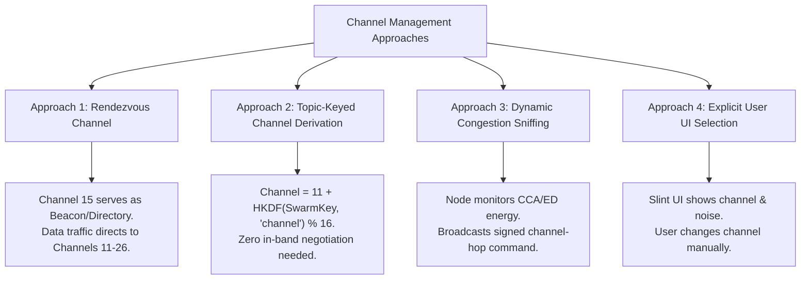
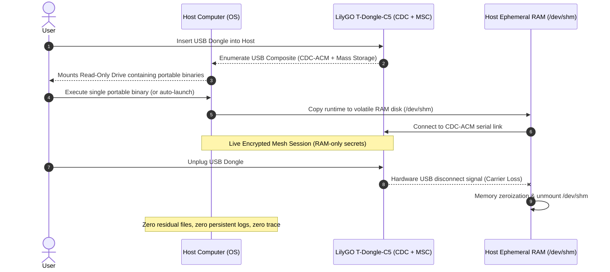

# Gibberish Project Ideas & Future Architecture Backlog 💡📡

This document tracks, categorizes, and explores emerging ideas, architectural expansions, and research vectors for **Project Gibberish**. It serves as a persistent brainstorm record and milestone staging ground.

---

## Index of Tracked Ideas

1. [Dynamic Channel Selection & Mesh Frequency Coordination](#1-dynamic-channel-selection--mesh-frequency-coordination) — [Issue #18](https://github.com/derpy4me/gibberish/issues/18)
2. [Headless Repeater Nodes (Zero-Trust Range Extenders)](#2-headless-repeater-nodes-zero-trust-range-extenders) — [Issue #19](https://github.com/derpy4me/gibberish/issues/19)
3. [Desktop-Native Operation (Dongle-Free with Generic 802.15.4 / Zigbee Transceivers)](#3-desktop-native-operation-dongle-free-with-generic-802154--zigbee-transceivers) — [Issue #20](https://github.com/derpy4me/gibberish/issues/20)
4. [Multi-Band & Multi-PHY Transports (Frequency-Agnostic Swarm)](#4-multi-band--multi-phy-transports-frequency-agnostic-swarm) — [Issue #21](https://github.com/derpy4me/gibberish/issues/21)
5. [Auto-Deploy & Stateless Zero-Trace Host Execution](#5-auto-deploy--stateless-zero-trace-host-execution) — [Issue #22](https://github.com/derpy4me/gibberish/issues/22)
6. [Cryptographic, Signal Security & Entropy Verification Suite](#6-cryptographic-signal-security--entropy-verification-suite) — [Issue #23](https://github.com/derpy4me/gibberish/issues/23)

---

## 1. Dynamic Channel Selection & Mesh Frequency Coordination

### Current State
Gibberish is currently pinned to IEEE 802.15.4 **Channel 15 (2.425 GHz)**. Channel 15 was selected for its position between standard Wi-Fi channels 1 and 6 to minimize interference. However, 2.4 GHz ISM spectrum can experience localized congestion, RF interference (microwave ovens, dense Wi-Fi, industrial Zigbee), or intentional channel jamming.

### Core Challenges
- **Discovery**: If nodes switch channels, how do new or returning nodes locate the active swarm without scanning 16 channels blindly?
- **Awareness**: How do users and groups know what channel they and their peers are currently communicating on?
- **Coordination**: How does a group or swarm agree to migrate channels without leaving members stranded?

### Brainstormed Architectural Approaches



1. **Rendezvous / Beacon Channel**:
   - Channel 15 acts as the common announcement / directory channel.
   - Low-duty-cycle discovery beacons announce group channel assignments.
   - High-throughput payload traffic (clipboard, files, chat) moves to an assigned data channel (Channels 11–26), returning to the rendezvous channel periodically.
2. **Deterministic Topic / Swarm Key Frequency Derivation**:
   - Eliminate channel negotiation entirely by mathematically deriving the channel:
     $$\text{Channel} = 11 + (\text{HKDF}(\text{SwarmMasterKey}, \text{"channel"}) \pmod{16})$$
   - Swarm members automatically tune their hardware to the derived channel on startup.
3. **Dynamic Frequency Selection (DFS) / Congestion Hopping**:
   - The ESP32-C5 radio measures background RSSI / Energy Detection (ED) and Clear Channel Assessment (CCA) failure rates.
   - If packet loss or CCA backoff exceeds a threshold, a node or group leader broadcasts a signed `MIGRATE_CHANNEL` frame instructing peers to hop to a specified target channel at a specific epoch timestamp.
4. **User & Group Visibility**:
   - Display current channel and spectrum noise floor on both the ST7735 LCD and desktop Slint UI.
   - Group metadata tracks member channel status via periodic one-hop health beacons.

---

## 2. Headless Repeater Nodes (Zero-Trust Range Extenders)

### Vision
Deploy autonomous, battery/solar or USB wall-plugged ESP32-C5 (or ESP32-C6) nodes in field environments, stairwells, or rooftops to act as range-extending mesh repeaters.

### Alignment with Core Philosophy
This aligns with Gibberish's **Zero-Trust Blind Dongle** architecture:
- Headless repeaters hold **no cryptographic identity keys** and **no swarm master keys**.
- They cannot decrypt payloads or read message content.
- Their sole responsibility is to receive valid 802.15.4 PHY frames, check the Network Admission Tag, verify the sliding Bloom filter (to suppress duplicate loops), decrement the TTL, and retransmit into the airwaves.

### Implementation Requirements
- **Firmware Mode**: A dedicated `headless_repeater` Cargo feature profile.
- **Power Optimization**: Disable LCD rendering (`st7735`), disable USB CDC logging, and utilize light sleep / timer-directed radio duty cycling when operating on battery/solar.
- **Physical Security Guarantee**: Because no keys exist in SRAM or Flash, an adversary capturing a repeater physical unit gains zero cryptographic advantage.

---

## 3. Desktop-Native Operation (Dongle-Free with Generic 802.15.4 / Zigbee Transceivers)

### Vision
Allow any desktop or laptop to run Gibberish directly without requiring the custom ESP32-C5 T-Dongle-C5 hardware, using off-the-shelf Zigbee USB sticks or native kernel 802.15.4 transceivers.

### Hardware Targets
1. **Generic TI CC2652 / CC1352 USB Dongles** (e.g., Sonoff Zigbee 3.0 Dongle Plus):
   - Flashed with raw IEEE 802.15.4 packet sniffer/forwarder firmware (or standard TI Z-Stack serial interface).
2. **Silicon Labs EFR32MG21** (e.g., Sonoff Dongle Plus-E):
   - Controlled via standard Silicon Labs EZSP / EmberZNet or raw radio serial framing.
3. **Linux Kernel 802.15.4 Subsystem**:
   - Interfacing directly with `AF_IEEE802154` raw network sockets using Linux `wpan-tools` (`nl802154`).

### Proposed Architectural Refactor
Introduce a modular transport abstraction in `crates/gibberish-protocol`:

```rust
#[async_trait]
pub trait PhysicalTransport: Send + Sync {
    /// Transmit raw IEEE 802.15.4 PHY frame into the airwaves
    async fn transmit_frame(&mut self, frame: &[u8]) -> Result<(), TransportError>;
    
    /// Receive raw incoming IEEE 802.15.4 PHY frame
    async fn receive_frame(&mut self) -> Result<Vec<u8>, TransportError>;
    
    /// Radio configuration (channel, TX power, CCA thresholds)
    async fn set_channel(&mut self, channel: u8) -> Result<(), TransportError>;
}
```

Implementations:
- `Esp32CdcTransport`: Connects to LilyGO T-Dongle-C5 over USB CDC-ACM.
- `LinuxWpanTransport`: Connects to Linux `wpan0` raw socket.
- `SerialZigbeeTransport`: Connects to TI CC2652 / generic USB serial radio sticks.
- `MockSimTransport`: Software mesh simulator for CI/headless tests.

---

## 4. Multi-Band & Multi-PHY Transports (Frequency-Agnostic Swarm)

### Vision
The Gibberish cryptographic and routing protocol should not be shackled to 2.4 GHz. The equipment attached should dictate the physical frequency:

| Medium | Frequency Band | Typical Range | Bandwidth | Ideal Use Case |
| :--- | :--- | :--- | :--- | :--- |
| **IEEE 802.15.4** | 2.4 GHz | 10 – 100 m | 250 kbps | Low-latency local mesh, clipboard sync, quick chats |
| **LoRa (SX1262 / SX1276)** | 433 / 868 / 915 MHz | 2 – 15 km | 0.3 – 50 kbps | Long-distance off-grid emergency mesh, cross-town relays |
| **BLE (Bluetooth LE)** | 2.4 GHz | 5 – 30 m | 1 – 2 Mbps | Native smartphone & laptop peer-to-peer without hardware dongles |
| **Wi-Fi Raw / ESP-NOW** | 2.4 / 5 GHz | 50 – 200 m | 1 – 54 Mbps | High-throughput sneakernet file transfers & audio streaming |

### Architectural Challenges
- **MTU Adaptation**: 802.15.4 has a strict 127-byte PHY MTU. LoRa has a 255-byte limit. BLE advertisements have 31/254-byte frames. The fragmentation and assembly layer (`gibberish-protocol`) must support dynamic MTU negotiation per transport.
- **Data Rate Differences**: Low-bandwidth mediums (LoRa) require aggressive payload compression and strict rate-limiting, whereas 802.15.4 / Wi-Fi can support bursty clipboard and bulk file streaming.

---

## 5. Auto-Deploy & Stateless Zero-Trace Host Execution

### Vision
Plug the T-Dongle-C5 into any host computer (Linux, macOS, Windows) and have the Gibberish client immediately operational with zero prior package installations. When the dongle is unplugged, all traces on the host machine are wiped.

### Hardware Feasibility on ESP32-C5
The ESP32-C5 USB peripheral supports **USB Composite Devices**:
- **Interface 0 (CDC-ACM)**: Communications channel for raw radio frames and control commands.
- **Interface 1 (MSC - Mass Storage Class)**: Presents the onboard MicroSD card as a standard USB flash drive to the host OS.

### Stateless Execution Flow



### Auto-Run Security Realities & Solutions
1. **OS Auto-Run Restrictions**: Modern operating systems (Windows, macOS, Linux) strictly block autorun scripts from removable drives to prevent malware.
2. **Recommended Cross-Platform Model**:
   - **Zero-Install Portable Executable**: The MicroSD card stores self-contained standalone binaries:
     - Linux: Single static executable / AppImage.
     - macOS: Single `.app` bundle signed for ad-hoc execution.
     - Windows: Single portable `.exe`.
   - **RAM-Disk Wrapper**: The launcher copies itself to `/dev/shm` (or OS temp RAM), sets memory locks (`mlock`), runs completely in volatile RAM, and listens for the USB disconnect event.
   - **Dongle-Removal Panic Trigger**: On serial port loss (`DTR`/carrier drop), the process immediately zeroes memory (`ZeroizeOnDrop`) and terminates.

---

## 6. Cryptographic, Signal Security & Entropy Verification Suite

### Objective
Empirically test, verify, and mathematically validate Gibberish's core security assertions:
1. *Airwave Indistinguishability*: Traffic appears as high-entropy random noise.
2. *Zero-Knowledge Blind Relays*: Hardware dongles and repeaters cannot leak or extract plaintext.
3. *Cryptographic Correctness*: No nonce reuse, robust replay rejection, and key isolation.

### Verification Matrix & Test Proposals

| Category | Verification Goal | Test Methodology | Tooling / Framework |
| :--- | :--- | :--- | :--- |
| **Signal Entropy** | Prove ciphertext packets are indistinguishable from white noise | Capture 100,000 live airwave frames and run NIST statistical tests (Frequency, Runs, FFT, Approximate Entropy) | NIST SP 800-22, Dieharder, `ent` |
| **RF Leakage / Sniffing** | Confirm no identifiable preambles, MAC identifiers, or unencrypted metadata exist on the airwaves | Capture physical transmissions using an SDR and inspect spectrograms & bitstreams | RTL-SDR, HackRF One, GNU Radio |
| **Blind Relay Security** | Prove an intermediate relay node or rogue firmware cannot deduce plaintext | Hardware in-the-loop firmware memory dumping during active packet transit | `gdb-multiarch` + OpenOCD / ESP-Prog memory inspection |
| **Protocol Fuzzing** | Ensure malformed, truncated, or hostile RF packets cannot crash or compromise nodes | Fuzz the 127-byte physical packet deserializer and host CDC framing parser | `cargo-fuzz` / `libFuzzer` / `honggfuzz` |
| **Nonce & Replay Invariants** | Confirm replay attacks and frame injections are strictly rejected | Automated integration test replaying historical frames against fresh nodes | `tests/integration-sim` + live RF replay harness |

---

## Tracking & Next Steps

- [ ] Convene design discussion on **Channel Selection** (Rendezvous vs. Key-Derivation vs. Dynamic Sniffing).
- [ ] Build initial prototype of `headless_repeater` firmware feature flag.
- [ ] Design the `PhysicalTransport` trait in `crates/gibberish-protocol` to prepare for generic Zigbee / desktop-native hardware.
- [ ] Benchmark ESP32-C5 USB Composite (CDC-ACM + MSC) in bare-metal Rust.
- [ ] Build entropy analysis script (`tools/entropy-test`) running `ent` and NIST tests on serialized wire frames.
