## Goal Capsule

- **Objective:** Synchronize dynamic lighting colors and animation patterns between two or more LilyGO T-Dongle-C5 devices over an autonomous, connectionless peer-to-peer radio link with no central coordinator or pairing.
- **Means:** Single-hop raw IEEE 802.15.4 broadcast packets carrying light state, paired with local randomized countdown timers (10–30s) that reset on packet reception and an immediate manual trigger via the onboard BOOT button (KTD1, KTD2, KTD4).
- **Product Authority:** Autonomous peer-to-peer broadcast sync is the active scope. Standard Zigbee 3.0 coordinator joining (e.g. Home Assistant / Zigbee2MQTT) and multi-hop mesh packet routing are explicitly deferred and out of scope.
- **Open Blockers:** None.

---

## Product Contract

### Summary

An autonomous peer-to-peer light synchronization firmware for LilyGO T-Dongle-C5 devices. Each dongle runs a 10–30 second random countdown timer; upon timer expiry or when pressing the onboard BOOT button, it selects a new color and animation pattern, updates its APA102 RGB LED and ST7735 LCD screen, and broadcasts the state over raw 802.15.4 radio. Receiving dongles immediately adopt the received visual state and reset their local timers to prevent broadcast cascades.

### Problem Frame

Exploring the multi-protocol capabilities of modern ESP32-C5 dongles often defaults to standard Wi-Fi or complex Home Automation coordinator setups. For rapid benchmarking, visual demos, and distributed systems experimentation on the bench, there is no simple, plug-and-play mechanism for two standalone dongles to discover each other, synchronize visual state, and showcase the 802.15.4 radio with zero external infrastructure.

### Key Decisions

- **Autonomous Raw 802.15.4 Broadcast** (session-settled: user-directed — chosen over Zigbee 3.0 coordinator joining: provides instant plug-and-play ad-hoc discovery with zero pairing or hub setup). Governs R1, R2.
- **Dual Synchronized Visual Feedback (LED + LCD)** (session-settled: user-directed — chosen over LED-only or LCD-only: drives the APA102 RGB LED with dynamic lighting animations while using the ST7735 display for color wash and telemetry). Governs R3, R4.
- **Expressive Pattern Palette** (session-settled: user-directed — chosen over minimal palette: supports Solid, Smooth Breathe, Strobe/Blink, Rainbow Cycle, and Firefly Pulse). Governs R5.
- **Randomized Backoff & Reset Timing** (session-settled: user-directed — chosen over fixed interval: 10–30s random interval per node; receipt of any broadcast resets the local timer to prevent cascades). Governs R6, R7, R9.
- **BOOT Button Manual Trigger** (session-settled: user-directed — chosen over autonomous-only: pressing GPIO 28 immediately rolls a new state, broadcasts, and resets timer). Governs R8.
- **Single-hop Last-Write-Wins Propagation** (session-settled: user-directed — chosen over multi-hop mesh: prevents radio storms and eliminates sequence deduplication requirements). Governs R2, R9.

### Requirements

**Radio & Protocol**
- R1. Nodes broadcast light state updates using raw IEEE 802.15.4 frames on a fixed standard 2.4 GHz channel with hardware Clear Channel Assessment (CCA) and random 0–30ms pre-TX jitter to mitigate RF collisions.
- R2. Packets carry an application magic identifier (`SYNC`), factory eFuse MAC-derived sender node ID, monotonically increasing sequence number, color (RGB), pattern identifier, and animation parameters.
- R10. Receiving nodes ignore self-transmitted loopback packets and stale or duplicated sequence numbers from known peer senders.

**Visual Presentation**
- R3. The onboard APA102 RGB LED (GPIO 4 CI, GPIO 5 DI) renders the active animation pattern and color in real time at 50 Hz.
- R4. The onboard ST7735 LCD display (GPIO 0 Backlight) renders a background color fill matching the active color alongside telemetry text showing the active pattern name, sender ID, and remaining seconds until next roll. Display redraws use differential/dirty-region updates to ensure SPI bus transactions never block radio RX servicing.
- R5. The pattern engine supports five distinct modes: Solid Color, Smooth Breathe (sinusoidal intensity fade), Strobe/Blink (fast rhythmic toggling), Rainbow Cycle (continuous hue rotation), and Firefly Pulse (soft spontaneous fade-burst).

**Timing & Synchronization**
- R6. Each node runs an independent countdown timer initialized to a random duration between 10 and 30 seconds, seeded from the hardware True Random Number Generator (TRNG).
- R7. When a node's local countdown timer reaches zero, the node selects a new random color and pattern, applies it locally, broadcasts the state, and resets its timer to a new random 10–30s interval.
- R8. When a node's onboard BOOT button (GPIO 28) is pressed, the node immediately executes the roll, broadcast, and timer-reset sequence defined in R7.
- R9. When a node receives an 802.15.4 broadcast packet with a valid application identifier, it immediately adopts the received color and pattern, and resets its local countdown timer to a fresh random 10–30s interval without re-transmitting.

### Actors

- A1. Initiator Node: A T-Dongle-C5 whose timer expires or whose BOOT button is pressed, generating and broadcasting a state change.
- A2. Peer Node: Any T-Dongle-C5 in radio range that receives the broadcast, synchronizes its visuals, and resets its timer.

### Key Flows

- F1. Autonomous Timer Roll & Sync
  - **Trigger:** Initiator node (A1) local countdown reaches zero.
  - **Actors:** A1 (Initiator), A2 (Peer).
  - **Steps:** A1 randomly picks a color and pattern from R5; A1 updates its APA102 LED (R3) and marks LCD telemetry dirty (R4); A1 applies 0–30ms pre-TX jitter and broadcasts via 802.15.4 with hardware CCA (R1, R2); A1 resets its countdown to a random 10–30s value (R6); A2 receives the frame, verifies magic and filters self-loopback/stale sequence (R2, R10), updates local LED (R3) and LCD (R4), and resets countdown (R9).
  - **Covered by:** R1, R2, R3, R4, R5, R6, R7, R9, R10.

- F2. Manual BOOT Button Override
  - **Trigger:** User presses the physical BOOT button on a dongle.
  - **Actors:** A1 (Initiator), A2 (Peer).
  - **Steps:** A1 detects debounced button press; A1 executes roll and broadcast with jitter/CCA identical to F1; A1 resets local countdown; A2 receives and synchronizes identically to F1.
  - **Covered by:** R8, R1, R2, R3, R4, R5, R6, R9, R10.

- F3. Near-Simultaneous Broadcast Race
  - **Trigger:** Two nodes broadcast within a narrow (~50ms) window.
  - **Actors:** Two concurrent Initiator nodes.
  - **Steps:** Hardware CCA and pre-TX jitter desynchronize transmissions in the air; each node processes incoming frames, applying Last-Write-Wins and resetting countdown timers to distinct random intervals.
  - **Covered by:** R1, R7, R9, R10.

### Acceptance Examples

- AE1. Autonomous Timer Sync
  - **Covers:** R1, R2, R3, R4, R5, R6, R7, R9.
  - **Given:** Node A and Node B are powered on with Node A's timer set to expire in 12s and Node B's in 25s.
  - **When:** 12 seconds elapse.
  - **Then:** Node A changes its LED and LCD to a new pattern/color and broadcasts; within 50ms Node B adopts Node A's exact pattern/color and resets its countdown to a new random value between 10s and 30s.

- AE2. Incoming Broadcast Timer Reset & Loopback Rejection
  - **Covers:** R6, R7, R9, R10.
  - **Given:** Node B has 3 seconds remaining on its timer, and Node A transmits.
  - **When:** Node B receives Node A's broadcast (and Node A sees its own RF broadcast reflected).
  - **Then:** Node B applies Node A's pattern and resets its countdown to 10–30s; Node A filters out its own packet by MAC/NodeID without resetting its timer.

- AE3. Manual BOOT Button Override
  - **Covers:** R8, R7, R9.
  - **Given:** Both nodes are idling in a Solid Blue pattern with 15s remaining on their timers.
  - **When:** The user presses the BOOT button on Node A.
  - **Then:** Node A immediately rolls a new pattern (e.g. Rainbow Cycle), updates its visuals, and broadcasts; Node B immediately switches to Rainbow Cycle and resets its timer.

- AE4. Near-Simultaneous Broadcast (Last-Write-Wins)
  - **Covers:** R1, R7, R9, R10.
  - **Given:** Node A and Node B timers expire within 10ms of each other.
  - **When:** Packets transmit with jitter and CCA.
  - **Then:** Both nodes adopt the state of the packet that arrived last, leaving them synchronized; timers reset to independent random durations.

### Scope Boundaries

**Deferred for later**
- Standard Zigbee 3.0 Home Automation network coordinator joining (Home Assistant, Zigbee2MQTT).
- Multi-hop mesh repeating with sequence numbers and TTL hops.
- Wi-Fi 6 or BLE dual-radio concurrent bridging.
- MicroSD card logging or custom pattern uploads.

**Outside this feature's identity**
- Master/slave or central coordinator architectures (this system is strictly symmetric and decentralized).
- Persistent state pairing databases or encrypted network handshakes.

### Dependencies & Assumptions

- **Hardware:** LilyGO T-Dongle-C5 boards equipped with ESP32-C5 MCU, APA102 RGB LED (GPIO 4/5), ST7735 LCD (SPI, GPIO 0 backlight), and onboard BOOT button (GPIO 28).
- **Toolchain:** Rust `no_std` embedded toolchain targeting `riscv32imac-unknown-none-elf` using `esp-hal` and `esp-ieee802154`.
- **Assumptions:** Both dongles operate on the same fixed IEEE 802.15.4 radio channel within standard line-of-sight RF range.

---

## Planning Contract

### Key Technical Decisions

- KTD1. **Bare-Metal `no_std` Rust with `esp-hal` and `esp-ieee802154`** (session-settled: user-approved — chosen over ESP-IDF std: guarantees minimal binary footprint, deterministic sub-millisecond execution, and direct hardware control on RISC-V `riscv32imac-unknown-none-elf`). Governs R1, R2.
- KTD2. **Dedicated Crate `c5-light-sync`** (session-settled: user-approved — chosen over modifying `c5-verify`: preserves `c5-verify` as a pristine hardware validation baseline). Governs R1.
- KTD3. **Pinned IEEE 802.15.4 Channel 15 (2.425 GHz) with CCA and Jitter** (session-settled: user-approved — chosen over default Channel 11: sits in the spectral guard gap between 2.4 GHz Wi-Fi Channel 1 and Channel 6; incorporates hardware Clear Channel Assessment and a 0–30ms pseudo-random pre-transmission jitter window to prevent simultaneous transmit collisions). Governs R1.
- KTD4. **Compact 16-Byte Binary Beacon Frame with Unique Node ID & Sequence Number** (session-settled: user-approved — fixed header `0x53594E43` ('SYNC'), 32-bit sender node ID derived from factory eFuse MAC, 32-bit monotonic sequence counter, RGB payload, and pattern ID. Filters out loopback and stale packets). Governs R2, R10.
- KTD5. **Hardware TRNG Seeding for Independent PRNG Instances** (session-settled: user-approved — PRNG state is seeded from the on-chip True Random Number Generator via `esp_hal::rng::Rng`, guaranteeing that two simultaneously powered boards boot with divergent random sequences). Governs R6.
- KTD6. **Non-Blocking Superloop with Bounded Display SPI Operations** (session-settled: user-approved — 20ms cooperative tick loop; LCD updates are dirty-flagged and batched to ensure SPI transfers never starve radio RX FIFO buffers). Governs R3, R4, R9.
- KTD7. **Modular Core Logic Crate Shape for Host Testing** (session-settled: user-approved — packet serialization, PRNG math, and pattern engines reside in a portable core module testable with `cargo test` on host x86_64). Governs R2, R5, R6, R10.

### High-Level Technical Design

```mermaid
flowchart TB
  subgraph HW["Hardware Interfaces (LilyGO T-Dongle-C5)"]
    Radio["ESP32-C5 802.15.4 Radio (Ch 15, CCA)"]
    TRNG["Hardware TRNG (esp_hal::rng::Rng)"]
    eFuse["Factory MAC Address (eFuse)"]
    LED["APA102 RGB LED (GPIO 4 CI, GPIO 5 DI)"]
    LCD["ST7735 80x160 LCD (SPI: GPIO 2/6/10/3/1/0)"]
    Button["BOOT Button (GPIO 28, Active-Low)"]
  end

  subgraph BootInit["Boot Initialization"]
    eFuse --> NodeID["Derive Unique Node ID"]
    TRNG --> SeedRNG["Seed Local PRNG"]
    SeedRNG --> InitTimer["Random Countdown (10-30s)"]
  end

  subgraph Loop["20ms Cooperative Superloop"]
    RxPoll["Poll 802.15.4 RX Buffer"] --> RxFilter{"Valid Magic &&\nSender != LocalID &&\nSeq > LastSeen?"}
    RxFilter -->|Yes| ApplyRx["Adopt Color & Pattern\nReset Countdown (10-30s)"]
    RxFilter -->|No / None| BtnCheck["Check Debounced BOOT Button"]
    ApplyRx --> BtnCheck

    BtnCheck -->|Pressed| TriggerRoll["Roll New State\nPre-TX Jitter (0-30ms)\nBroadcast with CCA\nReset Countdown"]
    BtnCheck -->|Not Pressed| TimerCheck{"Timer Expired?"}

    TimerCheck -->|Yes| TriggerRoll
    TimerCheck -->|No| DecTimer["Decrement Countdown"]

    TriggerRoll --> StepAnim["Step Pattern Frame (50 Hz)"]
    DecTimer --> StepAnim

    StepAnim --> RenderLED["Push APA102 SPI Frame"]
    RenderLED --> DirtyCheck{"LCD Dirty or Sec Elapsed?"}
    DirtyCheck -->|Yes| RenderLCD["Partial / Incremental LCD Redraw"]
    DirtyCheck -->|No| SleepWait["Wait for next 20ms tick"]
    RenderLCD --> SleepWait
  end

  Radio <-->|RX / TX| Loop
  Loop --> LED
  Loop --> LCD
  Button --> Loop
```



#### 16-Byte Broadcast Frame Specification
```text
Offset | Field           | Type    | Description
-------+-----------------+---------+-----------------------------------------
0..3   | Magic Header    | [u8; 4] | 0x53 0x59 0x4E 0x43 ("SYNC")
4..7   | Sender ID       | u32     | Low 4 bytes of board factory eFuse MAC
8..11  | Sequence Number | u32     | Monotonically increasing broadcast count
12..14 | RGB Color       | [u8; 3] | Red, Green, Blue intensity (0..255)
15     | Pattern ID      | u8      | 0=Solid, 1=Breathe, 2=Strobe, 3=Rainbow, 4=Firefly
```

### Implementation Constraints

- **Execution Domain:** `no_std` Rust on `riscv32imac-unknown-none-elf` bare-metal target.
- **Memory Allocation:** Zero dynamic heap allocation (`#![no_std]`).
- **Timing Resolution:** 20ms base tick (50 Hz refresh rate for APA102 LED animations and countdown updates).
- **SPI Bounding:** LCD draws are constrained to small dirty rectangles or background fills so the SPI bus is never held longer than 5ms per loop iteration, ensuring no 802.15.4 RX packets are missed.

---

## Implementation Units

### U1. Crate Scaffolding and Build Configuration
- **Goal:** Create the standalone `c5-light-sync` crate configured for ESP32-C5 bare-metal compilation with necessary dependencies and memory layout.
- **Requirements:** Advances R1, R2. Governed by KTD1, KTD2.
- **Dependencies:** None.
- **Files:**
  - `c5-light-sync/Cargo.toml`
  - `c5-light-sync/.cargo/config.toml`
  - `c5-light-sync/src/main.rs`
- **Approach:**
  1. Initialize `c5-light-sync` alongside `c5-verify`.
  2. Configure `.cargo/config.toml` targeting `riscv32imac-unknown-none-elf` with `linkall.x` and `espflash` runner.
  3. Add dependencies: `esp-hal` (with `esp32c5`, `unstable`), `esp-backtrace`, `esp-println`, `esp-bootloader-esp-idf`, and `esp-ieee802154`.
  4. Author minimal boot entry point verifying serial banner output.
- **Test Scenarios:**
  - Happy path: `cargo check --target riscv32imac-unknown-none-elf` passes with zero warnings or linker errors.
  - Verification: `espflash flash --monitor` boots on hardware and prints the startup banner.

### U2. Portable Core Logic Module (Protocols, RNG & Animations)
- **Goal:** Author the hardware-agnostic packet structure, random generator, loopback/sequence filter, and pattern math in a portable submodule with host unit tests.
- **Requirements:** Advances R2, R5, R6, R10. Governed by KTD4, KTD5, KTD7.
- **Dependencies:** U1.
- **Files:**
  - `c5-light-sync/src/core/mod.rs`
  - `c5-light-sync/src/core/packet.rs`
  - `c5-light-sync/src/core/pattern.rs`
  - `c5-light-sync/src/core/rng.rs`
- **Approach:**
  1. Implement `SyncPacket` with `serialize(&self, buf: &mut [u8]) -> usize` and `deserialize(buf: &[u8]) -> Option<SyncPacket>` validating magic `SYNC`.
  2. Implement loopback filter (`packet.sender_id != local_node_id`) and monotonic sequence verification.
  3. Implement `LightPattern` enum (Solid, Breathe, Strobe, Rainbow, Firefly) with step function returning RGB at current tick.
  4. Implement Xorshift32 PRNG seeded from hardware entropy.
  5. Write host unit tests running on `x86_64-unknown-linux-gnu`.
- **Test Scenarios:**
  - Covers AE1, AE2.
  - Happy path: `SyncPacket` round-trips serialize and deserialize accurately without data corruption.
  - Error path: Deserialization rejects packets shorter than 16 bytes, wrong magic, or self-matching sender ID.
  - Stale sequence: Packets with sequence number <= last seen sequence for that sender are rejected.
  - Edge cases: Pattern math clamps RGB values to 0..255 on all sine / fade phase boundaries.
- **Verification:** `cargo test --lib --target x86_64-unknown-linux-gnu` passes all unit tests.

### U3. APA102 RGB LED Driver & Animation Engine
- **Goal:** Implement the bit-bang or SPI driver for the onboard APA102 addressable RGB LED on GPIO 4 (Clock) and GPIO 5 (Data).
- **Requirements:** Advances R3, R5. Governed by KTD6.
- **Dependencies:** U1, U2.
- **Files:**
  - `c5-light-sync/src/led.rs`
- **Approach:**
  1. Configure GPIO 4 and GPIO 5 as push-pull outputs.
  2. Implement APA102 frame generation: 32-bit start frame (`0x00000000`), 32-bit LED frame (`0xE0 | brightness`, Blue, Green, Red), 32-bit end frame (`0xFFFFFFFF`).
  3. Hook up the animation engine from U2 to update the LED at 50 Hz.
- **Test Scenarios:**
  - Covers R3, R5.
  - Happy path: LED cleanly displays Solid, Breathe, Strobe, Rainbow, and Firefly patterns.
  - Edge case: Setting brightness to 0 cleanly turns off the LED with no ghost glow.
- **Verification:** Hardware displays smooth color cycles and distinct animation pulses.

### U4. ST7735 LCD Display Driver & Telemetry UI
- **Goal:** Drive the onboard 80x160 ST7735 IPS LCD with non-blocking bounded writes to render color wash background and status telemetry text.
- **Requirements:** Advances R4. Governed by KTD6.
- **Dependencies:** U1, U2.
- **Files:**
  - `c5-light-sync/src/display.rs`
- **Approach:**
  1. Initialize SPI bus for LCD: GPIO 2 (MOSI), GPIO 6 (SCK), GPIO 10 (CS), GPIO 3 (DC), GPIO 1 (RST), GPIO 0 (Backlight).
  2. Turn on backlight on GPIO 0.
  3. Initialize ST7735 display controller (using `mipidsi` or direct SPI command sequence).
  4. Implement dirty-rect / incremental redraw: full background redraw occurs only when color/pattern changes; second-level telemetry updates redraw only the text bounding box.
  5. Bounded latency: ensure no SPI transaction takes more than 5ms.
- **Test Scenarios:**
  - Covers R4.
  - Happy path: Display updates background fill upon color change and updates countdown numbers every second.
  - Edge case: Long pattern names render without clipping outside 80x160 display boundary.
- **Verification:** LCD illuminates and visibly reflects state changes alongside the APA102 LED without interrupting radio reception.

### U5. IEEE 802.15.4 Radio Driver & Superloop Integration
- **Goal:** Integrate raw 802.15.4 radio transmission/reception with hardware CCA, pre-TX jitter, BOOT button debouncing, and TRNG seeding into the 20ms superloop.
- **Requirements:** Advances R1, R2, R6, R7, R8, R9, R10. Governed by KTD1, KTD3, KTD4, KTD5, KTD6.
- **Dependencies:** U2, U3, U4.
- **Files:**
  - `c5-light-sync/src/radio.rs`
  - `c5-light-sync/src/main.rs`
- **Approach:**
  1. Read factory MAC address from eFuse to derive unique local Node ID.
  2. Seed PRNG from hardware TRNG (`esp_hal::rng::Rng`).
  3. Initialize IEEE 802.15.4 radio on Channel 15 (2.425 GHz) in raw promiscuous mode using `esp-ieee802154`.
  4. Configure GPIO 28 (BOOT button) as input with pull-up.
  5. Superloop logic: poll radio RX, validate magic, filter loopback/stale packets, reset countdown timer on receipt; if timer expires or button pressed, add 0–30ms random jitter, perform CCA check, and broadcast packet.
- **Test Scenarios:**
  - Covers AE1, AE2, AE3, AE4.
  - Happy path: Board A broadcasts on timer expiration; Board B receives frame, updates LED/LCD within 50ms, and resets its timer.
  - Loopback rejection: Board A transmits and ignores its own reflected broadcast.
  - Manual trigger: Pressing BOOT button on Board B immediately rolls state and synchronizes Board A.
  - Collision test: Near-simultaneous broadcasts resolve cleanly with CCA, jitter, and Last-Write-Wins.
- **Verification:** Both physical boards plugged into USB ports exhibit coordinated random color/pattern changes every 10–30s and respond instantaneously to button presses.

---

## Verification Contract

### Test Suite Execution
- **Host Unit Tests:**
  ```bash
  cargo test --manifest-path c5-light-sync/Cargo.toml --target x86_64-unknown-linux-gnu
  ```
  Verifies packet serialization, deserialization, sequence ordering, loopback rejection, PRNG distribution, and animation mathematical models without hardware.

- **Embedded Target Compilation:**
  ```bash
  cargo build --manifest-path c5-light-sync/Cargo.toml --target riscv32imac-unknown-none-elf --release
  ```
  Verifies zero linker errors, proper section allocations (`.text`, `.rodata`), and no unresolved symbols.

- **Hardware Flash & Live Telemetry:**
  ```bash
  espflash flash --monitor /dev/ttyACM0 c5-light-sync/target/riscv32imac-unknown-none-elf/release/c5-light-sync
  espflash flash --monitor /dev/ttyACM1 c5-light-sync/target/riscv32imac-unknown-none-elf/release/c5-light-sync
  ```

---

## Definition of Done

1. `c5-light-sync` compiles cleanly with zero warnings under `--release`.
2. Unit test suite passes on host covering packet integrity, sequence filtering, and pattern math.
3. Both LilyGO T-Dongle-C5 devices run identical compiled firmware.
4. Each dongle autonomously selects a random color and pattern every 10–30s and broadcasts it.
5. Transmissions employ hardware CCA and 0–30ms pre-TX jitter to avoid collision storms.
6. Receiving dongles immediately mirror the sender's APA102 LED animation and ST7735 LCD color/telemetry.
7. Receiving dongles ignore self-loopback broadcasts and reset their countdown timers to prevent cascading broadcasts.
8. Pressing the physical BOOT button on either dongle triggers an immediate synchronized change across both devices.
9. Display updates are non-blocking and do not drop radio frames.
10. Unused experimental code or temporary debug logs are removed before marking complete.
