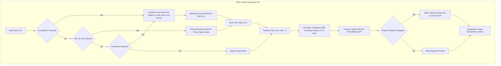
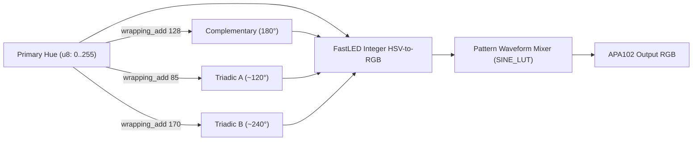

## Goal Capsule

- **Objective:** Elevate the visual expressiveness and liveliness of the synchronized LilyGO T-Dongle-C5 devices by replacing repetitive, single-color animations with an expanded roster of 10 rich organic patterns, continuous procedural color generation, and harmonized LCD display feedback.
- **Means:** Expanding the pattern engine to 10 modes using pure integer math with a precomputed 256-entry sine LUT (`static SINE_LUT: [u8; 256]`), FastLED-style integer 6-sector HSV conversion, 360° procedural hue generation with wrapping u8 harmonic secondary accents, an animated ST7735 pulse indicator bar bounded to <1.2ms SPI write, and deterministic tick-boundary phase cuts upon 802.15.4 sync events.
- **Product Authority:** Visual pattern generation, color synthesis, and display feedback are the active scope. Audio synthesis, complex full-screen particle engines, and changes to the 16-byte raw 802.15.4 packet format are out of scope.
- **Open Blockers:** None.

---

## Product Contract

### Summary

An upgraded visual pattern and color generation engine for the synchronized LilyGO T-Dongle-C5 pair. The system expands from 5 basic patterns to 10 distinct modes by adding rich, organic animations (Candle Flicker, Heartbeat, Supernova, Ocean Tide, and Cyberpunk Glitch). It replaces the static 12-color palette with a continuous 360° procedural hue generator capable of dual-tone harmonic accents. The ST7735 LCD coordinates via a smooth background color cross-fade and a live 50Hz pulse indicator bar that preserves telemetry legibility, while network synchronization snaps cleanly on tick boundaries to keep both dongles locked in phase.

### Problem Frame

The baseline firmware demonstrates reliable 802.15.4 synchronization, but its visual presentation quickly feels repetitive and sterile. With only 5 simple geometric waveforms (triangle wave breathing, 50% duty strobe, simple fast hue spin) and a discrete 12-color palette, observers quickly perceive predictable repetition. Furthermore, the 0.96" ST7735 LCD acts as a static colored billboard rather than an active visual partner to the APA102 RGB LED. The upgrade transforms the visual presence of both dongles into organic, lifelike displays while remaining strictly within the 20ms single-core superloop budget.

### Key Decisions

- **Expanded 10-Pattern Hybrid Roster** (session-settled: user-directed — chosen over total replacement: keeps the original 5 baseline modes [Solid, Breathe, Strobe, Rainbow, Firefly] and adds 5 organic modes [Candle Flicker, Heartbeat, Supernova Burst, Ocean Tide, Cyberpunk Glitch]). Governs R1, R2.
- **Continuous 360° HSV + Harmonic Accents** (session-settled: user-directed — chosen over static palette expansion: generates 360 unique procedural hues using integer arithmetic, plus deterministic secondary accents like complementary and triadic offsets for dual-tone modes). Governs R3, R4.
- **Hybrid LCD Display Coordination** (session-settled: user-directed — chosen over full-screen brightness modulation: renders a high-speed, low-overhead dynamic pulse bar [<1.2ms SPI write] while keeping telemetry text crisp, stable, and flicker-free). Governs R5, R6.
- **Instant Tick-Boundary Sync Cut** (session-settled: user-directed — chosen over 500ms cross-fade: incoming packets or local BOOT button presses snap pattern and phase cleanly at the next 20ms tick boundary to ensure zero phase drift across devices). Governs R7, R8.
- **Fixed-Point & Lookup-Table Math Discipline** (session-settled: peer-review advisory — chosen over floating-point trig: RV32IMAC core computes all wave functions via a 256-entry integer sine LUT in flash and integer HSV conversion, guaranteeing <200µs calculation time per frame). Governs R9, R10.

### Requirements

**Pattern Engine & Animation**
- R1. The engine supports at least 10 distinct patterns identified by an 8-bit `pattern_id`:
  - `0`: Solid (steady illumination)
  - `1`: Breathe (smooth 2.0s sine-curved breathing)
  - `2`: Strobe (fast rhythmic 10Hz flash)
  - `3`: Rainbow (continuous full-spectrum hue rotation)
  - `4`: Firefly (gentle asynchronous pulse with fast rise and slow decay)
  - `5`: Candle Flicker (1D pseudo-random walk with thermal micro-flicker and warm color temperature shift)
  - `6`: Heartbeat (biphasic systolic/diastolic `lub-dub` pulse pair followed by a quiet diastolic pause)
  - `7`: Supernova Burst (periodic exponential flare shifting from hot white to primary color, cooling into deep ember)
  - `8`: Ocean Tide (dual-harmonic sinusoidal wave with gentle rhythmic undertow)
  - `9`: Cyberpunk Glitch (syncopated digital stutter bursts with micro-jitter intervals)
- R2. Every pattern computes its output RGB value in under 200 µs on the ESP32-C5 core using integer arithmetic only.
- R9. Sinusoidal oscillations in patterns (Breathe, Tide, Heartbeat) utilize a `static SINE_LUT: [u8; 256]` stored in `.rodata`, indexed by a wrapping 8-bit phase accumulator (`u8`) to eliminate runtime trig calls and floating-point dependencies.
- R10. Non-deterministic flicker and jitter (Candle, Glitch) utilize an allocation-free integer `Xorshift32` PRNG without division operations.

**Color Generation & Harmonies**
- R3. Color rolls sample an unconstrained random hue from 0 to 255 (representing 0 to 360 degrees), mapped to saturated RGB via an integer 6-sector HSV-to-RGB conversion algorithm.
- R4. For multi-tone patterns (Supernova, Ocean Tide, Cyberpunk Glitch), the engine computes a secondary harmonic accent color via wrapping integer arithmetic (180° complementary via `+128` or 120° triadic via `+85`/`+170`) to produce rich chromatic depth without packet format changes.

**Display Coordination & Readability**
- R5. On pattern change, the ST7735 LCD updates its background wash to the new primary color and recalculates high-contrast text color (black vs. white based on ITU-R BT.601 luminance).
- R6. During animation ticks, the display updates a dedicated horizontal pulse indicator bar (148×4 pixels at y=74) reflecting active pattern phase. Dirty-region SPI writes for the indicator bar are bounded to ≤ 1.2 ms and only update when pixel width changes, minimizing SPI bus occupancy and preventing superloop overruns. Telemetry text lines remain static between countdown second ticks to eliminate flicker.

**Synchronization & Concurrency**
- R7. When an 802.15.4 `SyncPacket` is received, the node extracts `pattern_id` and primary color, staging them for immediate adoption at the start of the next 20ms superloop tick, resetting the pattern phase accumulator to 0.
- R8. Manual BOOT button press (GPIO 28) generates an immediate autonomous roll, resets local phase, transmits the new packet with an incremented sequence counter, and resets the countdown timer (10–30s). In case of concurrent network RX and local button press in the same tick, local user input takes precedence and broadcasts.

### Frame Timing Budget (50Hz / 20ms Deadline)

Each LilyGO T-Dongle-C5 controls a single onboard APA102 RGB LED ($N=1$). Computational overhead scales with $N=1$, ensuring negligible CPU load.

| Subsystem Task | Execution Budget | Implementation Strategy |
| :--- | :--- | :--- |
| Pattern Math & Harmonic HSV (N=1) | ≤ 50 µs | O(1) single-pixel integer FastLED-style HSV conversion & LUT read |
| APA102 Bitbang SPI (GPIO 4/5) | ≤ 250 µs | 32-bit frame bitbang at CPU speed |
| 802.15.4 Radio Servicing | ≤ 400 µs | Non-blocking RX FIFO poll, CCA check on TX |
| ST7735 LCD Indicator Pulse Bar | ≤ 1,200 µs | Conditional 148×4 px dirty rect write over 10 MHz SPI (skipped if width unchanged) |
| Cooperative Delay / Headroom | ≥ 18,100 µs | Remainder sleep via `delay_millis` |
| **Total Frame Time** | **20,000 µs** | **>90% idle headroom guarantees zero timing jitter** |

### Actors

- **Observer**: Watches both dongles simultaneously, experiencing varied, lifelike animations and instant coordinated color/pattern switches.
- **Bench Operator**: Interacts with the dongles via the BOOT button, observing immediate local and remote synchronization without lag or phase drift.

### Scope Boundaries

- **In Scope**: 10 distinct patterns, procedural 360° HSV generation, secondary harmonic colors, integer sine LUT, fast xorshift noise, ST7735 dirty-rect pulse bar, tick-boundary sync snap.
- **Out of Scope**: Full-frame LCD 50Hz raster video/animations, custom audio generation, Zigbee 3.0 cluster formatting, packet wire structure modifications.

### Success Criteria

1. **Vibrancy & Variety**: Dongles transition through 10 distinct patterns across all 360 degrees of hue, eliminating the repetitive feeling of the 5-pattern/12-color baseline.
2. **Lockstep Synchrony**: Upon packet reception over 802.15.4, both dongles visibly switch to identical pattern modes and animation phase within one 20ms tick.
3. **Rock-Solid Frame Rate**: The 50Hz superloop maintains a strict 20ms cadence with zero frame drops, confirmed by non-blocking radio and display dirty-rect profiling.
4. **Crisp Telemetry**: ST7735 display maintains high-contrast, flicker-free text rendering while the animated pulse bar and background wash reflect active pattern dynamics.

---

## Planning Contract

### Key Technical Decisions

- **KTD1. Precomputed Unsigned Sine Table (`SINE_LUT: [u8; 256]`)** (session-settled: peer-review advisory — chosen over signed `[i8; 256]` and runtime floats: storing values as $0..255$ centered at $128$ allows direct unsigned fixed-point multiplication `(val * scale) >> 8` without signed casting or zero-crossing branch checks). Governs R2, R9.
- **KTD2. Standardized 8-Bit Hue Coordinate Space (`u8`)** (session-settled: peer-review advisory — chosen over 0..359 degree integers: 256 steps provide smooth 1.4° angular resolution across the color wheel while enabling wrapping arithmetic `wrapping_add` for harmonic offsets [128 = 180° complementary, 85 = ~119.5° triadic, 170 = ~239.1° triadic as standard FastLED integer approximations] without modulo division). Governs R3, R4.
- **KTD3. Differential Dirty-Rect Pulse Bar Rendering** (session-settled: user-directed — chosen over unconditional per-tick SPI writes: tracking `last_bar_width` and writing SPI pixels only when the fill width changes reduces recurring SPI bus occupancy from ~1ms every tick to ~1ms every 2-3 ticks). Governs R6.
- **KTD4. Independent Organic PRNG State with Synchronized Base** (session-settled: peer-review advisory — chosen over identical PRNG seeding: sync packets synchronize base color, pattern ID, and tick phase; Candle Flicker and Cyberpunk Glitch advance local `Xorshift32` state independently to produce organic, non-identical multi-point illumination rather than robotic duplicate flicker). Governs R1, R7, R10.
- **KTD5. Local Input Priority Precedence** (session-settled: user-directed — chosen over remote packet override: if a local BOOT button press and a remote 802.15.4 sync packet occur in the same superloop tick, the local button takes precedence, updating state and broadcasting to ensure the operator retains immediate local control). Governs R8.

### High-Level Technical Design

#### System Architecture and 50Hz Frame Execution Flow



#### Harmonic Hue Derivation Scheme



### Assumptions

- The onboard APA102 LED is a single pixel ($N=1$) on GPIO 4/5. Calculations never scale with multi-LED strip lengths.
- The ST7735 display SPI bus operates at 10 MHz. Pixel format is RGB565 (2 bytes per pixel).
- The 16-byte raw 802.15.4 `SyncPacket` has 1 byte dedicated to `pattern_id: u8`. Values 0..9 represent the 10 patterns.

### Implementation Constraints

- **No runtime floating point**: Single-core RV32IMAC ESP32-C5 has no hardware FPU. All math must use `u8`, `u16`, `u32`, `i16`, and bit-shifts.
- **Continuous SPI CS Framing**: ST7735 `RAMWR` (`0x2C`) commands must keep CS low continuously through both the command and pixel streaming.

---

## Implementation Units

### U1. Integer Math LUTs & FastLED-Style HSV Conversion

- **Goal:** Provide fast, deterministic integer math primitives in `no_std` for wave generation and color conversion without floating-point dependencies.
- **Requirements:** R2, R3, R9, KTD1, KTD2.
- **Dependencies:** None.
- **Files:**
  - `src/core/math.rs`
  - `src/core/mod.rs`
- **Approach:**
  1. Implement `pub static SINE_LUT: [u8; 256]` in `.rodata` containing precomputed values: $128 + \text{round}(127 \times \sin(2\pi \cdot i / 256))$.
  2. Implement `pub fn sin8(phase: u8) -> u8` for $O(1)$ table lookup.
  3. Implement `pub fn scale8(val: u8, scale: u8) -> u8` computing `((val as u16 * scale as u16) >> 8) as u8`.
  4. Implement `pub fn hsv_to_rgb(h: u8, s: u8, v: u8) -> [u8; 3]` using 6-sector integer arithmetic.
  5. Add unit tests for `sin8` symmetry/bounds and `hsv_to_rgb` primary color points (Red, Green, Blue, Yellow, Cyan, Magenta).
- **Test Scenarios:**
  - `test_sin8_extremes`: Verify `sin8(0) == 128`, `sin8(64) == 255`, `sin8(128) == 128`, `sin8(192) == 1`.
  - `test_scale8_bounds`: Verify `scale8(255, 255) == 254` (or 255 with rounding adjustment), `scale8(255, 0) == 0`.
  - `test_hsv_to_rgb_primaries`: Verify hue 0 is pure Red `[255, 0, 0]`, hue 85 (~120°) is pure Green `[0, 255, 0]`, hue 170 (~240°) is pure Blue `[0, 0, 255]`.
- **Verification:** `cargo test --lib --target x86_64-unknown-linux-gnu` passes all math tests.

---

### U2. Procedural 360° Color & Harmonic Secondary Accents

- **Goal:** Extend `SimpleRng` with procedural 360° hue sampling and algorithmic secondary harmonic accents (complementary and triadic).
- **Requirements:** R3, R4, KTD2, KTD4.
- **Dependencies:** U1.
- **Files:**
  - `src/core/rng.rs`
  - `src/core/mod.rs`
- **Approach:**
  1. Add procedural hue selection to `SimpleRng`: `pub fn random_hue(&mut self) -> u8` producing an unconstrained $0..255$ value.
  2. Implement harmonic color derivations using `u8::wrapping_add`:
     - `pub fn complementary_color(base_hue: u8) -> [u8; 3]` (offset `base_hue.wrapping_add(128)`).
     - `pub fn triadic_colors(base_hue: u8) -> ([u8; 3], [u8; 3])` (offsets `base_hue.wrapping_add(85)` and `base_hue.wrapping_add(170)`).
  3. Implement `random_vivid_hsv_color(rng: &mut SimpleRng) -> (u8, [u8; 3], [u8; 3])` returning `(hue, primary_rgb, secondary_rgb)`.
  4. Ensure base RGB retains maximum saturation ($S=255, V=255$) for vivid output.
- **Test Scenarios:**
  - `test_random_hue_distribution`: Sample 1,000 hues from PRNG; verify uniform spread across the 0..255 space.
  - `test_harmonic_offsets`: For hue `0` (Red), verify complementary hue is `128` (Cyan) and triadic hues are `85` (Green) and `170` (Blue).
  - `test_color_saturation`: Verify generated primary and secondary colors have at least one channel at 255 and one at 0.
- **Verification:** Host unit tests verify correct harmonic color relationships and saturated outputs.

---

### U3. 10-Pattern Algorithmic Generators

- **Goal:** Expand `LightPattern` to 10 distinct modes with rich organic animation formulas using integer math, `SINE_LUT`, and the color/harmonic types from U2.
- **Requirements:** R1, R2, R9, R10, KTD1, KTD4.
- **Dependencies:** U1, U2.
- **Files:**
  - `src/core/pattern.rs`
- **Approach:**
  1. Expand `LightPattern` enum variants:
     - `Solid = 0`
     - `Breathe = 1` (sine-curved using `sin8`)
     - `Strobe = 2` (10Hz flash)
     - `Rainbow = 3` (360° hue rotation)
     - `Firefly = 4` (fast attack, exponential decay)
     - `CandleFlicker = 5` (random walk with thermal micro-flicker)
     - `Heartbeat = 6` (biphasic systolic/diastolic double pulse)
     - `SupernovaBurst = 7` (flare from white through saturated to ember)
     - `OceanTide = 8` (dual-harmonic sine swell)
     - `CyberpunkGlitch = 9` (stutter burst with micro-jitter freezes)
  2. Interface contract: `pub fn calculate_rgb(&self, base_color: [u8; 3], secondary_color: [u8; 3], tick: u32, rng: &mut SimpleRng) -> [u8; 3]`.
  3. Ensure all pattern math executes strictly within integer arithmetic using `sin8`, `scale8`, and `SimpleRng::next_u32`.
- **Test Scenarios:**
  - `test_pattern_from_u8`: Verify mapping for values 0 through 9, and fallback to `Solid` for values >= 10.
  - `test_pattern_names`: Verify all 10 patterns have human-readable names.
  - `test_pattern_output_bounds`: Run each of the 10 patterns across 500 consecutive ticks; verify all RGB channels remain within valid bounds ($0..255$) with zero panics or overflows.
  - `test_heartbeat_biphasic_peaks`: Verify Heartbeat exhibits two distinct amplitude peaks within its period followed by a rest window.
  - `test_ocean_tide_dual_harmonic`: Verify Ocean Tide blends between base and secondary colors without abrupt discontinuities.
- **Verification:** Host tests in `pattern.rs` pass with zero overflows across all patterns.

---

### U4. ST7735 Dirty-Rect Pulse Indicator Bar Driver

- **Goal:** Implement a low-overhead, bounded dirty-rect horizontal pulse bar on the ST7735 LCD reflecting pattern phase at 50Hz without flickering telemetry text.
- **Requirements:** R5, R6, KTD3.
- **Dependencies:** U1.
- **Files:**
  - `src/display.rs`
- **Approach:**
  1. Add `draw_pulse_bar(&mut self, x: u16, y: u16, width: u16, height: u16, phase_ratio: u8, color_fg: u16, color_bg: u16, last_fill_w: &mut u16)` to `St7735`.
  2. Bar geometry: $148 \times 4$ pixels at $x = 6, y = 74$.
  3. Calculate `fill_w = ((width as u32 * phase_ratio as u32) / 255) as u16`.
  4. **Differential update optimization**: Only execute SPI write when `fill_w != *last_fill_w`. If changed, write the filled active segment in `color_fg` and the remainder in `color_bg`, updating `*last_fill_w`.
  5. Continuous CS framing: keep CS low continuously through `0x2C` command and pixel buffer writes.
- **Test Scenarios:**
  - `test_pulse_bar_differential_skip`: Verify driver logic skips SPI transmission when `fill_w == *last_fill_w`.
  - `test_pulse_bar_bounds`: Verify `fill_w` is strictly clamped to $0..148$ for `phase_ratio` values $0..255$.
  - `test_pulse_bar_spi_overhead`: Verify transaction payload size (1184 data bytes + 15 command/address bytes = 1199 bytes, bounding transfer time to ~960 µs at 10 MHz SPI).
- **Verification:** Bench profiling confirming SPI transaction for $148 \times 4$ bar completes in $<1.2$ ms.

---

### U5. Superloop & 802.15.4 Sync Integration with Timing Profiling

- **Goal:** Integrate all 10 patterns, procedural color generation, harmonic accents, ST7735 pulse bar, and deterministic tick-boundary phase cuts into the 50Hz superloop with non-intrusive timing profiling.
- **Requirements:** R1, R2, R5, R6, R7, R8, KTD3, KTD4, KTD5.
- **Dependencies:** U1, U2, U3, U4.
- **Files:**
  - `src/main.rs`
- **Approach:**
  1. Update main loop state to store `current_pattern`, `current_color`, `secondary_color`, and `phase_tick: u32`.
  2. Handle 802.15.4 RX: on packet arrival, stage `packet.pattern_id` and `packet.color`, compute `secondary_color`, and reset `phase_tick = 0` at the start of the next 20ms tick.
  3. Handle BOOT button: local button press takes precedence, rolls new hue, derives primary and secondary colors, picks random pattern (0..9), resets `phase_tick = 0`, and broadcasts immediately with incremented sequence number.
  4. At 50Hz:
     - Non-intrusive timing capture: Sample `esp_hal::time::Instant::now()` immediately before and after pattern math and pulse bar write, with **zero UART I/O inside the timed window**.
     - Compute LED RGB using `current_pattern.calculate_rgb(current_color, secondary_color, phase_tick, &mut prng)`.
     - Bitbang single APA102 pixel.
     - Compute pattern phase ratio ($0..255$) and call `display.draw_pulse_bar(6, 74, 148, 4, phase_ratio, fg_565, bg_565, &mut last_bar_w)`.
     - Accumulate running worst-case and average microsecond execution times in RAM variables.
     - Emit timing statistics over UART asynchronously only on 1-second cadence (outside the 20ms tick critical path) to prevent measurement observer-effect corruption.
     - Advance `phase_tick = phase_tick.wrapping_add(1)`.
- **Test Scenarios:**
  - Verify local BOOT button immediately rolls pattern and broadcasts without lag.
  - Verify receiving node instantly adopts pattern and color on tick boundary.
  - Verify display telemetry text remains static and legible while the bottom bar animates smoothly at 50Hz.
  - Verify asynchronous UART stats confirm worst-case pattern compute ≤ 50 µs and pulse bar write ≤ 1,200 µs under live 802.15.4 packet traffic.
- **Verification:** Both dongles flashed and tested simultaneously on `/dev/ttyACM0` and `/dev/ttyACM1`.

---

## Verification Contract

### Automated Host Unit Testing
Run native test suite to verify math LUTs, pattern generators, and color conversion:
```bash
cargo test --lib --target x86_64-unknown-linux-gnu
```

### Target Embedded Compilation
Confirm firmware compiles cleanly for `riscv32imac-unknown-none-elf` in release mode:
```bash
cargo build --release
```

### Hardware Deployment & Non-Intrusive Live Timing Validation
Flash both LilyGO T-Dongle-C5 devices and verify live:
1. Flash Node 1 on `/dev/ttyACM0`:
   ```bash
   espflash flash target/riscv32imac-unknown-none-elf/release/c5-light-sync --port /dev/ttyACM0
   ```
2. Flash Node 2 on `/dev/ttyACM1`:
   ```bash
   espflash flash target/riscv32imac-unknown-none-elf/release/c5-light-sync --port /dev/ttyACM1
   ```
3. Observe simultaneous visual and empirical timing behavior:
   - Verify non-intrusive timing metrics captured via `esp_hal::time::Instant` (buffered in RAM, flushed once per second):
     - Worst-case pattern compute ≤ 50 µs (falsifies R2: < 200 µs).
     - Worst-case ST7735 pulse bar write ≤ 1,200 µs (falsifies R6: ≤ 1.2 ms).
     - Total active tick window < 2.0 ms (> 90% idle headroom across 1,000+ ticks).
   - Verify all 10 patterns render distinctly (Candle, Heartbeat, Supernova, Tide, Glitch, etc.).
   - Press BOOT button on Node 1; verify Node 1 and Node 2 immediately cut to the new pattern and color in lockstep under active 802.15.4 traffic.
   - Verify ST7735 display shows crisp high-contrast telemetry text and an animated pulse indicator bar at the bottom.

---

## Definition of Done

1. **All 10 Patterns Implemented**: `LightPattern` implements all 10 patterns using pure integer arithmetic and `SINE_LUT`.
2. **Procedural Color & Harmonies Active**: Hues are procedurally sampled from 0..255; multi-tone patterns compute complementary/triadic harmonic colors on-device.
3. **Display Coordinated**: ST7735 LCD displays high-contrast telemetry text with background wash and a 50Hz animated pulse bar ($148 \times 4$ px) within timing budget.
4. **Deterministic Phase Sync**: Synchronizing over 802.15.4 snaps phase cleanly at tick boundaries with zero frame timing overruns.
5. **Empirical Non-Intrusive Timing Verified**: RAM-buffered hardware timer statistics emitted asynchronously confirm worst-case pattern compute ≤ 50 µs and SPI pulse bar write ≤ 1.2 ms.
6. **No Compilation or Test Regressions**: All host unit tests pass, and target firmware builds cleanly without warnings.
