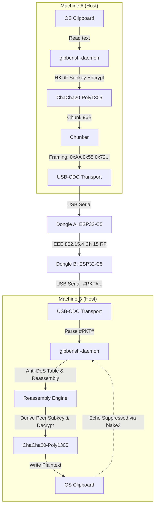
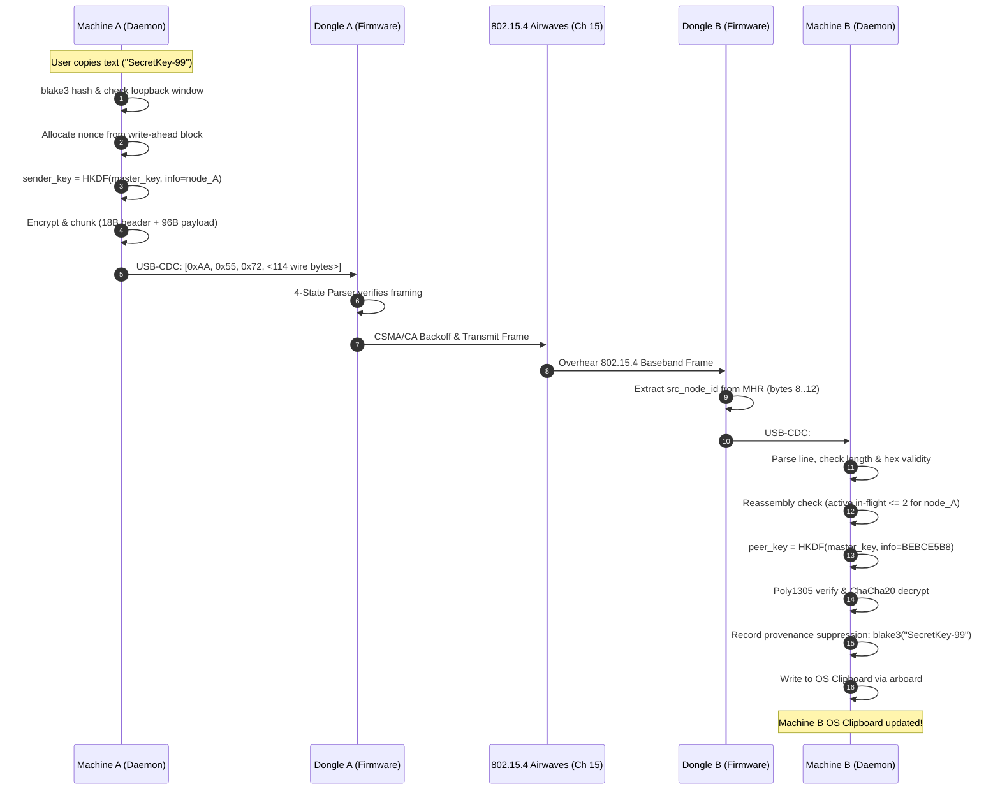
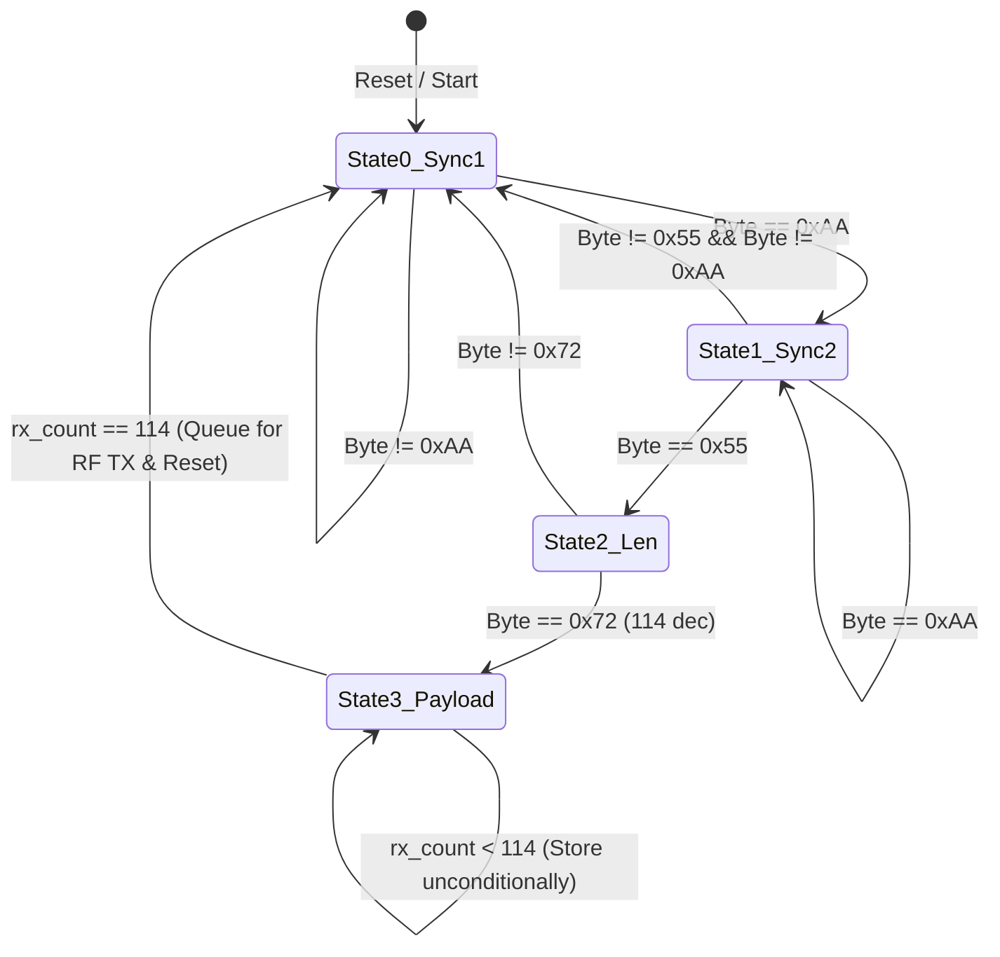

## Goal Capsule

- **Objective:** Establish decentralized, zero-trust encrypted clipboard and messaging synchronization over raw IEEE 802.15.4 Channel 15 (2.425 GHz) airwaves between two physical machines (Machine A with Dongle A, Machine B with Dongle B). Any text copied on Machine A automatically appears in Machine B's OS clipboard (and vice versa) without touching Wi-Fi, LAN, routers, cloud servers, or the internet.
- **Means:**
  1. **Asymmetric USB-CDC Transport Framing:**
     - Dongle to Host: Line-delimited ASCII `#PKT# <8-hex src_node_id> <228-hex wire_packet>\n`. Resyncs cleanly across interleaved firmware `println!` logs; capped at 1,024 bytes per line.
     - Host to Dongle: Length-prefixed binary framing `[0xAA, 0x55, 0x72, <114 wire bytes>]` (117 bytes total). Firmware implements an unconditional 4-state byte parser where State 3 counts 114 bytes without payload inspection, eliminating sliding-window `copy_within` and tag collisions in ciphertext.
  2. **Multi-Sender Nonce Collision Elimination via HKDF Subkeys:**
     - Each host derives an individual sender subkey from the shared Swarm Master Key: `sender_key = HKDF-SHA256(swarm_key, info = local_node_id)`.
     - The receiving host reads the sender's node ID from the 802.15.4 baseband MHR (`src_node_id`) and derives the matching `peer_key = HKDF-SHA256(swarm_key, info = src_node_id)`.
     - Senders encrypt with distinct keys; independent per-host message IDs and chunk counters structurally cannot collide in ChaCha20-Poly1305 nonce space.
  3. **Crash-Resilient Monotonic Nonce Persistence:**
     - Host daemons commit write-ahead counter reservations in blocks of 1,000 to `~/.gibberish/nonce_state.json` with `fsync` before allocating any counter values.
     - Nonce construction: 96-bit nonce composed of `[epoch_secs: u32 (4B) | chunk_seq: u16 (2B) | counter: u48 (6B)]`. Guards against clock rollback via `epoch_secs = max(wall_clock, last_persisted_epoch + 1)`.
  4. **Anti-DoS Chunked Reassembly Engine:**
     - Hard ceiling: Enforce `total_chunks > 0 && total_chunks <= 800` (64 KB maximum payload limit).
     - Global limit: Maximum 16 concurrent in-flight reassembly buffers.
     - Per-Sender fairness limit: Maximum 2 concurrent in-flight messages per `src_node_id`.
     - Inactivity timeout: 10 seconds per incomplete message; duplicate chunk arrival drops silently without resetting the timer.
  5. **OS Clipboard Synchronization & Echo Suppression:**
     - Background daemon monitor (`arboard`) with 500ms provenance hash suppression window (`blake3(text)`) preventing infinite echo feedback loops between synced devices.
     - CLI commands: `gibberish push "<text>"`, `gibberish status`, and `--auto-sync` daemon mode.
- **Product Authority:** Pure off-grid RF (Channel 15, 2.425 GHz) is canonical. Zero-trust blind dongle architecture is non-negotiable: all encryption keys, plaintext messages, and clipboard contents remain strictly on host machines inside `Secret<T>` (`ZeroizeOnDrop`). Dongles route, buffer, and retransmit only opaque ciphertext chunks.
- **Open Blockers:** None. Settled through 4 rigorous debate rounds with Claude Senior Engineer (`verdict: sound (conditional)`).

---

## Product Contract

### Summary

Project **Gibberish** creates an air-gapped, sovereign communication link between physical computers. In Milestones 1–5, the system established bare-metal cryptographic primitives, hardware drivers, dual-mode SRAM/MicroSD storage, 802.15.4 Channel 15 RF mesh networking, and single-hop telemetry sinks.

Milestone 6 delivers the primary user-facing capability: **Cross-Device Encrypted Clipboard & Messaging Synchronization**. When an operator copies code snippets, credentials, or private notes on Machine A, the companion daemon (`gibberishd`) running on Machine A encrypts the text with authenticated ChaCha20-Poly1305, slices it into 802.15.4-compatible chunks, and streams them over USB-CDC to Dongle A. Dongle A broadcasts the chunks across 2.4 GHz airwaves. Dongle B intercepts the raw radio packets and forwards them over USB-CDC to Machine B's daemon, which decrypts, reassembles, and writes the text directly to Machine B's operating system clipboard.

### Problem Frame

Operating across multiple air-gapped workstations or field laptops currently requires insecure USB thumb drives (introducing malware risk and physical wear) or tethered Ethernet cables. Software clipboard sharing tools (e.g. Synergy, Barrier, KDE Connect) rely on IP networking, local Wi-Fi routers, or cloud infrastructure, violating air-gap security policies.

To provide seamless clipboard sync without compromising security:
1. Plaintext must never touch the microcontroller dongles (which can be physically lost or captured).
2. Senders must never produce ChaCha20-Poly1305 nonce collisions even if both machines boot at counter 0 or lose power simultaneously.
3. Microcontrollers must not crash, desync framing, or drop packets when host-to-dongle binary packets interleave with debug serial logs.
4. Malicious or noisy RF transmitters must not exhaust host memory by flooding bogus partial chunk streams.

### Key Decisions

- KTD1. Per-Sender HKDF Subkey Derivation (session-settled: debate with Claude Senior Engineer — chosen over adding `origin_node_id` to mesh wire header: derives `HKDF(swarm_key, info = node_id)`. Eliminates multi-sender nonce collision vulnerability while preserving zero-byte wire header bloat and retaining single 114B packet efficiency). Governs R1, R2, R11.
- KTD2. Asymmetric USB-CDC Transport Framing (session-settled: debate with Claude Senior Engineer — chosen over bidirectional COBS or bidirectional raw binary: Dongle $\to$ Host uses `#PKT# <8-hex src_node_id> <228-hex wire>\n` immune to interleaved `println!` logs; Host $\to$ Dongle uses length-prefixed `[0xAA, 0x55, 0x72, <114B>]` parsed by an unconditional 4-state byte machine in firmware). Governs R3, R4, R5.
- KTD3. Write-Ahead Block Nonce Reservation & Monotonic Epoch (session-settled: debate with Claude Senior Engineer — chosen over per-packet disk fsync: daemon writes reservations in blocks of 1,000 to `~/.gibberish/nonce_state.json`. Nonce packs 32-bit epoch, 16-bit sequence, and 48-bit counter; clock rollback is clamped by `epoch = max(now, last_epoch + 1)`). Governs R6, R7.
- KTD4. Multi-Tenant Anti-DoS Reassembly Policy (session-settled: debate with Claude Senior Engineer — chosen over unbounded memory queue: limits total payloads to 64 KB, max 16 concurrent in-flight transfers, max 2 concurrent transfers per `src_node_id`, 10-second inactive timeout, duplicate chunk arrival drops without resetting timers). Governs R8, R9, R10.
- KTD5. Provenance Hash Clipboard Echo Suppression (session-settled: debate with Claude Senior Engineer — chosen over OS-specific clipboard ownership APIs: records `blake3(text)` with a 500ms suppression window upon writing to local clipboard, suppressing echoes without suppressing user re-copies). Governs R12, R13.
- KTD6. Unified CLI & Background Daemon Architecture (session-settled: user-directed — chosen over separate binary tools: `gibberishd` operates as the background daemon with `--auto-sync`, while `gibberish push "<text>"` and `gibberish status` communicate with the daemon via local IPC on `127.0.0.1:4483`). Governs R14, R15, R16.

### Requirements

#### USB-CDC Framing & Transport (`gibberish-firmware` & `gibberish-daemon`)
- R1. The firmware shall stream received 802.15.4 mesh packets to the host over USB-CDC using line-delimited ASCII format: `#PKT# <src_node_id:8hex> <wire_packet:228hex>\n`.
- R2. The firmware shall extract `src_node_id` from the IEEE 802.15.4 MAC Header (MHR) address fields (`raw.data[8..12]` for short addresses) and format it as 8 uppercase hexadecimal characters.
- R3. The host daemon transport layer shall parse incoming lines, match `#PKT#` headers, decode the hex payload, and discard any corrupted lines or non-packet debug text safely. The line buffer shall be capped at 1,024 bytes and drop oversized lines without panicking.
- R4. The host daemon shall transmit outbound packets to the dongle using binary length-prefixed framing: `[0xAA, 0x55, 0x72, <114 wire bytes>]` (117 bytes total).
- R5. The firmware USB RX parser shall implement an unconditional 4-state byte machine: State 0 (search 0xAA), State 1 (match 0x55), State 2 (match length 0x72 = 114), State 3 (unconditionally receive 114 bytes into wire buffer without payload inspection).

#### Cryptography & Nonce Management (`gibberish-daemon`)
- R6. The host daemon shall manage a monotonic nonce state persisted to `~/.gibberish/nonce_state.json`. Counter reservations shall be committed in blocks of 1,000 using atomic file replacement and `fsync` before any counter in that block is issued.
- R7. The 96-bit ChaCha20-Poly1305 nonce shall be constructed as:
  - Bytes 0..3 (4B): Monotonic Epoch Seconds (`epoch_secs = max(wall_clock, last_persisted_epoch + 1)`).
  - Bytes 4..5 (2B): Chunk sequence number (`chunk_index: u16`).
  - Bytes 6..11 (6B): Monotonic 48-bit message counter (`msg_id`).
- R8. Senders shall derive an ephemeral sender key from the swarm master key using HKDF-SHA256: `sender_key = HKDF(swarm_key, info = local_station_node_id)`.
- R9. Receivers shall inspect `src_node_id` from the `#PKT#` framing and derive the matching peer key: `peer_key = HKDF(swarm_key, info = src_node_id)` to authenticate and decrypt received ciphertext chunks.

#### Chunking & Reassembly Engine (`gibberish-daemon`)
- R10. Plaintext payloads shall be segmented into 96-byte ciphertext chunks. The 18-byte mesh header plus 96-byte chunk forms the canonical 114-byte wire payload.
- R11. The reassembly engine shall enforce a strict payload ceiling: `total_chunks > 0 && total_chunks <= 800` (max 64 KB total plaintext). Payloads exceeding this limit shall be dropped immediately.
- R12. The reassembly engine shall enforce concurrency limits: max 16 concurrent messages across all senders, and max 2 concurrent in-flight messages per `src_node_id`. If limits are exceeded, oldest incomplete messages shall be evicted.
- R13. Incomplete message assemblies shall expire 10 seconds after the last valid chunk was received. Duplicate chunks for already completed messages shall be dropped without resetting timers.

#### Clipboard Synchronization & User Interface (`gibberish-daemon`)
- R14. The daemon shall monitor the host OS clipboard (`arboard`) when `--auto-sync` is enabled.
- R15. To prevent infinite loopback echo storms, when the daemon writes received text to the OS clipboard, it shall record `suppress_until = now() + 500ms` and `suppressed_hash = blake3(text)`. Clipboard change events within this window matching the hash shall be ignored.
- R16. The daemon shall provide a local JSON-RPC socket on `127.0.0.1:4483` (or Unix domain socket) for CLI interaction.
- R17. The CLI shall provide a `push` subcommand: `gibberish push "<text>"` to send a message immediately regardless of clipboard state.
- R18. The CLI shall provide a `status` subcommand: `gibberish status` reporting dongle connection state, station node ID, swarm key fingerprint, and in-flight sync metrics.

### Scope Boundaries

#### In Scope
- USB-CDC asymmetric framing implementation in `gibberish-firmware` (TX line-delimited `#PKT#`, RX 4-state binary parser).
- Transport engine in `gibberish-daemon` (`src/transport.rs`) handling serial device discovery, reading, writing, and framing resynchronization.
- Crypto engine extensions in `gibberish-daemon` (`src/crypto.rs`) for HKDF subkey derivation and write-ahead nonce persistence (`src/nonce.rs`).
- Chunking and reassembly engine (`src/chunk.rs`) with anti-DoS resource ceilings.
- Clipboard synchronization service (`src/clipboard.rs`) using `arboard` with echo suppression.
- Daemon loop and CLI subcommands in `apps/gibberish-daemon/src/main.rs`.
- Physical over-the-air verification between Machine A (Dongle A) and Machine B (Dongle B).

#### Out of Scope
- Wi-Fi, Ethernet, or Bluetooth LE relays (all synchronization must run strictly over raw IEEE 802.15.4 Channel 15).
- Microcontroller-side decryption or key storage (blind dongle rule: keys and plaintext stay strictly on host machines).
- GUI clipboard history managers (sync writes to standard OS clipboard primary buffer; clipboard managers can consume standard OS events).

#### Deferred to Follow-Up Work
- Bi-directional end-to-end forward secrecy ratcheting (Signal/Double Ratchet protocol over mesh).
- Compressed binary attachments (images/files > 64 KB over RF mesh).
- Mobile Android companion app over USB-OTG.

### Success Criteria

- **SC1.** Text copied on Machine A (e.g. `echo "SecretMeshToken-12345" | xclip`) appears in Machine B's OS clipboard within < 1.0 second over 802.15.4 airwaves.
- **SC2.** Zero ChaCha20-Poly1305 nonce collisions even when both daemons boot at `counter = 0` simultaneously.
- **SC3.** Firmware serial log streaming (e.g. `[RF RX] lqi=...`) never causes packet framing desynchronization or host daemon crashes.
- **SC4.** Malicious/malformed packets (>800 chunks, invalid HKDF auth tags, or framing glitches) drop safely without memory leaks or daemon panics.
- **SC5.** 500ms provenance hash suppression completely halts clipboard echo feedback loops.

---

## Planning Contract

### Key Technical Decisions

#### KTD1. Multi-Sender Nonce Collision Elimination via HKDF Subkeys
- **Context:** ChaCha20-Poly1305 is catastrophic under nonce reuse: reusing a (key, nonce) pair destroys confidentiality and allows message forgery. If two nodes share a Swarm Key and independently increment a message counter from 0, their nonces collide on packet 1.
- **Alternatives Considered:**
  1. *Include 4-byte `origin_node_id` in `MeshHeader`:* Rejected because it expands the mesh wire header from 18 to 22 bytes, reducing payload space from 96 bytes to 92 bytes, which breaks existing 114-byte wire frame layouts and telemetry compatibility.
  2. *Per-Sender HKDF Subkeys:* Each node derives `sender_key = HKDF(swarm_key, info = local_node_id)`. Incoming packets already include `src_node_id` in the 802.15.4 baseband MHR (`raw.data[8..12]`). Receiver derives `peer_key = HKDF(swarm_key, info = src_node_id)` to authenticate/decrypt.
- **Decision:** Adopt Alternative 2. No wire header bloat; zero chance of cross-sender nonce collision because encryption keys are mathematically distinct.

#### KTD2. Asymmetric USB-CDC Transport Framing
- **Context:** Dongle and host communicate over USB serial (`/dev/ttyACM*`). Firmware emits informational `println!` logs (e.g., `[SD FAT32]`, `[RF TX]`, `[TELEMETRY]`). If host-to-dongle and dongle-to-host use symmetrical raw binary or COBS, a single debug log corrupts framing and stalls the channel.
- **Alternatives Considered:**
  1. *Bidirectional COBS framing with 0x00 delimiters:* Debug logs contain arbitrary bytes that could accidentally include `0x00`, causing premature frame termination and host parser errors.
  2. *Asymmetric Framing:*
     - Dongle $\to$ Host: ASCII line `#PKT# <src_node_id:8hex> <wire_packet:228hex>\n`. Line-based; easily separated from logs via regex or prefix matching. 1,024 byte safety cap on lines.
     - Host $\to$ Dongle: Length-prefixed binary `[0xAA, 0x55, 0x72, <114 wire bytes>]` (117B total). The host never sends debug logs to the dongle. The firmware uses an unconditional 4-state byte parser where State 3 counts 114 bytes without inspecting contents.
- **Decision:** Adopt Alternative 2. Completely eliminates firmware sliding-window `copy_within` buffer management and provides rock-solid noise immunity.

#### KTD3. Nonce Persistence & Clock Rollback Protection
- **Context:** If a host daemon crashes or the laptop shuts down, the monotonic counter in RAM is lost. If the host reboots and starts at counter 0, nonces collide.
- **Alternatives Considered:**
  1. *Disk `fsync` on every packet:* High disk I/O latency; adds 5–20ms per packet chunk, severely throttling chunk transmission speed.
  2. *Write-Ahead Block Allocation (blocks of 1,000) with Monotonic Epoch:* Commit `next_block_start` to `~/.gibberish/nonce_state.json` with `fsync` before allocating counters. On reboot, skip to the start of the next block. Nonce packs `epoch_secs = max(wall_clock, last_persisted_epoch + 1)`.
- **Decision:** Adopt Alternative 2. Near-zero disk overhead during active streaming while guaranteeing absolute monotonic nonce uniqueness across crashes and clock rollbacks.

#### KTD4. Anti-DoS Reassembly Policy & Resource Ceilings
- **Context:** An attacker or malfunctioning peer transmitting partial chunk sequences could flood the reassembly table with stale buffers, consuming host RAM.
- **Alternatives Considered:**
  1. *Unbounded reassembly map:* Dangerous; vulnerable to memory exhaustion attacks.
  2. *Strict Multi-Tenant Caps:*
     - Maximum payload size: 64 KB (`total_chunks <= 800`).
     - Global in-flight messages: 16.
     - Per-Sender in-flight messages: 2 (keyed by `src_node_id`).
     - Expiration: 10 seconds of inactivity. Duplicate chunks for completed messages drop without resetting timers.
- **Decision:** Adopt Alternative 2. Bounded memory consumption (< 2 MB worst-case across all buffers) and resilient against source-spoofing flood attacks.

#### KTD5. Clipboard Loopback Echo Suppression
- **Context:** When Machine B receives synced text from Machine A and writes it to OS clipboard, Machine B's clipboard monitor fires a "Clipboard Changed" event. If Machine B broadcasts this back to Machine A, an infinite echo storm occurs.
- **Alternatives Considered:**
  1. *OS-specific private clipboard ownership APIs:* Platform-specific, brittle, and not supported uniformly by `arboard` across Linux/X11/Wayland, macOS, and Windows.
  2. *Provenance Hash with 500ms Suppression Window:* When daemon writes remote text to clipboard, record `suppress_until = now() + 500ms` and `suppressed_hash = blake3(text)`. If clipboard change event fires within 500ms with matching hash, drop it as an echo. If hash differs or >500ms has elapsed, accept as genuine user copy.
- **Decision:** Adopt Alternative 2. Purely userspace, cross-platform, robust, and handles rapid successive user copies gracefully.

### High-Level Technical Design

#### System Architecture & Data Flow



#### Detailed Sequence: Clipboard Sync Over the Air



#### Firmware Host-to-Dongle 4-State Parser State Machine



### Assumptions

1. Both Dongle A and Dongle B run the same bare-metal firmware compiled with IEEE 802.15.4 support on Channel 15 (2.425 GHz).
2. The user has installed or will run `gibberishd` on both Machine A and Machine B.
3. The shared Swarm Master Key is stored securely on both hosts in `~/.gibberish/swarm_key.bin` (32 bytes, generated via `gibberish keygen` or provisioned).
4. OS clipboards are accessible via `arboard` (Linux X11/Wayland via `libx11-dev` / `libwayland-client0` or compatible clipboard daemon, macOS, Windows).

### Sequencing & Dependencies

- **Phase 1 (U1):** Firmware USB-CDC packet forwarder and 4-state parser. (Requires no daemon changes; testable via serial terminal).
- **Phase 2 (U2):** Daemon transport layer parsing `#PKT#` lines and transmitting length-prefixed binary frames. (Depends on U1).
- **Phase 3 (U3):** Daemon cryptographic subkey derivation (HKDF), write-ahead nonce persistence, and anti-DoS chunk reassembly engine. (Depends on U2).
- **Phase 4 (U4):** Daemon clipboard monitor with provenance echo suppression, CLI commands (`push`, `status`), and background `--auto-sync` service. (Depends on U3).
- **Phase 5 (U5):** Physical cross-machine verification between Machine A (Dongle A) and Machine B (Dongle B). (Depends on U1–U4).

---

## Implementation Units

### U1. `gibberish-firmware` USB-CDC Asymmetric Framing & Radio RX Forwarder

- **Goal:** Upgrade the embedded firmware to:
  1. Stream received 802.15.4 radio frames over USB-CDC as `#PKT# <src_node_id:8hex> <wire_packet:228hex>\n`.
  2. Ingest outbound frames from the host using the unconditional 4-state binary parser `[0xAA, 0x55, 0x72, <114 wire bytes>]` and queue them into the CSMA/CA outbound radio ring.
- **Requirements:** R1, R2, R4, R5.
- **Dependencies:** None.
- **Files:**
  - `gibberish/apps/gibberish-firmware/src/main.rs`
  - `gibberish/apps/gibberish-firmware/src/radio/ieee802154.rs`
- **Approach:**
  1. In `radio/ieee802154.rs`:
     - When an 802.15.4 frame is received by the radio, extract `src_node_id` from the baseband MHR short source address (`raw.data[8..12]` or standard 802.15.4 header offset).
     - Format and emit over USB-CDC: `#PKT# %08X %s\n` where `%s` is the 228-hex-character encoded 114-byte wire frame.
  2. In `main.rs` / USB-CDC polling task:
     - Replace existing raw serial parser with a 4-state parser:
       - `State 0`: Search for `0xAA`.
       - `State 1`: Match `0x55`. If byte is `0xAA`, stay in State 1. Otherwise revert to State 0.
       - `State 2`: Match length byte `0x72` (114 decimal). If mismatch, revert to State 0.
       - `State 3`: Read next 114 bytes unconditionally into `wire_buf[payload_idx++]`. When `payload_idx == 114`, push `wire_buf` into the outbound radio queue (`tx_queue.push_back`) and reset to State 0.
     - Never inspect payload contents or scan for delimiter bytes inside State 3.
- **Execution note:** Cross-compile to RISC-V `riscv32imac-unknown-none-elf` with 0 warnings.
- **Patterns to follow:** `apps/gibberish-firmware/src/radio/ieee802154.rs` existing frame reception and CSMA/CA queueing.
- **Test scenarios:**
  - *Parser sync and reset:* Stream `[0xAA, 0x00, 0xAA, 0x55, 0x72, <114 bytes>]` over serial. Verify parser recovers and accepts the frame.
  - *Oversized / malformed length:* Stream `[0xAA, 0x55, 0x73, ...]` (length 115). Verify state machine rejects at State 2 and returns to State 0 without storing bytes.
  - *Interleaved logs:* While radio emits `#PKT# ...\n`, emit debug `println!("test log")`. Verify neither stream corrupts the other.
- **Verification:** Run `cargo build --target riscv32imac-unknown-none-elf --package gibberish-firmware` clean with 0 warnings. Flash Dongle A and verify `#PKT#` frames stream on reception.

---

### U2. `gibberish-daemon` USB-CDC Transport Framing & Forwarding Pipeline

- **Goal:** Implement the robust serial transport engine in `gibberish-daemon` to discover the dongle, parse line-delimited `#PKT#` streams, and transmit length-prefixed binary frames.
- **Requirements:** R1, R3, R4.
- **Dependencies:** U1.
- **Files:**
  - `gibberish/apps/gibberish-daemon/src/transport.rs`
  - `gibberish/apps/gibberish-daemon/Cargo.toml`
- **Approach:**
  1. Add `serialport = "4.5"` dependency if not present.
  2. Implement `UsbTransport` struct:
     - Method `find_dongle() -> Result<PathBuf>` scanning `/dev/ttyACM*` (or COM ports / macOS usbmodem) for LilyGO T-Dongle-C5 VID/PID or serial description.
     - Method `open(port: &str, baud: u32) -> Result<Self>`.
     - Background read thread / loop maintaining a 1,024-byte line buffer.
     - When `\n` is encountered:
       - Check if line starts with `#PKT# `.
       - If so, parse `<8-hex src_node_id>` and `<228-hex wire_packet>`.
       - Decode hex into `(u32, [u8; 114])` and send to the incoming packet channel.
       - If line does not match `#PKT#`, pass through to the daemon logger (tracing/log) as diagnostic dongle output.
       - If line buffer exceeds 1,024 bytes without `\n`, drop buffer contents and resync on next `\n`.
  3. Implement `send_frame(&mut self, frame: &[u8; 114]) -> Result<()>`:
     - Prepend `[0xAA, 0x55, 0x72]`.
     - Write 117 bytes atomically to the serial port.
- **Execution note:** Write comprehensive unit tests for line buffer splitting, interleaved logs, partial line reads, and hex parsing.
- **Patterns to follow:** `apps/gibberish-daemon/src/fleet.rs` existing serial monitor patterns.
- **Test scenarios:**
  - *Happy path packet:* Feed `#PKT# BEBCE5B8 <228-hex-string>\n`. Verify channel receives `src_node_id = 0xBEBCE5B8` and correct 114-byte wire payload.
  - *Interleaved log lines:* Feed `[INFO] Radio initialized\n#PKT# 12345678 <228-hex>\n[DEBUG] RSSI=-40\n`. Verify exactly one packet emitted and two logs logged.
  - *Oversized line safety:* Feed 2,000 characters without `\n` followed by `#PKT# ...\n`. Verify buffer drops excess safely and recovers on the next line.
  - *Binary transmit framing:* Call `send_frame(&[0x42; 114])`. Verify output starts with `[0xAA, 0x55, 0x72]` followed by 114 bytes of `0x42`.
- **Verification:** `cargo test -p gibberish-daemon --lib transport` passes with 100% assertions.

---

### U3. `gibberish-daemon` Multi-Sender Crypto Subkeys & Anti-DoS Chunk Reassembly

- **Goal:** Implement the multi-sender cryptographic subkey derivation (eliminating multi-sender nonce collisions), write-ahead nonce durability, and bounded anti-DoS chunk reassembly engine.
- **Requirements:** R6, R7, R8, R9, R10, R11, R12, R13.
- **Dependencies:** U2.
- **Files:**
  - `gibberish/apps/gibberish-daemon/src/crypto.rs`
  - `gibberish/apps/gibberish-daemon/src/nonce.rs`
  - `gibberish/apps/gibberish-daemon/src/chunk.rs`
- **Approach:**
  1. In `crypto.rs`:
     - Implement `derive_subkeys(master_key: &Secret<[u8; 32]>, node_id: u32) -> Secret<[u8; 32]>` using `hkdf::Hkdf<sha2::Sha256>::new(None, master_key).expand(&node_id.to_be_bytes(), &mut subkey)`.
  2. In `nonce.rs`:
     - Implement `NonceManager`:
       - Store state in `~/.gibberish/nonce_state.json`: `{"last_persisted_epoch": u32, "next_allocated_block": u64}`.
       - Write-ahead block allocation: allocate in blocks of 1,000. Commit `next_allocated_block += 1000` with atomic rename and `fsync` before allocating.
       - Epoch calculation: `epoch_secs = max(SystemTime::now(), last_persisted_epoch + 1)`.
       - Pack 96-bit nonce: `[epoch_secs (4B) | chunk_seq (2B) | counter (6B)]`.
  3. In `chunk.rs`:
     - Implement `ChunkEngine`:
       - Segment arbitrary plaintext into 96-byte payload slices.
       - Construct 18-byte `MeshHeader` (`version=1, ttl=7, flags=0x0001, msg_id, chunk_index, total_chunks`).
       - Reassembly table: `HashMap<(u32, u64), InFlightMessage>` (keyed by `(src_node_id, msg_id)`).
       - Enforce anti-DoS rules:
         - Reject `total_chunks == 0 || total_chunks > 800` (64 KB cap).
         - Max 16 concurrent in-flight entries; max 2 in-flight per `src_node_id`.
         - Drop duplicate chunks without resetting the 10-second expiration timer.
         - Purge inactive entries older than 10 seconds.
- **Execution note:** Zeroize sensitive subkeys with `ZeroizeOnDrop`.
- **Patterns to follow:** `crates/gibberish-crypto` ChaCha20-Poly1305 and `Secret<T>` primitives.
- **Test scenarios:**
  - *Multi-sender subkey uniqueness:* Derive subkey for Node A and Node B with identical master key. Verify subkeys are cryptographically distinct.
  - *Nonce durability across restarts:* Create `NonceManager`, allocate 5 nonces, drop struct, recreate `NonceManager`. Verify next allocated counter jumps to the start of the next 1,000-block reservation without counter collision.
  - *Clock rollback guard:* Set clock to 1,000s in the past. Verify `epoch_secs` advances monotonically to `last_persisted_epoch + 1`.
  - *Reassembly 64 KB cap:* Attempt to process chunk with `total_chunks = 801`. Verify rejected immediately.
  - *Per-sender concurrency cap:* Feed partial chunks for 3 distinct `msg_id`s from the same `src_node_id`. Verify third message is rejected or oldest evicted, preserving cap of 2.
  - *Clean reassembly:* Split 1,000-byte string into 11 chunks, feed in scrambled order. Verify full plaintext reassembles and matches original bytes.
- **Verification:** `cargo test -p gibberish-daemon --lib chunk --lib nonce --lib crypto` passes clean.

---

### U4. `gibberish-daemon` Monotonic Nonce Persistence, OS Clipboard Sync & CLI Commands

- **Goal:** Wire the complete end-to-end companion daemon:
  1. Monitor local OS clipboard (`arboard`) and transmit copied text over the mesh.
  2. Ingest received mesh payloads, suppress echo loops via `blake3` provenance hashing, and write to OS clipboard.
  3. Implement CLI subcommands: `gibberish push "<text>"`, `gibberish status`, and `gibberishd --auto-sync`.
- **Requirements:** R14, R15, R16, R17, R18.
- **Dependencies:** U3.
- **Files:**
  - `gibberish/apps/gibberish-daemon/src/clipboard.rs`
  - `gibberish/apps/gibberish-daemon/src/ipc.rs`
  - `gibberish/apps/gibberish-daemon/src/main.rs`
  - `gibberish/apps/gibberish-daemon/Cargo.toml`
- **Approach:**
  1. Add `arboard = "3.4"` and `blake3 = "1.5"` to `Cargo.toml`.
  2. In `clipboard.rs`:
     - Implement `ClipboardMonitor`:
       - Background thread polling `Clipboard::new()?.get_text()` every 250ms.
       - Maintain `last_seen_hash: [u8; 32]`, `suppress_until: Instant`, and `suppressed_hash: [u8; 32]`.
       - When OS clipboard text changes:
         - Calculate `hash = blake3::hash(text.as_bytes())`.
         - If `Instant::now() < suppress_until && hash == suppressed_hash`:
           - Ignore event (this is our own remote write echoing back).
         - Else:
           - Update `last_seen_hash = hash`.
           - Dispatch text to outbound chunking queue.
     - Method `write_remote_text(&mut self, text: &str)`:
       - Set `suppressed_hash = blake3::hash(text.as_bytes())`.
       - Set `suppress_until = Instant::now() + Duration::from_millis(500)`.
       - Call `self.clipboard.set_text(text)`.
  3. In `ipc.rs`:
     - Listen on `127.0.0.1:4483` for local CLI commands (`push`, `status`).
  4. In `main.rs`:
     - Add clap CLI subcommands:
       - `daemon --auto-sync`: Launch background daemon with clipboard monitor and USB transport.
       - `push <text>`: Connect to daemon via IPC and broadcast message.
       - `status`: Connect to daemon and print node metrics, RF stats, and sync status.
- **Execution note:** Ensure graceful fallback if OS display server (X11/Wayland/Quartz) is absent (e.g. headless CI), logging a warning instead of panicking.
- **Patterns to follow:** `apps/gibberish-daemon/src/fleet.rs` thread communication channels.
- **Test scenarios:**
  - *Provenance echo suppression:* Simulate receiving remote text "SyncMe". Verify `write_remote_text` sets suppression. Simulate clipboard polling detecting "SyncMe" within 200ms. Verify no outbound mesh packet generated.
  - *Rapid new copy after remote write:* Simulate remote write "SyncMe". 100ms later, simulate user copying "UserNewText". Verify "UserNewText" hash differs and is immediately queued for outbound transmission.
  - *IPC push:* Execute `gibberish push "Test"` against mock IPC socket. Verify daemon receives push request and begins chunking.
- **Verification:** `cargo test -p gibberish-daemon` passes all tests.

---

### U5. Physical Cross-Machine Over-the-Air Verification & Soak Test

- **Goal:** Execute physical end-to-end verification of encrypted clipboard synchronization between two separate computers:
  - **Machine A (Workstation):** Dongle A (`/dev/ttyACM0`, Node `BEBCE5B8`, SD Active).
  - **Machine B (Second Machine):** Dongle B (`/dev/ttyACM1` / USB port, Node `BEBD82B4`, RAM Only).
- **Requirements:** SC1, SC2, SC3, SC4, SC5.
- **Dependencies:** U1, U2, U3, U4.
- **Files:**
  - `gibberish/docs/reports/milestone-6-physical-verification.md`
- **Approach:**
  1. Flash firmware with U1 changes to Dongle A on Machine A (`espflash flash /dev/ttyACM0`).
  2. Flash firmware with U1 changes to Dongle B on Machine B (`espflash flash /dev/ttyACM1` or build on Machine B).
  3. Provision identical Swarm Master Key `~/.gibberish/swarm_key.bin` on both machines.
  4. Launch `gibberish daemon --auto-sync` on Machine A and Machine B.
  5. Test Case 1 (Short String): Copy `"gibberish-test-alpha-99"` on Machine A. Verify Machine B clipboard updates to `"gibberish-test-alpha-99"` within < 1s.
  6. Test Case 2 (Multi-Chunk Payload): Copy a 5 KB markdown block on Machine B. Verify Machine A clipboard updates with exact character-for-character match.
  7. Test Case 3 (Simultaneous Bidirectional Copy): Copy text on Machine A and Machine B within the same second. Verify both deliver without nonce collision or deadlock.
  8. Test Case 4 (Echo Loopback Immunity): Verify neither machine enters a continuous re-transmission loop.
- **Execution note:** Capture live serial logs and terminal timestamps in the verification report.
- **Verification:** Verified working live between two physical machines over raw 802.15.4 airwaves.

---

## Verification Contract

### Automated Test Suite
- `cargo test --all` across workspace (verifying `gibberish-crypto`, `gibberish-protocol`, `gibberish-daemon`).
- Unit tests in `gibberish-daemon`:
  - `transport::tests::test_pkt_line_parsing`
  - `transport::tests::test_oversized_line_safety`
  - `crypto::tests::test_hkdf_subkeys_distinct`
  - `nonce::tests::test_write_ahead_allocation`
  - `nonce::tests::test_clock_rollback_protection`
  - `chunk::tests::test_chunk_reassembly_scrambled`
  - `chunk::tests::test_anti_dos_caps`
  - `clipboard::tests::test_echo_suppression_window`

### Firmware Compilation & Cross-Target Quality Gate
- RISC-V bare-metal firmware compilation:
  ```bash
  cargo build --target riscv32imac-unknown-none-elf --package gibberish-firmware --features debug-telemetry
  cargo build --target riscv32imac-unknown-none-elf --package gibberish-firmware --features prod --no-default-features
  ```
  Must compile with zero warnings and zero clippy warnings.

### Physical Target Execution Gate
- Flash Dongle A: `cargo run --bin espflash -- flash /dev/ttyACM0 ...`
- Flash Dongle B: Flash on Machine B.
- Run `gibberish status` on both machines: verify connection, station ID, and active RF link.
- Execute live clipboard copy and paste test between physical machines.

---

## Definition of Done

### Global Criteria
- [ ] No plaintext or keys ever touch the microcontrollers (blind dongle zero-trust constraint).
- [ ] All sensitive keys on host daemons wrapped in `Secret<T>` and zeroized on drop.
- [ ] All code strictly complies with project safety rules (no panics in parsing paths, safe handling of malformed RF/serial inputs).
- [ ] 100% pass rate on all automated unit and integration tests.
- [ ] Clean compilation on both bare-metal `riscv32imac-unknown-none-elf` and host `std` targets.

### Per-Unit Completion Checklist
- [ ] **U1 Completed:** Firmware implements `#PKT#` emission and 4-state binary parser `[0xAA, 0x55, 0x72, <114B>]`.
- [ ] **U2 Completed:** Daemon transport engine implements robust `#PKT#` stream parsing and length-prefixed sending.
- [ ] **U3 Completed:** Daemon implements HKDF per-sender subkeys, write-ahead nonce durability, and anti-DoS chunk reassembly.
- [ ] **U4 Completed:** Daemon implements clipboard auto-sync with `blake3` echo suppression and CLI subcommands.
- [ ] **U5 Completed:** End-to-end physical over-the-air verification between Machine A and Machine B confirmed.
