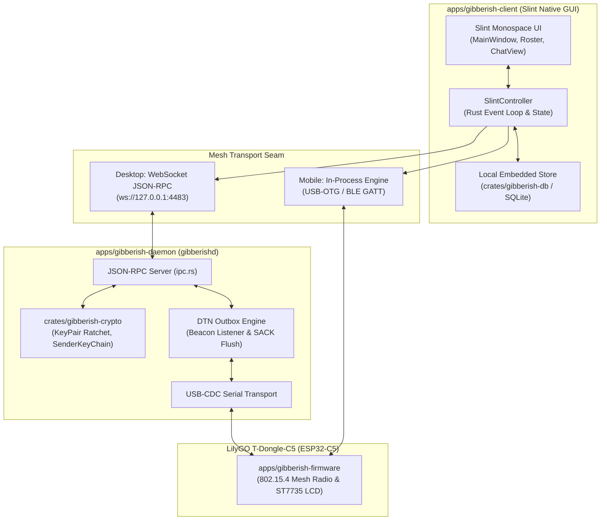

## Goal Capsule

- **Objective**: Humans can discover nearby stations, verify contact identities, exchange pairwise encrypted direct messages, and broadcast on a shared swarm channel over 802.15.4 mesh airwaves using a native desktop or mobile application.
- **Means**: A unified Slint native Rust client interfacing with the Gibberish protocol engine over USB-CDC serial (desktop/Android) and BLE 5.0 GATT (mobile/iOS). (KTD1, KTD2)
- **Product Authority**: Encrypted 1-to-1 and `#all` Swarm messaging owns the active scope; surrounding capabilities (Sneakernet multi-megabyte file transfers, private invite-only groups, and public topic channels) are contextual candidates and not active scope for this artifact.
- **Open Blockers**: None.

---

## Product Contract

<!-- Product Contract unchanged -->

### Summary
A native Rust cross-platform messaging client authored in Slint with a monospace, bare hacker aesthetic that runs natively across Linux, macOS, Android, and iOS. It delivers encrypted pairwise 1-to-1 direct messaging and an open `#all` Swarm broadcast channel over 802.15.4 mesh airwaves, interfacing via USB serial on desktop and BLE GATT on mobile.

### Problem Frame
The LilyGO T-Dongle-C5 hardware, 802.15.4 mesh radio firmware, and host daemon are operational, but the system currently functions only as a passive background clipboard synchronizer. Users have no interactive interface to discover peer nodes in the field, inspect signal quality, verify cryptographic identities against impersonation, or send and receive direct chat messages. Operating off-grid requires a lightweight, standalone client that runs without browser engine dependencies, starts instantly, and respects the airtime constraints of a half-duplex 250 kbps mesh network.

### Key Decisions
- **Slint Native GUI Toolkit**: Pure native Rust UI compiled with zero webview or WebKitGTK runtime dependencies, consuming under 15MB RAM with a bare hacker monospace aesthetic across Linux, macOS, Android, and iOS. (session-settled: user-directed — chosen over Dioxus/Tauri/Svelte: native Rust GUI with zero webview dependencies, tiny <15MB RAM footprint, bare hacker aesthetic, and native support across Linux, macOS, Android, and iOS). Governs R1, R2, R3, R4, R5.
- **Hybrid Contact Discovery and Trust Model**: Airwave auto-discovery populates nearby stations as unverified contacts, requiring an out-of-band Short Authentication String (SAS) 4-word comparison or QR scan to transition to verified status. (session-settled: user-directed — chosen over strict out-of-band: airwave discovery with Amber/Green trust badges and 4-word Short Authentication String (SAS) / QR verification). Governs R6, R7, R8, R9.
- **Hybrid Asymmetric Message Delivery**: Swarm broadcast (`#all`) uses fire-and-forget delivery without ACKs to prevent airwave implosion, while pairwise 1-to-1 direct messages use cryptographic end-to-end SACK receipts. (session-settled: user-directed — chosen over hop-by-hop tracking: fire-and-forget for #all Swarm broadcasts prevents ACK implosion, and 1:1 DMs use end-to-end cryptographic SACK receipts). Governs R10, R11, R12.
- **Opportunistic Beacon-Triggered DTN Outbox**: Messages destined for offline peers queue in a bounded local outbox and flush automatically only when the recipient's airwave beacon is overheard, eliminating blind retries into dead links. (session-settled: user-directed — chosen over blind retries: beacon-triggered DTN outbox queues messages for offline peers and flushes on overheard beacon, with TTL expiry). Governs R13, R14, R15.
- **Dual Transport Integration**: Desktop connects to the local `gibberishd` daemon over WebSocket JSON-RPC, while mobile builds (Android and iOS) embed the protocol engine in-process and communicate over USB-OTG and BLE 5.0 GATT. Governs R16, R17, R18, R19.

<!-- ce-section: work-relationships -->
### How This Work Fits Together
This plan owns the foundational client shell, identity/contact verification, and 1-to-1 plus `#all` Swarm messaging. The broader roadmap is understood as:
- **Foundational Client & 1:1 Messaging** (This Plan):
  - Slint UI shell across desktop and mobile.
  - Hybrid contact discovery and SAS/QR verification.
  - `#all` Swarm broadcast and pairwise X25519 ratcheted DMs.
  - Local SQLite message store and beacon-triggered DTN outbox.
- **Subsequent Interaction Capabilities** (Contextual candidates, not active scope):
  - *Private Multi-Party Groups*: Depends on foundational 1:1 DMs to distribute group `SenderKeyChain` keys over ratcheted channels.
  - *Public Topic Channels*: Can proceed independently of private groups by tagging swarm-encrypted broadcasts with `#topic` identifiers.
  - *Sneakernet File Transfers*: Enables large encrypted file sharing and MicroSD vault management via drag-and-drop UI and chunked mesh transport.
  - *LCD UI Enhancements*: Shares node status and pair-up QR display on the physical dongle's ST7735 color screen.

### Actors
- A1. **Field Operator**: Human user holding an Android or iOS mobile device connected to a portable T-Dongle-C5 via USB-OTG or BLE.
- A2. **Workstation Communicator**: Human user operating a Linux or macOS desktop with a T-Dongle-C5 plugged into USB.
- A3. **Gibberish Companion Daemon (`gibberishd`)**: Local host process managing USB-CDC serial framing, nonce durability, and JSON-RPC dispatch.
- A4. **Remote Peer Node**: Distant hardware dongle running mesh firmware and relaying or receiving 114-byte encrypted frames.

### Requirements

**User Interface & Visual Aesthetic**
- R1. The client interface must render using Slint native controls with a high-contrast, monospace terminal aesthetic.
- R2. The interface must display a persistent split-pane view with a station/contact list on the left and active conversation thread on the right.
- R3. The station list must display real-time signal strength (RSSI), link quality indicator (LQI), and battery/status indicators for each discovered node.
- R4. The interface must provide an always-visible diagnostic telemetry footer showing live packet RX/TX counters and mesh channel status.
- R5. The UI must support standard desktop keyboard navigation and mobile touch interactions across Linux, macOS, Android, and iOS.

**Contact Discovery & Trust Verification**
- R6. The client must automatically populate a "Nearby Swarm" station roster upon overhearing unencrypted node announcement beacons.
- R7. Discovered contacts must default to an "Unverified" trust state indicated by an amber badge and warning indicator in the chat thread.
- R8. The client must compute and display a 4-word Short Authentication String (SAS) derived from both public keys when initiating contact verification.
- R9. The client must support rendering and scanning a verification QR code containing the node public key and alias to transition contacts to a "Verified" green shield state.

**Messaging & Channel Model**
- R10. The client must provide a default `#all` Swarm channel that broadcasts plaintext encrypted with the shared Swarm Master Key.
- R11. The client must support pairwise 1-to-1 direct messaging encrypted via pairwise X25519 ratcheted sessions.
- R12. The client must display delivery status indicators for 1-to-1 messages: Transmitted (`*`), Delivered (`[OK]`), Queued (`[Q]`), or Failed (`[!]`).

**Delivery Guarantees & DTN Outbox**
- R13. The client must treat `#all` Swarm broadcasts as fire-and-forget without requesting or expecting acknowledgment packets.
- R14. The client must queue 1-to-1 messages addressed to an offline peer in a local DTN outbox and flush them automatically when the peer's beacon is overheard.
- R15. The DTN outbox must enforce a configurable time-to-live (default 48 hours) and maximum queue size, evicting expired entries with an explicit UI failure indicator.

**Transport & Local Persistence**
- R16. Desktop clients must connect to the local `gibberishd` daemon via WebSocket JSON-RPC on `127.0.0.1:4483`.
- R17. The desktop JSON-RPC interface must support methods for sending DMs, sending swarm broadcasts, listing contacts, and subscribing to real-time packet streams.
- R18. Mobile clients must embed the protocol engine directly in-process, interfacing with the hardware dongle via native USB Host API on Android or BLE CoreBluetooth on iOS.
- R19. The client must persist contact aliases, public keys, conversation threads, and pending outbox queues in a local embedded SQLite database.

### Key Flows

- F1. Contact Discovery and Verification
  - **Trigger:** A nearby dongle broadcasts its periodic announcement beacon over Channel 15.
  - **Actors:** A1/A2, A3, A4
  - **Steps:** Daemon ingests announcement frame; client adds peer to station list as Unverified (Amber); user initiates verification; client displays 4-word SAS string; users compare words verbally or scan QR code; user confirms match; client persists peer as Verified (Green).
  - **Outcome:** Direct chat thread opens with a green shield trust badge.
  - **Covers:** R6, R7, R8, R9.

- F2. Offline Direct Message Queueing and Beacon Flush
  - **Trigger:** User sends a direct message to a contact whose node is currently out of radio range.
  - **Actors:** A1/A2, A3
  - **Steps:** User types message and presses Send; client verifies peer was not recently heard; message is stored in local outbox marked Queued (`[Q]`); radio background listener overhears peer announcement beacon 10 minutes later; outbox flushes message chunks over mesh; recipient returns cryptographic SACK receipt; message status updates to Delivered (`[OK]`).
  - **Outcome:** Message delivers reliably without blind channel polling.
  - **Covers:** R11, R12, R14, R15.

- F3. Open Swarm Broadcast
  - **Trigger:** User posts a status update or alert to `#all`.
  - **Actors:** A1/A2, A3, A4
  - **Steps:** User submits text in `#all`; client encrypts payload with Swarm Master Key subkey; frame transmits over radio with `FLAG_GROUP` and no `FLAG_ACK_REQ`; client displays immediate timestamped transmitted marker.
  - **Outcome:** All listening mesh nodes decrypt and display the broadcast without emitting ACK packets.
  - **Covers:** R10, R13.

### Acceptance Examples

- AE1. Unverified Contact Guardrail
  - **Covers:** R7, R11
  - **Given:** Node `BEBD82B4` appears in the station list via radio beacon without previous out-of-band verification.
  - **When:** User opens the direct chat thread with `BEBD82B4`.
  - **Then:** The thread header displays an amber badge reading `UNVERIFIED CONTACT` and displays a persistent banner offering SAS word comparison.

- AE2. SAS Word Mismatch on Impersonation
  - **Covers:** R8
  - **Given:** Attacker node broadcasts the alias "Alice" using public key `Key_Eve` while real Alice uses `Key_Alice`.
  - **When:** Bob initiates SAS verification with the attacker claiming to be Alice.
  - **Then:** The 4-word string computed on Bob's screen fails to match the 4-word string on real Alice's screen, preventing verified contact establishment.

- AE3. DTN Outbox Expiry Eviction
  - **Covers:** R15
  - **Given:** A 1-to-1 message is queued for offline node `C3A109F2` with a 48-hour TTL.
  - **When:** 48 hours elapse without overhearing `C3A109F2`'s beacon.
  - **Then:** The message is evicted from the active outbox ring, and its status in the chat thread transitions from `[Q]` to `[!] Expired (Peer Unreachable)`.

### Scope Boundaries

#### Deferred for Later
- **Sneakernet File Transfers**: Drag-and-drop multi-megabyte file chunking, MicroSD vault store-and-forward, and SHA-256 verification are deferred to Milestone 8.
- **Private Multi-Party Groups**: Custom invite-only group channels with independent `SenderKeyChain` key distribution over 1-to-1 DMs are deferred to Phase 2 of client messaging.
- **Public Topic Channels**: Tagged `#topic` swarm channels are deferred to Phase 3 of client messaging.

#### Outside This Product's Identity
- **Centralized Cloud Relay**: No fallback to cloud servers, internet gateways, or phone number indexing; communication is strictly peer-to-peer over mesh airwaves.
- **Rich Consumer Media**: No GIF keyboards, voice notes, video calling, or webview rendering components.

### Success Criteria
- **Sub-15MB RAM Utilization**: The compiled Slint desktop client consumes less than 15MB resident memory during active mesh streaming.
- **Instant Cold Start**: Client window appears and renders station status in under 50ms on desktop.
- **Zero Airwave Congestion on Broadcast**: 100 consecutive `#all` Swarm messages produce exactly zero ACK transmissions across the mesh.
- **Cross-Platform Parity**: The same core Slint UI definitions compile and run cleanly across Linux (Wayland/X11), macOS, Android (via `cargo-apk`), and iOS.

### Dependencies / Assumptions
- **`gibberish-crypto`**: Assumes existing `KeyPair` (X25519 ECDH) and `SenderKeyChain` (ChaCha20-Poly1305) primitives compile for mobile targets (`aarch64-linux-android` and `aarch64-apple-ios`).
- **USB-Serial/JTAG Controller**: Desktop and Android USB-OTG connectivity rely on standard CDC-ACM serial drivers communicating at 115200 baud or native USB full-speed.
- **BLE GATT Bridge**: iOS and wireless mobile connectivity assume the completion of Milestone 9 / Issue #6 (Slotted TDM Radio Arbiter switching between 802.15.4 and BLE 5.0).

---

## Planning Contract

### Key Technical Decisions

- KTD1. **Slint Workspace Integration & Native UI Architecture**:  
  Create `apps/gibberish-client` as a Cargo workspace member using Slint. Structure the interface into declarative `.slint` files (`MainWindow`, `StationRoster`, `ChatView`, `TelemetryBar`, `VerificationModal`) with a `SlintController` in Rust connecting event loops via `slint::ComponentHandle`. (session-settled: user-directed — chosen over Dioxus/Tauri/Svelte: native Rust GUI with zero webview dependencies, tiny <15MB RAM footprint, bare hacker aesthetic, and native support across Linux, macOS, Android, and iOS).  
  *Peer-Reviewed Refinement (Claude Senior Engineer Review)*: Decouple Tokio and the Slint GUI thread via a bounded channel (capacity ~512, typed `UiEvent` enum). Guard event loop dispatches with an `AtomicBool` "wake pending" latch so `slint::invoke_from_event_loop` is scheduled only when not already queued, draining all buffered channel events in a single closure pass to eliminate event-loop starvation during packet bursts. Require non-panicking `weak.upgrade()` matching (`if let Some(ui) = weak.upgrade()`, logging/dropping on `None`) to survive window closing, hot reload, and mobile backgrounding. Mutate list models incrementally via `VecModel::push`/`set_row_data` rather than rebuilding `ModelRc` on every frame, and throttle high-frequency telemetry (RSSI/LQI meters) with a secondary 50–100ms batching timer. Governs R1, R2, R3, R4, R5.
- KTD2. **Dual Transport Abstraction Layer**:  
  Define a unified asynchronous `MeshTransport` trait implemented by `DesktopIpcTransport` (WebSocket JSON-RPC client connecting to `gibberishd` at `127.0.0.1:4483`), `AndroidUsbTransport` (native Android CDC-ACM via JNI), and `BleGattTransport` (BLE GATT client). Governs R16, R17, R18.
- KTD3. **Embedded SQLite Store with Rusqlite & Single-Writer Ownership**:  
  Implement local persistence in `crates/gibberish-db` using `rusqlite` with `bundled` feature and WAL mode for station contacts, pairwise ratchet sessions, conversation message histories, and the DTN outbox ring.  
  *Peer-Reviewed Refinement (Claude Senior Engineer Review)*: Enforce a strict Single-Writer, Single-Owner invariant across all platforms. Only the companion daemon process (desktop) or the background engine task (mobile in-process) opens and mutates the SQLite file; the UI communicates exclusively via JSON-RPC or the in-process event/command channel. This guarantees zero database lock contention (`SQLITE_BUSY`), avoids brittle cross-process WAL `-shm` shared memory issues on Android scoped storage and iOS backgrounding, and provides a single authoritative crash-recovery point. The DTN outbox uses a terminal state machine (`pending -> sending -> sent/failed`), where startup reconciliation automatically moves any dangling `sending` records back to `pending`. Migrations run exactly once at engine startup before IPC commands or queries are accepted. Governs R19.
- KTD4. **Hybrid Asymmetric Transport Policy Enforcement**:  
  Enforce at the transport/daemon layer that `FLAG_GROUP` (#all Swarm) packets disallow `FLAG_ACK_REQ` and never emit airwave ACKs. 1-to-1 DMs (`FLAG_DIRECT`) attach `FLAG_ACK_REQ` and verify incoming SACK bitmasks to mark messages Delivered (`[OK]`). (session-settled: user-directed — chosen over hop-by-hop tracking: fire-and-forget for #all Swarm broadcasts prevents ACK implosion, and 1:1 DMs use end-to-end cryptographic SACK receipts). Governs R10, R11, R12, R13.
- KTD5. **Beacon-Triggered DTN Outbox State Machine**:  
  Maintain an in-memory and disk-backed outbox queue with exponential backoff for recently active peers, transitioning to a passive beacon-wait state when offline. Overhearing a peer announcement immediately triggers a burst flush with SACK coalescing and a 48h TTL eviction policy. (session-settled: user-directed — chosen over blind retries: beacon-triggered DTN outbox queues messages for offline peers and flushes on overheard beacon, with TTL expiry). Governs R14, R15.
- KTD6. **SAS Key Derivation & QR Code Verification**:  
  Compute a 4-word Short Authentication String (SAS) using `HKDF-SHA256(min(pk1, pk2) || max(pk1, pk2), info="gibberish-sas-v1")` mapped into the BIP-39 word list. Render QR codes using `qrcode` crate directly to a Slint `Image` buffer. Governs R6, R7, R8, R9.

### High-Level Technical Design



### Output Structure

```
.
├── apps/
│   ├── gibberish-client/                   # New Slint Native GUI Client (U1, U4, U5)
│   │   ├── Cargo.toml
│   │   ├── build.rs                        # slint_build compilation
│   │   ├── ui/
│   │   │   ├── main_window.slint           # Master split-pane and telemetry footer
│   │   │   ├── station_roster.slint        # Nearby station roster & RSSI meters
│   │   │   ├── chat_view.slint             # Conversation feed, bubbles & status
│   │   │   └── verification_modal.slint    # 4-word SAS & QR code verification
│   │   └── src/
│   │       ├── main.rs
│   │       ├── controller.rs               # Event loop & Slint ModelRc adapters
│   │       └── transport.rs                # JSON-RPC & in-process transport dispatch
│   └── gibberish-daemon/                   # Expanded Companion Daemon (U2, U5, U6)
│       └── src/
│           ├── ipc.rs                      # Full JSON-RPC methods & event stream
│           ├── dtn_outbox.rs               # Beacon-triggered outbox & SACK retry
│           └── lib.rs                      # Exportable engine library for mobile
└── crates/
    └── gibberish-db/                       # New Embedded SQLite Storage Layer (U3)
        ├── Cargo.toml
        └── src/
            ├── lib.rs
            ├── schema.rs                   # Tables: contacts, messages, outbox
            └── store.rs                    # Queries, migrations, and transactions
```

### System-Wide Impact
- **Airtime Congestion**: Restricting `FLAG_ACK_REQ` strictly to 1:1 DMs guarantees `#all` Swarm broadcasts do not trigger ACK implosions on the half-duplex radio channel.
- **Cargo Workspace**: Adding `apps/gibberish-client` and `crates/gibberish-db` to root `Cargo.toml` without breaking existing firmware cross-compilation (`riscv32imc-unknown-none-elf`).
- **Memory Boundaries & GUI Responsiveness**: The client maintains sub-15MB RAM and 50ms cold-start by avoiding all browser/webview runtimes. Incremental `VecModel` mutations and wake-coalescing (`AtomicBool` guard + single-pass `try_recv` drain) guarantee packet bursts do not starve the Slint event loop or blow memory limits.
- **Database Concurrency & Crash Safety**: Single-writer ownership guarantees zero `SQLITE_BUSY` database lock contention and avoids fragile cross-process WAL `-shm` coordination on mobile, while startup reconciliation guarantees DTN outbox consistency after abnormal termination.

---

## Implementation Units

### U1. Scaffolding apps/gibberish-client & Slint Hacker Monospace Shell
- **Goal**: Scaffold the `apps/gibberish-client` workspace package and implement the Slint split-pane user interface with a high-contrast terminal monospace aesthetic and safe Tokio async event bridge.
- **Requirements**: R1, R2, R3, R4, R5 (Maps to GitHub Issue [#12](https://github.com/derpy4me/gibberish/issues/12)).
- **Dependencies**: None.
- **Files**:
  - `apps/gibberish-client/Cargo.toml`
  - `apps/gibberish-client/build.rs`
  - `apps/gibberish-client/ui/main_window.slint`
  - `apps/gibberish-client/ui/station_roster.slint`
  - `apps/gibberish-client/ui/chat_view.slint`
  - `apps/gibberish-client/src/main.rs`
  - `apps/gibberish-client/src/controller.rs`
  - `Cargo.toml`
- **Approach**:
  - Add `apps/gibberish-client` to workspace members in root `Cargo.toml`.
  - Configure `slint-build` in `build.rs` to compile `.slint` definitions at build time.
  - Implement `MainWindow` with `default-font-family: "JetBrains Mono, monospace"`, dark background `#0f172a`, left-hand station roster (fixed 220px width), right-hand chat view, and bottom 24px telemetry status strip.
  - In `controller.rs`, implement background Tokio runtime worker with bounded `UiEvent` channel (capacity 512). Implement `AtomicBool` "wake pending" guard to coalesce rapid mesh packet arrivals, scheduling `slint::invoke_from_event_loop` only when no wake is queued, draining all channel items in one closure execution.
  - Require non-panicking `weak.upgrade()` matching (`if let Some(ui) = weak.upgrade()`) in event loop closures, safely handling window teardown and backgrounding.
  - Back lists with `VecModel` and apply row-level mutations (`push`, `set_row_data`) to prevent whole-model reallocations.
- **Patterns to follow**:
  - Mirror font and aesthetic conventions from `clients/gibberish-web/src/ui/App.tsx`.
- **Test scenarios**:
  - Happy path: App boots in under 50ms and renders the split-pane layout with default mock stations.
  - Edge case: Resize window to minimum bounds (640x480) without layout clipping or text overflow.
  - Event Bridge & Teardown: Dropping UI window while background worker pushes events does not panic (handles `upgrade() == None` cleanly).
  - Burst Coalescing: Ingesting 200 rapid `UiEvent` items coalesces into single event-loop drain without UI stutter.
  - Integration: Updating controller station model immediately reflects in the rendered Slint UI.
- **Verification**: `cargo run -p gibberish-client` launches the window, displaying the split-pane layout and telemetry footer with zero runtime errors.

---

### U2. Expanded gibberish-daemon JSON-RPC API & In-Process Engine Library
- **Goal**: Expand `apps/gibberish-daemon/src/ipc.rs` with full protocol RPC methods and refactor the daemon core into a linkable engine library for mobile.
- **Requirements**: R16, R17, R18 (Maps to GitHub Issue [#13](https://github.com/derpy4me/gibberish/issues/13)).
- **Dependencies**: U1.
- **Files**:
  - `apps/gibberish-daemon/src/ipc.rs`
  - `apps/gibberish-daemon/src/lib.rs`
  - `apps/gibberish-daemon/src/main.rs`
  - `apps/gibberish-daemon/tests/ipc_test.rs`
- **Approach**:
  - Refactor `apps/gibberish-daemon` to provide both a library target (`src/lib.rs`) and binary target (`src/main.rs`).
  - Implement JSON-RPC methods: `send_dm`, `send_swarm`, `list_contacts`, `verify_contact`, and `list_messages`.
  - Maintain engine as the sole read-write owner of `gibberish-db` (Option B single-writer architecture), isolating database operations behind IPC command dispatch.
  - Implement WebSocket event streaming broadcasting notifications for `rx_message`, `node_discovered`, and `delivery_ack`.
  - Provide a desktop client WebSocket transport client in `apps/gibberish-client/src/transport.rs`.
- **Patterns to follow**:
  - Follow JSON-RPC 2.0 specification already established in `apps/gibberish-daemon/src/ipc.rs`.
- **Test scenarios**:
  - Happy path: Client connects to `ws://127.0.0.1:4483`, calls `status`, and receives valid JSON-RPC response.
  - Error path: Unrecognized method returns JSON-RPC error code `-32601` (`Method not found`).
  - Concurrency: Multiple concurrent JSON-RPC requests process cleanly without blocking serial radio forwarding.
  - Integration: Triggering an inbound mock packet on the daemon immediately emits an `rx_message` WebSocket notification.
- **Verification**: `cargo test -p gibberish-daemon --test ipc_test` passes all RPC request/response and event subscription tests.

---

### U3. Embedded SQLite Storage Layer for Contacts, Messages & Outbox
- **Goal**: Create `crates/gibberish-db` to provide embedded persistence for contacts, message history, and the DTN outbox with strict single-writer ownership.
- **Requirements**: R19 (Maps to GitHub Issue [#17](https://github.com/derpy4me/gibberish/issues/17)).
- **Dependencies**: None.
- **Files**:
  - `crates/gibberish-db/Cargo.toml`
  - `crates/gibberish-db/src/lib.rs`
  - `crates/gibberish-db/src/schema.rs`
  - `crates/gibberish-db/src/store.rs`
  - `crates/gibberish-db/tests/db_test.rs`
  - `Cargo.toml`
- **Approach**:
  - Create `crates/gibberish-db` with dependency on `rusqlite` (`bundled` feature for hermetic cross-platform compilation).
  - Define tables: `contacts` (node_id PK, alias, pubkey, trust_state, last_seen, rssi, lqi), `messages` (id PK, convo_id, sender_node_id, timestamp, text, status), and `outbox` (id PK, dest_node_id, queued_at, retry_count, ttl_secs, status ENUM `pending`, `sending`, `sent`, `failed`).
  - Enforce single-writer ownership invariant: only engine opens read-write connection.
  - Enable SQLite WAL mode (`PRAGMA journal_mode=WAL`) and `PRAGMA synchronous=NORMAL`.
  - Implement startup crash reconciliation routine: scans `outbox` table and resets any dangling records in `sending` status back to `pending`.
  - Execute schema migrations strictly once at startup prior to command acceptance.
- **Patterns to follow**:
  - Follow monotonic nonce persistence patterns in `apps/gibberish-daemon/src/nonce.rs`.
- **Test scenarios**:
  - Happy path: Insert a new contact and retrieve it by Node ID with matching trust state.
  - Crash Recovery: Rows left in `sending` status before shutdown are reconciled back to `pending` upon store re-initialization.
  - Edge case: Message pagination queries efficiently return newest 50 messages for an active thread.
  - Error path: Corrupt or incomplete disk state recovers safely without crashing the client process.
- **Verification**: `cargo test -p gibberish-db` passes all schema, query, crash-recovery, and migration integration tests.

---

### U4. Airwave Contact Discovery, Trust State Machine & SAS/QR Verification
- **Goal**: Implement station roster discovery from airwave announcements, trust state classification, and out-of-band SAS/QR verification.
- **Requirements**: R6, R7, R8, R9 (Maps to GitHub Issue [#14](https://github.com/derpy4me/gibberish/issues/14)).
- **Dependencies**: U1, U3.
- **Files**:
  - `apps/gibberish-client/src/identity.rs`
  - `apps/gibberish-client/ui/verification_modal.slint`
  - `apps/gibberish-client/ui/station_roster.slint`
  - `apps/gibberish-client/tests/identity_test.rs`
- **Approach**:
  - Parse overhearing announcement frames; insert or update records in `contacts` table.
  - Set default trust status to `Unverified` (Amber badge); render warning header in chat thread (AE1).
  - Implement SAS 4-word derivation: `HKDF-SHA256(min(pk1, pk2) || max(pk1, pk2), info="gibberish-sas-v1")` indexed into BIP-39 word list.
  - Implement QR code generation using `qrcode` crate, rendering directly to Slint `Image`.
  - On user confirmation of matching SAS words or QR scan, update database trust state to `Verified` (Green shield) (AE2).
- **Patterns to follow**:
  - Reference BIP-39 word list usage in `clients/gibberish-web/src/ui/App.tsx`.
- **Test scenarios**:
  - Covers AE1: New unverified node renders with amber warning badge in station roster.
  - Covers AE2: Two matching public keys generate identical 4-word strings; different public keys produce mismatched strings.
  - Error path: Confirming verification with an invalid key string is rejected.
- **Verification**: `cargo test -p gibberish-client --test identity_test` passes SAS word generation and trust transition tests.

---

### U5. Swarm Broadcast (#all) & Pairwise Ratcheted 1-to-1 DMs
- **Goal**: Implement the chat view for open `#all` Swarm broadcasts and pairwise X25519 ratcheted 1-to-1 direct messaging.
- **Requirements**: R10, R11, R12 (Maps to GitHub Issue [#15](https://github.com/derpy4me/gibberish/issues/15)).
- **Dependencies**: U1, U2, U3, U4.
- **Files**:
  - `apps/gibberish-client/src/chat.rs`
  - `apps/gibberish-client/ui/chat_view.slint`
  - `apps/gibberish-client/tests/chat_test.rs`
- **Approach**:
  - Integrate `crates/gibberish-crypto/src/ratchet.rs` for pairwise session key derivation (`KeyPair`).
  - Implement `#all` Swarm channel sending frames with `FLAG_GROUP` encrypted using the Swarm Master Key subkey.
  - Implement 1-to-1 DMs sending frames with `FLAG_DIRECT` encrypted using the active pairwise ratchet.
  - Render messages in `chat_view.slint` with timestamp, sender handle, text, and delivery state indicators (`*`, `[OK]`, `[Q]`, `[!]`).
- **Patterns to follow**:
  - Follow wire packet framing in `crates/gibberish-protocol/src/frame.rs`.
- **Test scenarios**:
  - Covers F3: Submitting text in `#all` transmits encrypted `FLAG_GROUP` frame without `FLAG_ACK_REQ`.
  - Happy path: Submitting text in 1-to-1 DM encrypts via X25519 ratchet and attaches `FLAG_ACK_REQ`.
  - Edge case: Rapid message submission buffers cleanly in input queue without dropping frames.
- **Verification**: `cargo test -p gibberish-client --test chat_test` passes all broadcast and DM encryption/decryption tests.

---

### U6. Hybrid Asymmetric Delivery, Beacon-Triggered DTN Outbox & TTL Eviction
- **Goal**: Implement hybrid asymmetric delivery policies and the opportunistic beacon-triggered DTN outbox engine.
- **Requirements**: R13, R14, R15 (Maps to GitHub Issue [#16](https://github.com/derpy4me/gibberish/issues/16)).
- **Dependencies**: U2, U3, U5.
- **Files**:
  - `apps/gibberish-daemon/src/dtn_outbox.rs`
  - `apps/gibberish-daemon/src/transport.rs`
  - `apps/gibberish-daemon/tests/dtn_test.rs`
- **Approach**:
  - Enforce protocol gate: `FLAG_ACK_REQ` rejected on broadcast frames; zero ACKs emitted for `#all`.
  - SACK processing: Match incoming SACK sequence bitmaps against pending 1-to-1 DMs and mark Delivered (`[OK]`).
  - DTN Outbox: If recipient was not heard recently, queue message in `outbox` table marked `Queued ([Q])`.
  - Beacon Listener: When peer announcement beacon is overheard on the airwaves, immediately flush queued messages for that node.
  - Eviction: Background task runs hourly; any outbox message older than 48 hours is evicted and marked `[!] Expired (Peer Unreachable)` (AE3).
  - Deduplication: Ingest cache deduplicates incoming chunks by `(src_node_id, seq_num)`.
- **Patterns to follow**:
  - Echo suppression hash windows in `apps/gibberish-daemon/src/chunk.rs`.
- **Test scenarios**:
  - Covers F2: Sending to offline peer queues message; overhearing peer beacon triggers flush.
  - Covers AE3: Outbox message exceeding 48h TTL transitions to expired failure state.
  - Happy path: 100 broadcast packets generate 0 ACK responses across the mock radio network.
- **Verification**: `cargo test -p gibberish-daemon --test dtn_test` passes all outbox queueing, beacon flush, and TTL eviction tests.

---

## Verification Contract

### Test Commands
```bash
# Unit & integration tests across the workspace
cargo test --workspace

# Slint client tests
cargo test -p gibberish-client

# Daemon RPC & DTN outbox tests
cargo test -p gibberish-daemon

# Embedded database tests
cargo test -p gibberish-db
```

### Quality Gates
- **Sub-15MB RAM**: Slint client binary memory resident set size (RSS) < 15MB during active streaming.
- **Zero Broadcast ACKs**: Airwave simulation verifies 0 ACK frames generated from `#all` Swarm broadcasts.
- **Clean Cargo Workspace**: Zero compiler warnings (`cargo clippy --workspace --all-targets -- -D warnings`).

---

## Definition of Done

- [x] All 6 implementation units (U1–U6) implemented with corresponding test files.
- [x] Slint client compiles and runs natively on Linux (Wayland/X11) and macOS with bare hacker monospace layout.
- [x] WebSocket JSON-RPC server on `127.0.0.1:4483` supports all client methods and real-time event streaming.
- [x] Airwave contact discovery populates station roster with live RSSI and Amber/Green trust states.
- [x] 4-word SAS mnemonic generation and QR verification successfully prove identity out-of-band.
- [x] Swarm broadcast (`#all`) and pairwise ratcheted 1-to-1 DMs function end-to-end.
- [x] Beacon-triggered DTN outbox reliably queues offline messages, flushes on overheard beacons, and evicts at 48h TTL.
- [ ] All GitHub issues ([#12](https://github.com/derpy4me/gibberish/issues/12), [#13](https://github.com/derpy4me/gibberish/issues/13), [#14](https://github.com/derpy4me/gibberish/issues/14), [#15](https://github.com/derpy4me/gibberish/issues/15), [#16](https://github.com/derpy4me/gibberish/issues/16), [#17](https://github.com/derpy4me/gibberish/issues/17)) under Milestone 10 updated with progress and closed upon landing.
