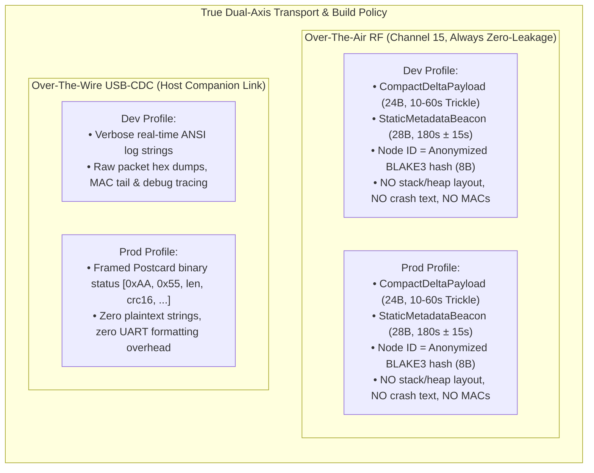
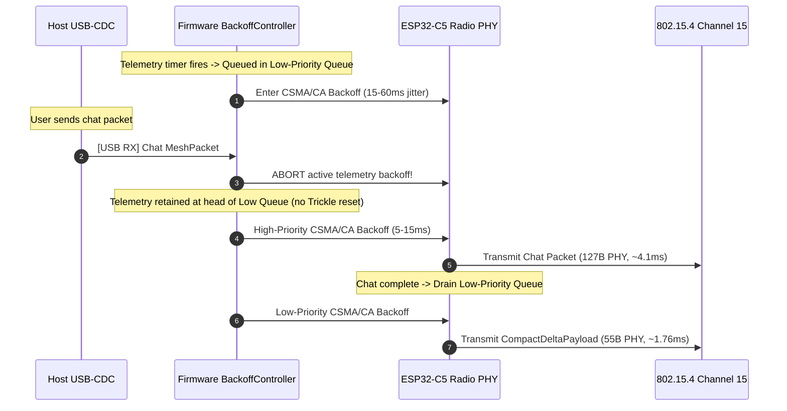

## Goal Capsule

- **Objective:** Eliminate redundant RF airtime consumption by >56% (cutting telemetry payload by 75% from 96B down to 24B) and establish an airtight dual-axis telemetry policy (Over-The-Air RF vs Over-The-Wire USB-CDC across Dev vs Prod profiles) for Project Gibberish.
- **Means:** Split-cadence OTA beaconing (static metadata on long epoch vs compact deltas on an adaptive RFC 6206 Trickle cadence), variable-length PHY framing (eliminating 64-byte padding), firmware two-tier priority queue with user-chat preemption, RFC 1982 serial arithmetic with ambiguous-zone handling, and CRC16 length-prefixed postcard wire streaming.
- **Product Authority:** In-Band RF Telemetry Optimization (GitHub Issue #25); surrounding remote diagnostic tooling (#26) and mobile platform bridges (#27, #28) are tracked contextually and excluded from active implementation scope for this contract.
- **Open Blockers:** None.

---

## Product Contract

### Summary
An optimized telemetry subsystem for Project Gibberish that enforces strict information-density boundaries across physical transport (Over-The-Air RF vs Over-The-Wire USB-CDC) and build profile (Dev vs Prod). It replaces fixed 96-byte beacons with split-cadence framing—emitting a `StaticMetadataBeacon` at low frequency and a `CompactDeltaPayload` on an adaptive RFC 6206 Trickle cadence (10s–60s) with variable-length PHY framing (cutting frame size from 127 bytes to 55–59 bytes, reducing telemetry payload by 75%). The firmware scheduler introduces a two-tier priority queue guaranteeing interactive user chat and clipboard frames preempt telemetry backoff queues with zero dropped high-priority packets. Over-the-air frames are strictly zero-leakage across both build profiles, while USB-CDC streams rich ANSI logs in dev and length-prefixed, CRC16-verified Postcard binary records in prod.

### Problem Frame
In the current IEEE 802.15.4 mesh implementation, nodes periodically broadcast a fixed 96-byte telemetry frame (`DebugTelemetryPayload` in debug, `ClosedTelemetry` in prod) at fixed intervals (5s in debug, 60s in prod). Every beacon redundantly transmits static hardware and configuration attributes—including the 8-byte station MAC tail, hardware revision, build tier, and storage capabilities—alongside 64 bytes of zeroed diagnostic padding. Transmitting 127 PHY bytes at 250 kbps occupies the half-duplex radio channel for ~4.1 ms per beacon. In dense deployments, these beacons collide with interactive user chat messages and clipboard sync packets.

Furthermore, existing firmware lacks a transmission priority queue: when a telemetry packet enters CSMA/CA backoff, incoming user chat packets wait behind it or risk contention collision.

Finally, existing telemetry lacks a principled boundary between what is broadcast over the air to peers versus what is streamed over the USB-CDC wire to the local host machine. Development builds require deep runtime introspection (heap usage, buffer depths, diagnostic event codes) over USB-CDC, but broadcasting unredacted node state over the air introduces RF signal intelligence and snooping risks. In production builds, sending unthrottled formatted log strings over USB-CDC burdens microcontroller CPU cycles and UART bandwidth.

### Key Decisions
- **In-Band RF Telemetry Optimization as primary work unit** (session-settled: user-directed — chosen over remote diagnostic tooling and mobile bridges: addresses immediate airtime collision risks and firmware protocol foundation first). Governs R1, R5, R7.
- **Split-cadence framing over monolithic periodic beacon** (session-settled: user-approved — chosen over single unified beacon: decouples slow-moving configuration from dynamic scalar counters, cutting regular heartbeat payload size to 24 bytes). Governs R1, R2, R3.
- **Variable-length PHY framing over fixed padding** (session-settled: user-approved — chosen over 96-byte padded frames: eliminates 64-byte zero-padding in debug frames, cutting on-air duration from ~4.1 ms to ~1.76 ms). Governs R5, R6.
- **Passive epoch wait over active solicit** (session-settled: user-approved — chosen over active solicitation queries: late-joining nodes buffer peer state in a `pending_context` state until the periodic static beacon arrives, preventing solicit storms). Governs R10, R11.
- **Firmware two-tier priority queue with user packet preemption** (session-settled: user-approved — chosen over single-tier FIFO queue: guarantees chat, clipboard, and SACK packets abort and preempt low-priority telemetry backoffs with zero dropped high-priority packets). Governs R13, R14.
- **Decoupled dual-axis transport vs build profile separation** (session-settled: user-directed — chosen over uniform telemetry schema: RF is always zero-leakage structured binary with anonymized BLAKE3 node IDs in both dev and prod; USB-CDC alone toggles between verbose formatted strings with MACs in dev and framed binary in prod). Governs R7, R8, R9.
- **RFC 6206 Trickle adaptive delta cadence** (session-settled: user-approved — chosen over linear backoff: doubles interval 10s -> 20s -> 40s -> 60s in steady state with pseudo-random jitter, resetting to 10s on debounced state changes). Governs R4, R16.
- **RFC 1982 epoch comparison with explicit ambiguous-zone handling** (session-settled: user-approved — chosen over simple wrapping subtraction: explicitly isolates `wrapping_sub == 128` into pairwise `AmbiguousEpoch` awaiting next static beacon). Governs R11, R17.

<!-- ce-section: work-relationships -->
### How This Work Fits Together
This plan owns the in-band RF telemetry optimization and dual-axis transport contracts tracked in GitHub Issue #25. Surrounding initiatives remain contextual candidates:

- **In-Band RF Telemetry Optimization (Issue #25)**: Owned by this plan. Establishes the core protocol frames, variable-length PHY handling, priority scheduler, adaptive Trickle heartbeat, and build profile segregation.
  - *Enables* **Unified Cross-Platform Diagnostic Schema & Remote Collector Pipeline (Issue #26)**: Depends on normalized telemetry events and device state formats established here. Can proceed independently once protocol frames stabilize.
  - *Enables* **Android USB-OTG CDC-ACM Transport & Daemon (Issue #27)**: Reuses the optimized USB-CDC wire framing and status streaming contract defined for host machines.
  - *Enables* **iOS BLE GATT Client Integration & Airwave Sync Bridge (Issue #28)**: Reuses the compact delta payload and static beacon definitions for BLE GATT characteristic notifications without requiring USB serial access.

### Visualizations





### Requirements

#### Over-The-Air Split-Cadence Framing
- R1. Protocol SHALL define a `StaticMetadataBeacon` containing the node identifier (`node_id: [u8; 8]`—8-byte truncated BLAKE3 hash of station identity across both Dev and Prod per R7), hardware revision (`hw_rev: u8`), build profile tier (`build_tier: TelemetryTier` as `u8`), storage capability flags (`storage_mode: StorageModeStatus` as `u8`), protocol schema version (`schema_version: u8`), configuration epoch (`config_epoch: u8`), uptime epoch counter (`uptime_epoch: u16`, big-endian), and reserved padding (`reserved: [u8; 13]`). Total serialized struct size SHALL be exactly 28 bytes (`const _: () = assert!(core::mem::size_of::<StaticMetadataBeacon>() == 28);`).
- R2. Firmware SHALL emit the `StaticMetadataBeacon` on system boot, on persistent storage mount/unmount state transitions (debounced to at most once per 10 seconds per R16), and periodically at a 180-second baseline with ±15 seconds TRNG jitter (165s..195s).
- R3. Protocol SHALL define a `CompactDeltaPayload` containing configuration epoch (`config_epoch: u8`), monotonic uptime seconds (`uptime_secs: u32`, big-endian), lifetime RX packet count (`rx_count: u32`, big-endian), lifetime TX packet count (`tx_count: u32`, big-endian), dropped packet count (`drop_count: u32`, big-endian), SRAM ring buffer utilization (`sram_used: u16`, big-endian), available heap in KB (`free_heap_kb: u8`), most recent diagnostic event code (`last_event: DiagnosticEventCode` as `u8`), last received packet RSSI (`last_rssi: i8`), last received packet LQI (`last_lqi: u8`), and reserved padding (`reserved: u8` zeroed for 4-byte struct alignment). Total serialized struct size SHALL be exactly 24 bytes (`const _: () = assert!(core::mem::size_of::<CompactDeltaPayload>() == 24);`).
- R4. Firmware SHALL emit `CompactDeltaPayload` on an adaptive RFC 6206 Trickle cadence ($k=\infty$) that doubles the transmission interval from $I_{min} = 10\text{s} \to 20\text{s} \to 40\text{s} \to I_{max} = 60\text{s}$ during steady-state mesh silence, with transmission time $t \in [I/2, I)$ drawn from hardware TRNG (`hw_rng`). Monotonic counter progress (`uptime_secs`, `rx_count`, `tx_count`) SHALL be classified as consistent normal operation and SHALL NOT reset the interval. The interval SHALL reset to $I_{min} = 10\text{s}$ only upon discrete network/system inconsistency events: `config_epoch` increment, SD card mount/unmount, discrete diagnostic error event (`last_event != DiagnosticEventCode::None` / `Boot`), or link drop detection.

#### Variable-Length PHY & Airtime Reduction
- R5. Firmware and protocol serialization SHALL eliminate the 64-byte zeroed `diagnostic_reserve` field from over-the-air frames, truncating the physical IEEE 802.15.4 packet length to the exact serialized payload length. Total physical frame length for `CompactDeltaPayload` SHALL be 55 bytes (11B MHR + 18B MeshHeader + 24B payload + 2B dummy FCS), and `StaticMetadataBeacon` SHALL be 59 bytes (11B MHR + 18B MeshHeader + 28B payload + 2B dummy FCS).
- R6. Radio reception logic (`ieee802154.rs`) and host daemon parser SHALL perform strict length validation using computed offsets before attempting struct deserialization or casting, rejecting truncated or malformed frames without panicking.

#### Dual-Axis Information Density & Security Policy
- R7. Over-the-air RF telemetry frames SHALL enforce a strictly identical zero-leakage security posture across **both** Dev and Prod build profiles: raw stack traces, memory heap pointers, internal crash dumps, and raw IEEE factory MAC addresses SHALL never be broadcast over the air. In both Dev and Prod profiles, `node_id` SHALL be an 8-byte truncated BLAKE3 hash of the station identity. The raw factory MAC tail is strictly confined to local USB-CDC host logging in Dev builds.
- R8. Over-the-wire USB-CDC communication in production builds SHALL stream framed compact Postcard-encoded binary status records with a 6-byte header (`[0xAA, 0x55, len_hi, len_lo, crc16_hi, crc16_lo, ...payload...]`), prohibiting unthrottled human-readable debug string logging over the physical serial interface.
- R9. Development-only diagnostic descriptors, verbose string formatters, and raw packet hex dumpers SHALL be enclosed in compile-time gating attributes (`#[cfg(not(feature = "prod"))]`) such that production firmware binaries physically excise all diagnostic strings.

#### Late-Joiner Context & Fleet Tracking
- R10. Nodes encountering a `CompactDeltaPayload` with an unknown `config_epoch` SHALL transition the peer record to a `pending_context` state in `FleetManager` while awaiting the peer's periodic `StaticMetadataBeacon`.
- R11. Receivers SHALL evaluate `config_epoch` transitions using RFC 1982 serial-number arithmetic (`(new_epoch.wrapping_sub(old_epoch) as i8) > 0`). When `wrapping_sub == 128`, the receiver SHALL classify the epoch as `AmbiguousEpoch` and maintain buffered metrics without updating node identity until the next `StaticMetadataBeacon` arrives.
- R12. Event-triggered broadcast transmissions (triggered by storage changes or discrete error states) SHALL apply a random delay between 0 and 200 ms prior to carrier-sense backoff to prevent thundering herd broadcast storms across adjacent nodes.

#### Firmware Priority Queuing & Preemption
- R13. The firmware radio subsystem SHALL maintain a two-tier priority queue:
  - **High-Priority Queue (4 slots)**: Interactive user chat messages (`FLAG_DIRECT`, `FLAG_GROUP`), clipboard sync (`FLAG_CLIPBOARD`), and selective acknowledgments (`FLAG_SACK`). Overflow policy: backpressure to host sender (returns `Err(QueueFull)` on USB-CDC ingest, preventing silent drop).
  - **Low-Priority Queue (2 slots)**: Autonomous telemetry frames (`StaticMetadataBeacon`, `CompactDeltaPayload`). Overflow policy: newest state overwrites older pending state.
  When a High-Priority frame arrives while a Low-Priority frame is in active backoff, the scheduler SHALL immediately abort the Low-Priority backoff, retain the low-priority frame at the head of `low_queue`, and transmit the High-Priority frame with minimal CSMA/CA delay (5–15 ms). Once the High-Priority queue empties, the Low-Priority frame immediately initiates a fresh CSMA/CA backoff with zero lost high-priority packets (telemetry frames follow newest-overwrites-oldest state-sampling).
- R14. Once a frame clears CCA and is committed to the physical radio transmitter (`esp_ieee802154_transmit`), it constitutes a non-preemptible window bounded to $\le 4.256\text{ ms}$ post-CCA (derived from direct IEEE 802.15.4 PHY timing: 133 physical bytes [6B preamble/SFD/PHR + 127B PSDU] $\times 8$ bits = 1064 bits $\div$ 250,000 bps = 4.256 ms exactly, equivalent to 266 O-QPSK symbols $\times 16\text{ µs/symbol} = 4.256\text{ ms}$). High-Priority frames arriving during this window SHALL queue immediately at the head of the transmit queue to be transmitted next.
- R15. Telemetry frames (`FLAG_TELEMETRY`, `FLAG_TELEMETRY_STATIC`) SHALL be unencrypted broadcast frames authenticated solely by the 64-bit Network Admission Tag (`network_tag`). They SHALL omit the 16-byte Poly1305 authentication tag carried by encrypted chat/clipboard packets.
- R16. Firmware state-change triggers (SD card mount/unmount and link drops) SHALL be rate-limited by a 10-second debounce dwell to prevent Trickle interval reset storms under flapping conditions.
- R17. `FleetManager` SHALL track peer context states (`Active`, `PendingContext`, `AmbiguousEpoch`) on a per-peer basis so that ambiguity on one peer does not block or stall updates for other peers. A 360-second timeout SHALL govern ambiguous states before marking the peer context stale.
- R18. Production USB-CDC status frames SHALL use a 6-byte synchronization, length, and CRC16-CCITT header (`[0xAA, 0x55, len_hi, len_lo, crc16_hi, crc16_lo]`). Host parser SHALL implement a sliding-window resync that discards corrupted bytes until a valid magic + CRC16 pair matches, preventing byte-slip desynchronization across serial reconnects.

### Key Flows
- F1. Normal Adaptive Trickle Heartbeat
- F2. Storage State Change Broadcast & Debounced Trickle Reset
- F3. Late-Joiner Discovery and Resolution
- F4. High-Priority User Packet Preemption of Telemetry Backoff

### Acceptance Examples
- AE1. Airtime Reduction Verification: `CompactDeltaPayload` transmitted frame length $\le 55$ bytes; on-air RF duration $\le 1.8$ ms at 250 kbps (>56% airtime reduction and 75% telemetry payload reduction vs. 127B baseline).
- AE2. Late-Joiner Pending Context Handling: `FleetManager` transitions unseen epoch to `PendingContext`, records numerical metrics, and promotes to `Active` upon static beacon arrival.
- AE3. Production Wire Efficiency & Zero Leakage: Firmware compiled with `--features prod` emits zero debug strings over USB-CDC and streams length-prefixed, CRC16-verified Postcard binary frames. OTA broadcasts disclose zero factory MAC addresses in either build profile.
- AE4. Preemption Verification: A chat packet queued during active telemetry backoff transmits within 20 ms without high-priority packet drop or telemetry starvation.

### Success Criteria
- **Airtime Occupancy:** Channel occupancy for periodic telemetry reduced by at least 56% compared to baseline, with telemetry payload reduced by 75% (24B vs 96B).
- **Preemption Latency:** Interactive user chat packets transmit with $<20$ ms latency even during simultaneous telemetry scheduling.
- **Security Compliance:** Automated binary inspection verifies zero diagnostic debug strings in production firmware ELF artifacts, and zero sensitive heap/stack dumps or raw factory MACs in over-the-air frames across all profiles.

---

## Planning Contract

### Summary
Implementation plan detailing exact Rust struct layouts, computed-offset slice framing, two-tier priority queue state machine in `ieee802154.rs`, Trickle adaptive cadence in `main.rs`, and per-peer `FleetManager` tracking in `gibberish-daemon`.

### Key Technical Decisions
- KTD1. **Explicit Wire Type Discriminated Sub-Flags:** `FLAG_TELEMETRY (0x0020)` for `CompactDeltaPayload` (24B), `FLAG_TELEMETRY_STATIC (0x0080)` for `StaticMetadataBeacon` (28B). Governs U1, U2, U3.
- KTD2. **Zero-Copy Byte Packing for Over-The-Air Telemetry:** Exact packed slice layouts without serde/postcard overhead over the air, ensuring deterministic frame lengths (24B and 28B with compile-time `const_assert` size checks). Governs U1.
- KTD3. **Two-Tier Priority Queue & Preemption in `BackoffController`:** Separate ring buffers for High (chat/clipboard/SACK, 4 slots, backpressure to USB sender on full) and Low (telemetry, 2 slots, newest overwrites oldest). High arrival aborts low backoff timer, retains low frame at head, and transmits high. Low initiates fresh CSMA/CA once high queue empties. Governs U2.
- KTD4. **RFC 6206 Trickle with $k=\infty$ & TRNG Jitter:** Delta interval doubles $10\text{s} \to 20\text{s} \to 40\text{s} \to 60\text{s}$ during steady-state. Monotonic counter advances are consistent; interval resets to $10\text{s}$ only on discrete state events (epoch change, storage mount/unmount, error event, link drop), debounced to 10s. Governs U2.
- KTD5. **Exact Computed-Offset PHY Framing:** `assemble_variable_phy_frame` writes $11\text{B MHR} + 18\text{B MeshHeader} + \text{Payload} + 2\text{B dummy FCS}$ and returns exact length $N \le 127$ (55B for delta, 59B for static). `RadioManager::transmit_variable` transmits only $N$ bytes. Governs U1, U2.
- KTD6. **Defensive Non-Panicking Parser with Checked Slicing:** `parse_phy_frame_with_validator` uses `checked_sub` and bounds validation with `Result::Err`, never indexing unsafely. Governs U1, U3.
- KTD7. **RFC 1982 Comparison with Ambiguous State:** `is_newer_epoch` returns `EpochOrder { Newer, Older, Ambiguous }`. Governs U1, U3.
- KTD8. **CRC16-Protected Framing for Prod USB-CDC:** `[0xAA, 0x55, len_hi, len_lo, crc16_hi, crc16_lo, ...postcard...]` with sliding-window resync parser. Governs U2, U3.

---

## Implementation Units

### U1. Protocol Framing, Wire Structs & Epoch Arithmetic
- **Goal:** Define `StaticMetadataBeacon` and `CompactDeltaPayload` with compile-time size assertions, implement RFC 1982 epoch comparison with ambiguous tie-break, and implement computed-offset variable-length PHY serialization in `crates/gibberish-protocol`.
- **Files:**
  - `crates/gibberish-protocol/src/frame.rs`
  - `crates/gibberish-protocol/tests/framing_tests.rs`
- **Approach:**
  - Add `FLAG_TELEMETRY_STATIC: u16 = 0x0080`.
  - Implement `StaticMetadataBeacon` (28 bytes packed):
    - `node_id: [u8; 8]` (8B truncated BLAKE3 hash of station identity)
    - `hw_rev: u8` (1B)
    - `build_tier: TelemetryTier` (1B)
    - `storage_mode: StorageModeStatus` (1B)
    - `schema_version: u8` (1B)
    - `config_epoch: u8` (1B)
    - `uptime_epoch: u16` (2B, big-endian)
    - `reserved: [u8; 13]` (13B zeroed)
    - `const _: () = assert!(core::mem::size_of::<StaticMetadataBeacon>() == 28);`
  - Implement `CompactDeltaPayload` (24 bytes packed):
    - `config_epoch: u8` (1B)
    - `uptime_secs: u32` (4B, big-endian)
    - `rx_count: u32` (4B, big-endian)
    - `tx_count: u32` (4B, big-endian)
    - `drop_count: u32` (4B, big-endian)
    - `sram_used: u16` (2B, big-endian)
    - `free_heap_kb: u8` (1B)
    - `last_event: DiagnosticEventCode` (1B)
    - `last_rssi: i8` (1B)
    - `last_lqi: u8` (1B)
    - `reserved: u8` (1B zeroed padding)
    - `const _: () = assert!(core::mem::size_of::<CompactDeltaPayload>() == 24);`
  - Implement RFC 1982 helper:
    ```rust
    #[derive(Debug, Clone, Copy, PartialEq, Eq)]
    pub enum EpochComparison {
        Newer,
        Older,
        Equal,
        Ambiguous, // difference == 128
    }

    pub fn compare_epoch(new_epoch: u8, old_epoch: u8) -> EpochComparison {
        if new_epoch == old_epoch {
            return EpochComparison::Equal;
        }
        let diff = new_epoch.wrapping_sub(old_epoch);
        if diff == 128 {
            EpochComparison::Ambiguous
        } else if (diff as i8) > 0 {
            EpochComparison::Newer
        } else {
            EpochComparison::Older
        }
    }
    ```
  - Implement `assemble_variable_phy_frame` and `parse_variable_phy_frame` with defensive bounds checking.
- **Test Scenarios:**
  - `test_static_metadata_beacon_exact_size`: 28 bytes verified by unit test and compile-time assert.
  - `test_compact_delta_payload_exact_size`: 24 bytes verified by unit test and compile-time assert.
  - `test_rfc1982_epoch_comparison`: verify normal newer, normal older, equal, and `diff == 128` ambiguous case.
  - `test_variable_phy_frame_bounds`: verify malformed length fields return `None`/`Err` without panicking.
- **Verification:** `cargo test -p gibberish-protocol` passing with zero warnings.

### U2. Firmware Priority TX Queue, Variable PHY Driver & Trickle Emitter
- **Goal:** Update `apps/gibberish-firmware` to implement two-tier priority queuing in `BackoffController`, variable-length PHY frame transmission in `RadioManager`, RFC 6206 Trickle cadence, and CRC16-framed Postcard streaming on USB-CDC.
- **Files:**
  - `apps/gibberish-firmware/src/radio/ieee802154.rs`
  - `apps/gibberish-firmware/src/main.rs`
- **Approach:**
  - In `ieee802154.rs`:
    - Refactor `BackoffController` to hold `high_queue: [Option<MeshPacket>; 4]` and `low_queue: [Option<VariableFrame>; 2]`.
    - Implement `schedule_high(...)`: aborts active low backoff, retains low-priority frame at head of `low_queue`, sets high backoff (5–15 ms). Returns `Err(QueueFull)` if all 4 high slots are full.
    - Implement `schedule_low(...)`: sets low backoff (15–60 ms) only if high queue is empty. New telemetry deltas overwrite oldest pending slot if full.
    - Implement `RadioManager::transmit_variable(&mut self, header: &MeshHeader, payload: &[u8]) -> bool`.
    - Non-preemptible window derivation test: verify that post-CCA transmit loop is bounded to $\le 4.256\text{ ms}$ (133 physical bytes $\times 8$ bits = 1064 bits $\div 250,000\text{ bps} = 4.256\text{ ms}$, i.e. 266 O-QPSK symbols $\times 16\text{ µs/symbol} = 4.256\text{ ms}$).
    - Update `poll_rx` to accept variable frames down to `MHR_LEN + MESH_HEADER_LEN + 24` bytes (55 bytes).
  - In `main.rs`:
    - Implement Trickle cadence state (`current_interval_ms`, `t_ms`, `doubling_counter`).
    - Classify monotonic counter updates as consistent; reset interval to 10s only on discrete state events (epoch change, storage mount/unmount, error event, link drop) with 10s debounce dwell.
    - Maintain 180s ± 15s TRNG static beacon timer.
    - In prod build, stream `ClosedTelemetry` formatted with `[0xAA, 0x55, len_hi, len_lo, crc16_hi, crc16_lo, ...postcard...]` over USB-CDC.
- **Test Scenarios:**
  - `cargo check -p gibberish-firmware --target riscv32imac-unknown-none-elf`
  - `cargo check -p gibberish-firmware --target riscv32imac-unknown-none-elf --features prod`
  - Unit tests in `ieee802154.rs` verifying priority preemption, queue requeue on abort, and variable frame parsing.
- **Verification:** Clean compilation for debug and prod profiles.

### U3. Host Daemon Parser, Length-Prefixed CDC & Per-Peer Fleet State Machine
- **Goal:** Update `apps/gibberish-daemon` to ingest variable-length telemetry frames, decode CRC16-framed Postcard USB-CDC streams with resync, and manage per-peer `Active`, `PendingContext`, and `AmbiguousEpoch` states in `FleetManager`.
- **Files:**
  - `apps/gibberish-daemon/src/fleet.rs`
  - `apps/gibberish-daemon/src/transport.rs`
  - `apps/gibberish-daemon/src/bin/gibberish_sink.rs`
- **Approach:**
  - In `fleet.rs`:
    - Define `PeerContextState { Active, PendingContext { first_seen_secs: u64 }, AmbiguousEpoch { detected_secs: u64 } }`.
    - Ingest `CompactDeltaPayload`: if peer is unknown or epoch is newer, enter `PendingContext`, update metrics, flag `[Pending Sync]`.
    - Ingest `StaticMetadataBeacon`: evaluate `compare_epoch`. If newer, promote peer to `Active`. If ambiguous, enter `AmbiguousEpoch` with 360s timeout.
  - In `transport.rs`:
    - Implement sliding-window sync scanner for `[0xAA, 0x55, len_hi, len_lo, crc16_hi, crc16_lo]` stream framing for production CDC dongles, validating CRC16-CCITT before deserialization.
- **Test Scenarios:**
  - `test_fleet_late_joiner_pending_context`
  - `test_fleet_beacon_promotes_to_active`
  - `test_fleet_ambiguous_epoch_handling`
  - `test_framed_postcard_crc16_validation_and_resync`
- **Verification:** `cargo test -p gibberish-daemon` passing.

### U4. End-to-End Simulation & Verification Contract
- **Goal:** Execute simulated multi-node mesh tests and verify airtime reduction, preemption latency, and zero-leakage compliance.
- **Files:**
  - `apps/gibberish-daemon/src/bin/fleet_sink_test.rs`
  - `apps/gibberish-daemon/src/bin/hw_stress_test.rs`
  - `tests/integration-sim/src/main.rs`
- **Approach:**
  - Simulate multi-node mesh with split-cadence telemetry and high-priority chat injections.
  - Verify that `CompactDeltaPayload` frames occupy $\le 55$ bytes PHY length (75% payload cut).
  - Verify chat preemption latency remains $<20$ ms under continuous telemetry scheduling.
  - Verify automated symbol check on `--features prod` firmware ELF: zero debug strings.
  - Verify over-the-air capture: zero MAC tail leakage across both dev and prod profiles.
- **Verification:** Automated tests pass.

---

## Verification Contract

| Test / Command | Scope | Target / Requirement | Done Signal |
|---|---|---|---|
| `cargo test -p gibberish-protocol` | Unit | U1 (R1, R3, R5, R6, R11, R15) | All tests pass, compile-time asserts hold, zero warnings |
| `cargo check -p gibberish-firmware --target riscv32imac-unknown-none-elf` | Firmware Debug | U2 (R1, R2, R4, R9, R13, R14) | Successful compilation |
| `cargo check -p gibberish-firmware --target riscv32imac-unknown-none-elf --features prod` | Firmware Prod | U2 (R7, R8, R9, R18) | Successful compilation, strings stripped |
| `cargo test -p gibberish-daemon` | Host Daemon | U3 (R6, R10, R11, R17, R18) | All fleet, parser, and CRC resync unit tests pass |
| `cargo run -p gibberish-daemon --bin fleet_sink_test` | Integration | U4 (AE1, AE2, AE3, AE4) | Simulation completes, >56% PHY airtime cut verified |

---

## Definition of Done

- [ ] `StaticMetadataBeacon` (28B: 15B fields + 13B reserved) and `CompactDeltaPayload` (24B: 23B fields + 1B reserved) implemented in `gibberish-protocol` with variable-length PHY serialization and `const_assert` size validations
- [ ] RFC 1982 epoch comparison implemented with explicit `Ambiguous` handling for `wrapping_sub == 128`
- [ ] Firmware implements two-tier priority queue in `BackoffController` with immediate preemption for chat/clipboard/SACK packets, zero silent drops on full high queue, and low-priority requeue to head
- [ ] Non-preemptible window derived from IEEE 802.15.4 PHY specifications ($\le 4.256$ ms bounded latency)
- [ ] Firmware emits RFC 6206 Trickle deltas ($10\text{s}..60\text{s}$, $k=\infty$) with monotonic counter consistency, 10s debounced state reset, and 180s $\pm 15$s TRNG static beacon
- [ ] Physical IEEE 802.15.4 frame length cut to 55B for deltas and 59B for static beacons (>56% PHY airtime cut, 75% telemetry payload cut)
- [ ] Defensive, non-panicking bounds-checked parser implemented in both firmware and daemon
- [ ] Over-the-air RF frames verified as 100% zero-leakage across both dev and prod profiles: node ID is always an 8-byte truncated BLAKE3 hash; raw factory MAC tail is confined strictly to USB-CDC dev logs
- [ ] Production USB-CDC streams length-prefixed, CRC16-CCITT verified Postcard binary frames (`[0xAA, 0x55, len_hi, len_lo, crc16_hi, crc16_lo]`) with sliding-window resynchronization and zero plaintext strings
- [ ] `FleetManager` manages per-peer `Active`, `PendingContext`, and `AmbiguousEpoch` state machines
- [ ] All unit, firmware, and integration tests pass with zero regressions
