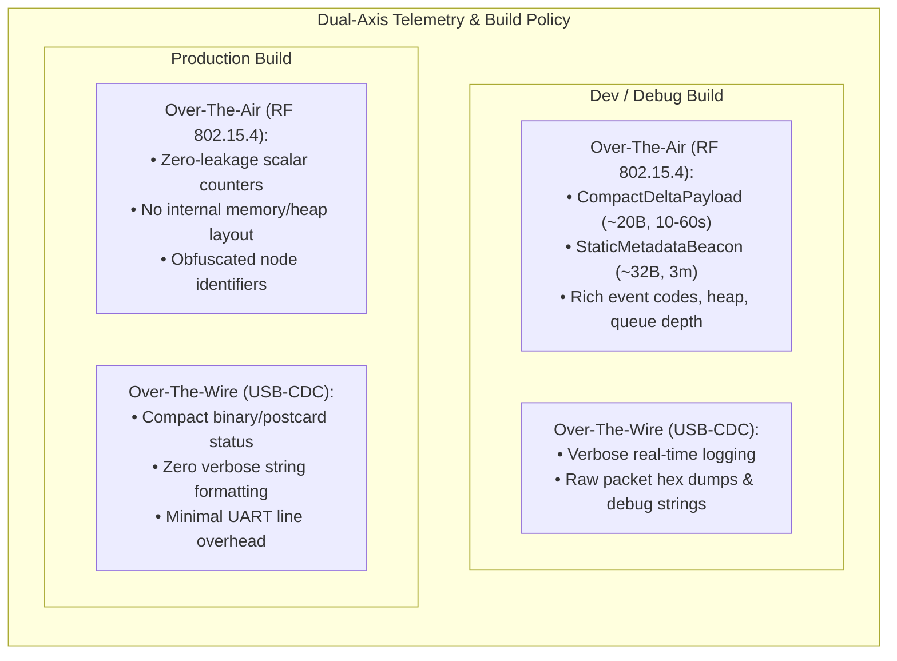
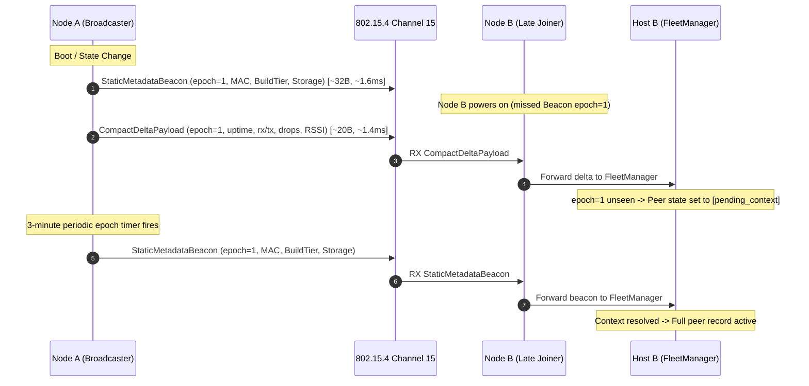

## Goal Capsule

- **Objective:** Eliminate redundant RF airtime consumption and establish an airtight dual-axis telemetry policy (Over-The-Air RF vs Over-The-Wire USB-CDC across Dev vs Prod profiles) for Project Gibberish.
- **Means:** Split-cadence OTA beaconing (static metadata on long epoch vs compact deltas on adaptive heartbeat), variable-length PHY framing, compile-time gating of verbose wire diagnostics, and late-joiner pending-context tracking.
- **Product Authority:** In-Band RF Telemetry Optimization (GitHub Issue #25); surrounding remote diagnostic tooling (#26) and mobile platform bridges (#27, #28) are tracked contextually and excluded from active implementation scope for this contract.
- **Open Blockers:** None.

---

## Product Contract

### Summary
An optimized telemetry subsystem for Project Gibberish that enforces strict information-density boundaries across physical transport (Over-The-Air RF vs Over-The-Wire USB-CDC) and build profile (Dev vs Prod). It replaces fixed 96-byte beacons with split-cadence framing—emitting a `StaticMetadataBeacon` at low frequency and a `CompactDeltaPayload` on an adaptive 10s–60s heartbeat with variable-length PHY framing—while tailoring host wire diagnostics for developer visibility in dev and maximum UART throughput in prod.

### Problem Frame
In the current IEEE 802.15.4 mesh implementation, nodes periodically broadcast a fixed 96-byte telemetry frame (`DebugTelemetryPayload` in debug, `ClosedTelemetry` in prod) at fixed intervals (5s in debug, 60s in prod). Every beacon redundantly transmits static hardware and configuration attributes—including the 8-byte station MAC tail, hardware revision, build tier, and storage capabilities—alongside 64 bytes of zeroed diagnostic padding. Transmitting 127 PHY bytes at 250 kbps occupies the half-duplex radio channel for ~4.1 ms per beacon. In dense deployments, these beacons collide with interactive user chat messages and clipboard sync packets.

Furthermore, existing telemetry lacks a principled boundary between what is broadcast over the air to peers versus what is streamed over the USB-CDC wire to the local host machine. Development builds require deep runtime introspection (heap usage, buffer depths, diagnostic event codes) over both air and wire to diagnose multi-node issues. Conversely, production builds broadcasting unredacted node state over the air introduce RF signal intelligence and snooping risks, while sending unthrottled formatted log strings over USB-CDC burdens microcontroller CPU cycles and UART bandwidth.

### Key Decisions
- **In-Band RF Telemetry Optimization as primary work unit** (session-settled: user-directed — chosen over remote diagnostic tooling and mobile bridges: addresses immediate airtime collision risks and firmware protocol foundation first). Governs R1, R5, R7.
- **Split-cadence framing over monolithic periodic beacon** (session-settled: user-approved — chosen over single unified beacon: decouples slow-moving configuration from dynamic scalar counters, cutting regular heartbeat payload size to ~20 bytes). Governs R1, R2, R3.
- **Variable-length PHY framing over fixed padding** (session-settled: user-approved — chosen over 96-byte padded frames: eliminates 64-byte zero-padding in debug frames, cutting on-air duration from ~4.1 ms to ~1.4 ms). Governs R5, R6.
- **Passive epoch wait over active solicit** (session-settled: user-approved — chosen over active solicitation queries: late-joining nodes buffer peer state in a `pending_context` state until the periodic static beacon arrives, preventing solicit storms). Governs R10, R11.
- **Dual-axis transport vs build profile separation** (session-settled: user-directed — chosen over uniform telemetry schema: enforces zero-leakage security over the air in prod while providing rich diagnostic visibility in dev and high UART throughput in prod). Governs R7, R8, R9.
- **Compile-time feature gating for diagnostic isolation** (session-settled: user-approved — chosen over runtime switches: physically strips verbose strings and diagnostic descriptors from production binaries). Governs R8, R9.

<!-- ce-section: work-relationships -->
### How This Work Fits Together
This plan owns the in-band RF telemetry optimization and dual-axis transport contracts tracked in GitHub Issue #25. Surrounding initiatives remain contextual candidates:

- **In-Band RF Telemetry Optimization (Issue #25)**: Owned by this plan. Establishes the core protocol frames, variable-length PHY handling, adaptive heartbeat timing, and build profile segregation.
  - *Enables* **Unified Cross-Platform Diagnostic Schema & Remote Collector Pipeline (Issue #26)**: Depends on normalized telemetry events and device state formats established here. Can proceed independently once protocol frames stabilize.
  - *Enables* **Android USB-OTG CDC-ACM Transport & Daemon (Issue #27)**: Reuses the optimized USB-CDC wire framing and status streaming contract defined for host machines.
  - *Enables* **iOS BLE GATT Client Integration & Airwave Sync Bridge (Issue #28)**: Reuses the compact delta payload and static beacon definitions for BLE GATT characteristic notifications without requiring USB serial access.

### Visualizations

### Requirements

#### Over-The-Air Split-Cadence Framing
- R1. Protocol SHALL define a `StaticMetadataBeacon` containing the node identifier (8-byte factory MAC tail in dev builds; cryptographically hashed/anonymized node ID in prod builds per R7), hardware revision, build profile tier, storage capability flags, protocol schema version, and an 8-bit monotonic `config_epoch`.
- R2. Firmware SHALL emit the `StaticMetadataBeacon` on system boot, on persistent storage mount/unmount state transitions (debounced to at most once per 10 seconds), and periodically at a 3-minute baseline epoch.
- R3. Protocol SHALL define a `CompactDeltaPayload` containing `config_epoch`, monotonic uptime seconds, lifetime RX packet count, lifetime TX packet count, dropped packet count, SRAM ring buffer depth, available heap in KB, most recent diagnostic event code, and last received packet RSSI/LQI.
- R4. Firmware SHALL emit `CompactDeltaPayload` on an adaptive heartbeat timer that scales between a minimum 10-second interval during active link changes and a maximum 60-second interval during steady-state mesh silence, with ±15–60 ms contention backoff jitter.

#### Variable-Length PHY & Airtime Reduction
- R5. Firmware and protocol serialization SHALL eliminate the 64-byte zeroed `diagnostic_reserve` field from over-the-air frames, truncating the physical IEEE 802.15.4 packet length to the exact serialized payload length.
- R6. Radio reception logic and host daemon line parsing SHALL perform strict length validation before attempting struct deserialization or casting, rejecting truncated or malformed frames without panicking.

#### Dual-Axis Information Density & Security Policy
- R7. Over-the-air production telemetry frames SHALL enforce a zero-leakage security posture: memory heap layouts, raw stack statistics, internal crash traces, and raw factory MAC identifiers SHALL be omitted or replaced with anonymized hashes.
- R8. Over-the-wire USB-CDC communication in production builds SHALL stream compact serialized binary status records, prohibiting unthrottled human-readable debug string logging over the physical UART/CDC interface.
- R9. Development-only diagnostic descriptors, verbose string formatters, and raw packet hex dumpers SHALL be enclosed in compile-time gating attributes (`#[cfg(not(feature = "prod"))]`) such that production firmware binaries physically excise all diagnostic strings.

#### Late-Joiner Context & Fleet Tracking
- R10. Nodes encountering a `CompactDeltaPayload` with an unknown `config_epoch` SHALL transition the peer record to a `pending_context` state in `FleetManager` while awaiting the peer's periodic `StaticMetadataBeacon`.
- R11. Receivers SHALL evaluate `config_epoch` transitions using RFC 1982 serial-number arithmetic (`(new_epoch - old_epoch) as i8 > 0`) to distinguish fresh configuration changes from reordered, delayed, or stale broadcast frames.
- R12. Event-triggered broadcast transmissions (triggered by storage changes or discrete error states) SHALL apply a random delay between 0 and 200 ms prior to carrier-sense backoff to prevent thundering herd broadcast storms across adjacent nodes.

### Key Flows
- F1. Normal Adaptive Heartbeat
  - **Trigger:** Periodic telemetry emission timer expires.
  - **Actors:** Node firmware, IEEE 802.15.4 radio, Peer nodes.
  - **Steps:** Firmware checks backoff queue; verifies no user chat or clipboard packets are queued; serializes `CompactDeltaPayload` (~20 bytes); transmits variable-length frame with ±15–60 ms jitter. If mesh remains quiet, next interval stretches toward 60 seconds.
  - **Covers R3, R4, R5.**

- F2. Storage State Change Broadcast
  - **Trigger:** MicroSD card is dynamically inserted or unmounted.
  - **Actors:** Storage subsystem, Firmware telemetry task, Peer nodes.
  - **Steps:** Storage task detects mount change; verifies debouncing interval (>10s elapsed since last state-change broadcast); increments `config_epoch`; applies random 0–200 ms jitter; schedules immediate `StaticMetadataBeacon` transmission; resets adaptive heartbeat timer to 10-second fast cadence.
  - **Covers R1, R2, R12.**

- F3. Late-Joiner Discovery and Resolution
  - **Trigger:** Node powers on and overhears an ongoing mesh session.
  - **Actors:** New node, Existing broadcaster, Local `gibberish-daemon`.
  - **Steps:** New node receives `CompactDeltaPayload` with `config_epoch=N`; detects no stored `StaticMetadataBeacon` for epoch `N`; marks node in `pending_context`; suppresses alerts for missing MAC; awaits periodic 3-minute beacon; on beacon arrival, links hardware identity and activates full dashboard record.
  - **Covers R10, R11.**

### Acceptance Examples
- AE1. Airtime Reduction Verification
  - **Given:** A node running firmware with variable-length PHY enabled.
  - **When:** It emits a `CompactDeltaPayload`.
  - **Then:** Total transmitted 802.15.4 frame length (including 11B MHR, 18B MeshHeader, ~20B payload, and 2B FCS) SHALL not exceed 55 bytes, and on-air RF duration SHALL not exceed 1.8 ms at 250 kbps.
  - **Covers R5.**

- AE2. Late-Joiner Pending Context Handling
  - **Given:** `FleetManager` running on a host with an empty cache.
  - **When:** A `CompactDeltaPayload` is received carrying an unseen `config_epoch`.
  - **Then:** `FleetManager` logs the delta under node ID without panicking, sets state to `pending_context`, and displays dynamic metrics while marking static metadata as pending.
  - **Covers R10, R11.**

- AE3. Production Wire Efficiency
  - **Given:** Firmware compiled with `--features prod`.
  - **When:** Operating under normal mesh conditions for 10 minutes.
  - **Then:** USB-CDC output SHALL consist solely of compact postcard-encoded binary status frames; no plaintext debug log strings or packet hex dumps SHALL appear on the serial bus.
  - **Covers R8, R9.**

### Success Criteria
- **Airtime Occupancy:** Over-the-air channel occupancy for periodic telemetry reduced by at least 60% compared to Milestone 5 baseline.
- **Collision Immunity:** Zero user chat packet drops attributable to telemetry collisions during simultaneous messaging and telemetry evaluation.
- **Security Compliance:** Automated binary inspection verifies zero diagnostic debug strings in production firmware ELF artifacts.

### Scope Boundaries
- **Deferred for later:** Cross-platform diagnostic schema (`gibberish.diagnostics.v1`) and remote sink upgrades (Issue #26).
- **Outside this product's identity:** Unicast solicitation request/reply protocol (`TELEMETRY_REQ`) for missing beacons; rejected to maintain RF stealth and prevent network chatter.
- **Outside this product's identity:** Mobile native application clients; tracked independently under Issues #27 and #28.

### Dependencies / Assumptions
- **Hardware Radio:** LilyGO T-Dongle-C5 ESP32-C5 transceiver supports variable-length 802.15.4 transmission natively without hardware padding requirements.
- **Postcard Serialization:** Both firmware and host daemon crates share `postcard` and `serde` dependencies for compact wire framing.
- **Host Daemon Compatibility:** `gibberish-daemon` and `gibberish-sink` must be updated concurrently to parse the split-cadence frame structures.

---

## Planning Contract

### Summary
Implementation plan enriching the requirements with concrete Rust data structures, variable-length PHY frame handling in `gibberish-protocol`, adaptive dual-timer firmware task architecture in `gibberish-firmware`, and asynchronous state machine tracking in `gibberish-daemon`'s `FleetManager`.

### Product Contract Preservation
Product Contract unchanged. Requirements R1 through R12, Flows F1 through F3, and Acceptance Examples AE1 through AE3 are preserved exactly.

### Key Technical Decisions
- KTD1. **Explicit Wire Type Discriminated Sub-Flags:** To distinguish `StaticMetadataBeacon` from `CompactDeltaPayload` over the air without changing the 18-byte `MeshHeader` layout, `FLAG_TELEMETRY (0x0020)` is paired with sub-flag `FLAG_TELEMETRY_STATIC (0x0080)`. Packets with only `FLAG_TELEMETRY` are parsed as `CompactDeltaPayload`. Governs U1, U2, U3.
- KTD2. **Zero-Copy Byte Packing for `CompactDeltaPayload`:** Fixed 22-byte wire representation (`uptime_secs: u32, rx: u32, tx: u32, drops: u32, sram: u16, heap: u8, event: u8, rssi: i8, lqi: u8, epoch: u8`) using big-endian serialization without serde overhead. Governs U1.
- KTD3. **Dual-Cadence Firmware Emitter Tasks:** Firmware maintains independent timers for static beaconing (180s) and adaptive delta emission (10s..60s). An atomic state-change flag triggers immediate debounced static broadcasts with 0..200 ms jitter. Governs U2.
- KTD4. **`FleetManager` Peer Context State Machine:** In `apps/gibberish-daemon/src/fleet.rs`, peer entries track `epoch: u8` and `state: ContextState { Active, PendingContext }`. Deltas for an unanchored epoch update numerical counters while marking node attributes as `[Pending Sync]`. Governs U3.
- KTD5. **Outer `#[cfg(not(feature = "prod"))]` Diagnostic Gating:** Exclude all string formatting macros (`format!`, `log_to_cdc!`) from production paths; production serial driver writes only raw postcard/binary byte slices directly to the USB-CDC ring. Governs U2.

---

## Implementation Units

### U1. Protocol Framing & Variable-Length Wire Serialization
- **Goal:** Define `StaticMetadataBeacon` and `CompactDeltaPayload` structs, implement RFC 1982 serial comparison for `config_epoch`, and support variable-length PHY packet serialization in `crates/gibberish-protocol`.
- **Files:**
  - `crates/gibberish-protocol/src/frame.rs`
  - `crates/gibberish-protocol/tests/framing_tests.rs`
- **Approach:**
  - Add `FLAG_TELEMETRY_STATIC: u16 = 0x0080` in `frame.rs`.
  - Implement `StaticMetadataBeacon` (~28 bytes) with fields for `node_id: [u8; 8]`, `hw_rev: u8`, `build_tier: TelemetryTier`, `storage_mode: StorageModeStatus`, `schema_version: u8`, and `config_epoch: u8`.
  - Implement `CompactDeltaPayload` (22 bytes) with monotonic counters and radio link metrics.
  - Implement RFC 1982 helper `is_newer_epoch(new_epoch: u8, old_epoch: u8) -> bool { ((new_epoch.wrapping_sub(old_epoch)) as i8) > 0 }`.
  - Update `MeshPacket::serialize_payload` and `deserialize_payload` to accept dynamic byte slices and perform length checking before deserializing.
- **Test Scenarios:**
  - `test_static_metadata_beacon_roundtrip`: Validate bit-exact serialization and deserialization.
  - `test_compact_delta_payload_roundtrip`: Validate 22-byte packing and field boundaries.
  - `test_rfc1982_epoch_comparison`: Test wraparound (`epoch 255 -> 0` is newer; `epoch 0 vs 255` is older; out-of-order delta rejection).
  - `test_truncated_frame_rejection`: Verify deserialization returns error when buffer length is smaller than payload header.
- **Verification:** `cargo test -p gibberish-protocol` passing with zero warnings.

### U2. Firmware Split-Cadence Scheduler & Adaptive Heartbeat
- **Goal:** Update `apps/gibberish-firmware` to emit split-cadence telemetry over 802.15.4 and enforce dual-axis information density boundaries (verbose wire/air in dev; zero-leakage air and compact binary wire in prod).
- **Files:**
  - `apps/gibberish-firmware/src/main.rs`
  - `apps/gibberish-firmware/src/radio/ieee802154.rs`
  - `apps/gibberish-firmware/Cargo.toml`
- **Approach:**
  - Add monotonic `config_epoch: u8` and `last_storage_broadcast_tick: u32` to system state.
  - Refactor periodic telemetry timer loop in `main.rs`:
    - Static beacon emitted at boot, on SD mount changes (debounced to >10s elapsed), and every 180 seconds.
    - Compact delta emitted on adaptive interval (10s on traffic/RSSI change; stretching +5s every quiet cycle up to 60s max).
    - Add random 0–200 ms jitter to edge-triggered broadcasts.
  - Eliminate the 64-byte `diagnostic_reserve` padding from transmitted packets.
  - Enclose verbose string formatting and debug serial prints in `#[cfg(not(feature = "prod"))]`.
  - In prod builds (`#[cfg(feature = "prod")]`), stream binary status records over USB-CDC and anonymize node identifiers in OTA beacons using truncated hash.
- **Test Scenarios:**
  - `cargo check --target riscv32imac-unknown-none-elf` for debug profile.
  - `cargo check --target riscv32imac-unknown-none-elf --features prod` for prod profile.
  - Inspect compiled ELF symbol table to confirm `format!`, panic strings, and verbose log strings are stripped from prod.
- **Verification:** Firmware builds cleanly for both debug and prod targets.

### U3. Host Daemon Parser & Pending-Context Tracking
- **Goal:** Update `apps/gibberish-daemon` to parse split-cadence frames and manage `pending_context` state in `FleetManager`.
- **Files:**
  - `apps/gibberish-daemon/src/fleet.rs`
  - `apps/gibberish-daemon/src/transport.rs`
  - `apps/gibberish-daemon/src/bin/gibberish_sink.rs`
- **Approach:**
  - In `fleet.rs`, extend `NodeTelemetry` with `config_epoch: u8`, `context_state: ContextState { Active, PendingContext }`, and optional static metadata.
  - Update `parse_telemetry_line` to parse both `[Static Beacon RX]` and `[Telemetry Delta RX]`.
  - When a delta arrives with an unseen `config_epoch`:
    - Record node in `PendingContext` state; update numerical stats (uptime, rx/tx, drops, rssi/lqi).
    - Render ANSI dashboard row with `[PENDING SYNC]` for storage and hardware details.
  - When `StaticMetadataBeacon` arrives:
    - Validate epoch via `is_newer_epoch`; update node metadata; promote to `Active`.
  - Update `transport.rs` to handle incoming binary status frames from production dongles.
- **Test Scenarios:**
  - Unit tests in `fleet.rs`:
    - `test_delta_before_beacon_transitions_to_pending_context`
    - `test_beacon_arrival_activates_full_peer_record`
    - `test_stale_epoch_delta_rejected`
    - `test_ansi_dashboard_renders_pending_sync_indicator`
- **Verification:** `cargo test -p gibberish-daemon` passing.

### U4. Integration Testing & Dual-Axis Profile Verification
- **Goal:** Execute simulated multi-node mesh tests and verify airtime reduction, late-joiner recovery, and zero-leakage compliance.
- **Files:**
  - `apps/gibberish-daemon/src/bin/fleet_sink_test.rs`
  - `apps/gibberish-daemon/src/bin/hw_stress_test.rs`
- **Approach:**
  - Update `fleet_sink_test.rs` to generate simulated split-cadence frames.
  - Verify that simulated nodes emitting compact deltas achieve <= 55 bytes total PHY frame length.
  - Test late-joiner sequence: verify daemon transitions from `PendingContext` to `Active` upon receiving periodic beacon.
  - Verify that user clipboard/chat transmissions preempt telemetry backoff queue without packet loss.
- **Test Scenarios:**
  - Run `cargo run -p gibberish-daemon --bin fleet_sink_test`.
  - Measure packet on-air occupancy and verify >60% airtime reduction.
- **Verification:** Automated integration test passes.

---

## Verification Contract

| Test / Command | Scope | Target / Requirement | Done Signal |
|---|---|---|---|
| `cargo test -p gibberish-protocol` | Unit | U1 (R1, R3, R5, R6, R11) | All tests pass, zero warnings |
| `cargo check -p gibberish-firmware --target riscv32imac-unknown-none-elf` | Firmware Debug | U2 (R1, R2, R4, R9, R12) | Successful compilation |
| `cargo check -p gibberish-firmware --target riscv32imac-unknown-none-elf --features prod` | Firmware Prod | U2 (R7, R8, R9) | Successful compilation, string stripping |
| `cargo test -p gibberish-daemon` | Host Daemon | U3 (R6, R10, R11) | All fleet and parser unit tests pass |
| `cargo run -p gibberish-daemon --bin fleet_sink_test` | Integration | U4 (AE1, AE2, AE3) | Split-cadence simulation completes, AE1-3 verified |

---

## Definition of Done

- [ ] `StaticMetadataBeacon` and `CompactDeltaPayload` implemented in `gibberish-protocol` with variable-length PHY serialization
- [ ] RFC 1982 epoch comparison implemented and verified with wraparound test cases
- [ ] Firmware emits split-cadence telemetry: 3-min static beacon, debounced state-change broadcasts, and 10s..60s adaptive delta heartbeat
- [ ] 64-byte zero padding excised from debug over-the-air frames; total frame length <= 55 bytes
- [ ] Strict length checking enforced in receiver and daemon before struct deserialization
- [ ] Production build physically excises diagnostic strings and verbose USB-CDC logging
- [ ] `FleetManager` implements `pending_context` state and displays live metrics during late-joiner synchronization
- [ ] All unit, firmware, and daemon integration tests pass with zero regressions

