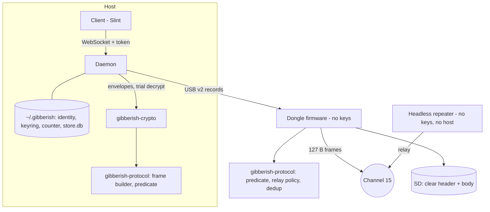
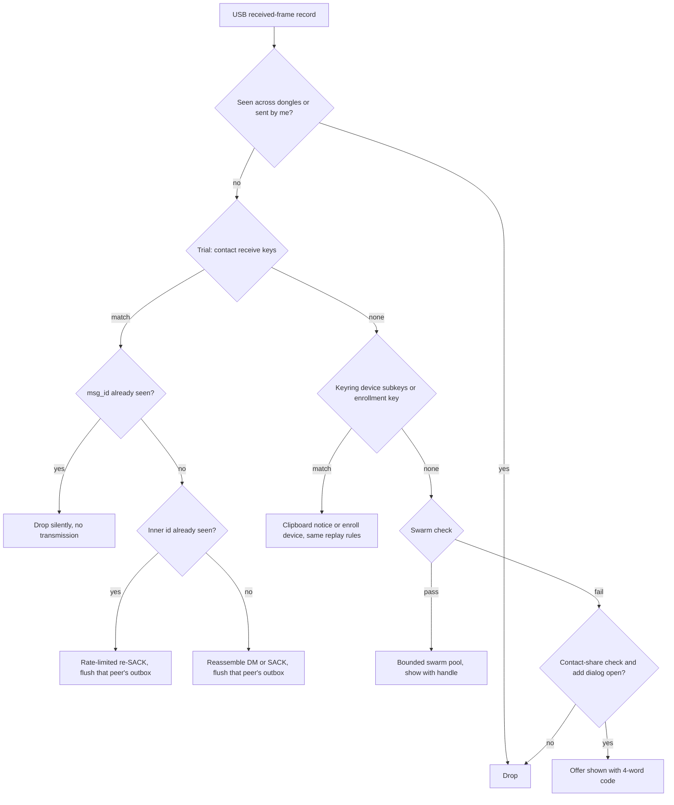
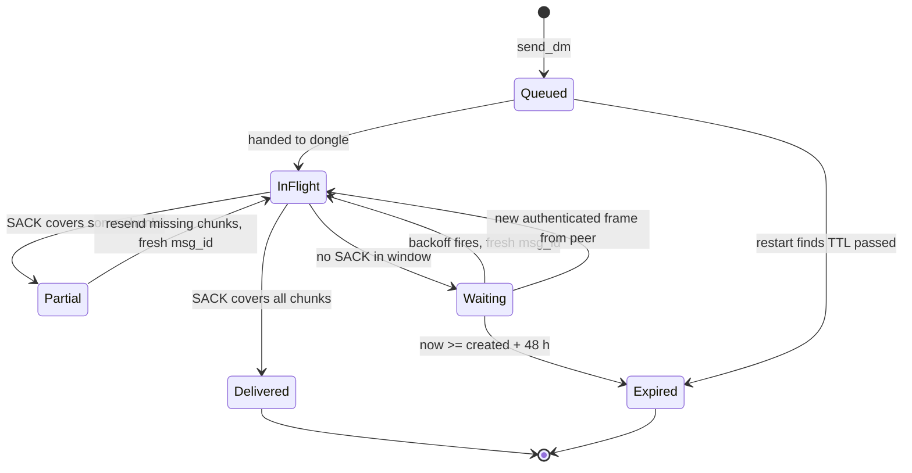
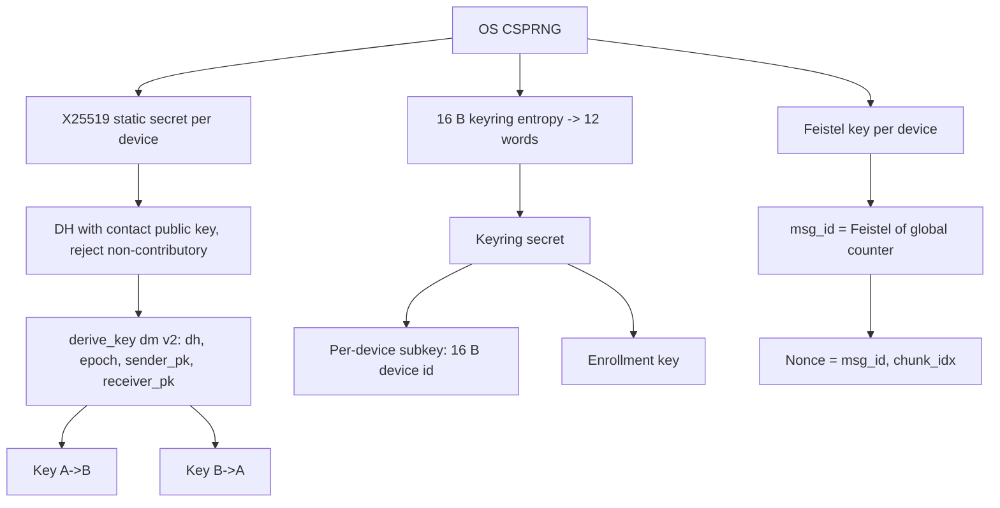

# Production OPSEC Radio Contract - Plan

## Goal Capsule

- **Objective:** An outsider with an 802.15.4 sniffer near a production Gibberish swarm learns only that a mesh exists and when it is active. Apart from on-air contact shares a user chooses to make, they cannot identify or track a device, see who DMs whom, read DM or clipboard content, or learn anything about a dongle's health. Swarm channel posts are public by design.
- **Means:** One breaking change to the on-air, USB, storage, and database formats (KTD1-KTD4, KTD14, KTD16, KTD17). Host-held per-device keys protect private traffic (KTD6-KTD13). An on-air sniffer audit gates release (KTD23).
- **Product authority:** This plan is the authoritative contract for what production builds may put on the air. It supersedes the production-telemetry requirements in `docs/plans/2026-09-22-1400-feature-offgrid-telemetry-and-build-tiers-plan.md`, `docs/plans/2026-09-26-1414-feat-telemetry-efficiency-and-dual-axis-matrix-plan.md`, and `docs/plans/2026-09-28-1507-feat-opt-in-debug-telemetry-and-build-profiles-plan.md`. Traffic-pattern concealment and hostile-member protection are follow-on areas, not active scope. Within this plan, R-IDs win on product behavior and KTDs win on mechanism.
- **Execution profile:** Five phases, landed in order. Phase 1 (U1, U2) ships on its own, and U1 alone stops the current leak before the format change. New wire and key types land alongside the legacy ones, and each legacy symbol is deleted by the unit that migrates its last consumer, so every unit leaves the workspace building. The files listed under System-Wide Impact as single-owner are edited by one unit at a time.
- **Stop conditions:**
  - Stop and ask the user before adding or changing any dependency (U5 needs a CSPRNG and `bip39`), before editing `Cargo.lock`, and before any GitHub issue edit (R30).
  - Stop and ask if hardware rejects or mishandles the frame-control value pinned in KTD2; the fallback changes the on-air class signature.
  - Stop and report if evidence shows a session-settled decision cannot work.
- **Tail ownership:** The on-air audit (U20) needs the user at the bench with both dongles. The GitHub issue revisions (U21) need user confirmation per issue.
- **Open blockers:** None.

---

## Product Contract

Planning revisions (user-confirmed 2026-09-29):
- R15 and AE6 exclude the relay-mutable hop limit and sequence byte.
- R25 and AE1 define "idle" and use one production dongle plus one sniffer.
- R31 and R32 are added.
- AE2 names the simulated relay path.
- R12, R14, and F3 describe what this plan builds: QR display, pasted-code import, and 12-word linking.
- R23 and AE4 refuse the debug dongle, not the daemon.

### Summary

Production dongles transmit only when their user sent something or when relaying. No production frame carries a device, swarm, or conversation identifier, except an on-air contact share the user initiates.
The swarm channel is open plaintext with a visible warning; DMs and clipboard sync get real keys held only on hosts.
Done is proven by an on-air sniffer audit, and the old plans, glossary entries, and claims that described production beacons are corrected so the design cannot drift back.
The work lands as one breaking format change: frame construction and relay rules move into the host-testable protocol crate, the daemon owns all keys, counters, and retries, and the dongle only checks frame shape.

### Problem Frame

Earlier telemetry work treated "cheap to encode" as "fine to send."
The 2026-09-26 plan redefined "zero-leakage" as "no MACs or stack traces," then shipped the same unencrypted beacons in both builds; the 2026-09-22 plan promised encrypted production beacons from a dongle that holds no keys.
The result was compression instead of elimination: production firmware still broadcasts a static beacon every 165-195 s and Trickle deltas every 10-60 s, carrying the MAC-derived node ID, uptime, heap, drops, storage mode, build tier, and RSSI (`apps/gibberish-firmware/src/main.rs:327-435`).
Receivers in production discard these frames, so they serve no one but a listener.

The leak is wider than telemetry.
Every frame carries the MAC tail in its header, a sequential header counter, and a constant network tag that spells "GIBBERIS" or is a fixed swarm constant.
`msg_id` embeds half the node ID; SACKs expose sender and receiver IDs in cleartext; a button press broadcasts a fixed pattern relayed three hops.
The swarm master key is hardcoded as `[0x55; 32]` in a public repository, so DMs, clipboard, and SD card contents protect nothing today.
Three correctness bugs sit on the same fault line: nonce reuse after 65,536 messages, multi-hop decryption failure, and production daemons that never learn their node ID.

Each prior plan passed its own checks because nothing ever inspected what went over the air.

---

### Key Decisions

- **Open plaintext swarm channel.** Joining must be zero-friction; encrypted group broadcast belongs to the future private-rooms work. (session-settled: user-directed — chosen over a per-swarm secret key, a built-in default key, or a passphrase-derived key: users should join and chat with no setup.) Governs R8, R9, R10.
- **Keyless dongles and repeaters relay any well-formed Gibberish frame.** Preserves the blind-dongle rule and keeps repeaters hostless. (session-settled: user-directed — chosen over an admission key in dongle RAM or flash: accepts that outsiders can flood the mesh through relays.) Governs R20.
- **DMs and clipboard become private inside this contract.** Without a swarm secret, only pairwise and personal keys protect them. (session-settled: user-approved — chosen over a metadata-only contract that ships DMs flagged not-private.) Governs R11, R12, R13, R14.
- **DM identity is per device.** Each machine a user runs is a separate contact with its own key; clipboard sync still spans the user's linked devices. (session-settled: user-approved — chosen over one per-user identity synced across devices, which needs device lists, per-device subkeys for contacts, and revocation.) Governs R11, R14, R18.
- **Adding a contact is mutual.** Each person imports the other's contact code (shown as a QR, imported by pasting its text), or both make a single on-air share. (session-settled: user-approved — chosen over a one-sided add with an automatic encrypted reply frame: one more user action, but no extra private frame type on the air.) Governs R14.
- **On-air contact shares need a 4-word code match.** An outsider in radio range could otherwise swap keys during the share. (session-settled: user-approved — chosen over storing on-air contacts as unverified and usable: one more confirmation step closes an outsider man-in-the-middle.) Governs R11, R32.
- **Clipboard device linking is built in this plan.** Private clipboard depends on it and the mesh plan's version does not exist; a restored machine becomes a new device. (session-settled: user-approved — chosen over disabling over-air clipboard in production until a follow-on.) Governs R12.
- **Clipboard push is a client button.** The client is where users copy and paste; a received clipboard waits for a click unless auto-sync is on. (session-settled: user-approved — chosen over CLI and local-API-only push, with the client button deferred.) Governs R12.
- **Swarm sender is a user-chosen handle only.** The handle is the user's choice to be recognizable; proving it is really them is follow-on work. (session-settled: user-approved — chosen over handle plus key fingerprint, which makes every post trackable, and anonymous posts.) Governs R9.
- **No presence of any kind.** Offline DMs retry with backoff and then expire. (session-settled: user-approved — chosen over flushing on a contact's swarm handle, which is spoofable, and an opt-in presence ping, which ends radio silence.) Governs R1, R19.
- **Loss protection stops at RAM wipe plus host-only keys.** A lost RAM dongle holds nothing after power loss; private SD contents are useless without host keys. (session-settled: user-directed — chosen over further seizure hardening: risks are addressed when they occur.) Governs R21.
- **Swarm posts are archived to SD as-is.** They are already public on the air. (session-settled: user-approved — chosen over excluding them from SD or a host-supplied storage key, which would break keyless repeaters.) Governs R21.
- **On-air sniffer audit gates release.** Serialized-frame tests are the same kind of check that let the earlier failure through. (session-settled: user-approved — chosen over unit tests alone or a one-off manual sniff.) Governs R25, R26, R31.
- **Debug builds stay open but quarantined.** Lab troubleshooting keeps full telemetry; a forgotten debug dongle alarms its owner instead of silently leaking. Governs R22, R23, R24.

---

<!-- ce-section: work-relationships -->
### How This Work Fits Together

This plan owns the outsider-facing production contract. The breakdown below is the current understanding, not a committed roadmap.

- **Outsider-proof production radio (this plan).**
  - **Traffic-pattern concealment** (cover traffic, size padding, timing): *Depends on* this plan's uniform private-frame format (R6). *Still to decide* whether airtime and battery cost are acceptable. The acknowledgment scheduler takes a delay policy (KTD13) so cover traffic can be added without a redesign.
  - **Hostile-member protection** (sender authentication, trust states beyond the on-air SAS check, swarm impersonation): *Shares* the pairwise identity keys introduced by R11 and R14. This plan must not choose a key hierarchy that blocks per-member sender authentication; the reserved key epoch (KTD6) keeps rekeying possible.
  - **Private rooms** (encrypted group broadcast): *Can proceed independently of* this plan once pairwise keys exist; it replaces the swarm channel for anyone who wants confidential group chat.
  - **Headless repeaters (#19):** *Enabled by* R20; repeaters need no credential.

---

### Actors

- A1. Swarm user: runs a daemon and client with a dongle; posts to the swarm, sends DMs, syncs clipboard across linked devices.
- A2. Outsider: listens with a sniffer or SDR on channel 15; holds no keys; may capture, replay, or inject frames.
- A3. Relay: a keyless dongle or headless repeater that rebroadcasts frames.
- A4. Developer: runs debug builds in the lab to troubleshoot.

---

### Requirements

**Radio silence**

- R1. A production dongle transmits only frames its host hands it or frames it relays; with nothing queued by its host, it emits nothing.
- R2. Production dongles emit no autonomous beacons, telemetry, or button-triggered frames; the button has no RF effect in production.
- R3. Diagnostic telemetry frame types exist only in debug builds, so a production build cannot construct them.
- R4. Dongle health (buffer depth, drops, storage mode) reaches only the locally attached host, never the air.

**Nothing identifying on the air**

- R5. No production frame carries the hardware MAC or a value derived from it, a constant network or swarm tag, or a per-device counter that increments predictably.
- R6. DM, clipboard, SACK, and retransmission frames are indistinguishable from one another on the air: same length, with no cleartext message type, sender, or recipient.
- R7. A relayed frame reveals neither the relay's identity nor the originator's.

**Swarm channel**

- R8. Anyone with a dongle joins the swarm channel and reads it with no setup; posts travel as plaintext.
- R9. A swarm post identifies its sender only by a handle the user chooses and can change; it carries no device or node identifier.
- R10. The client shows a persistent warning that the swarm channel is not encrypted.

**Private traffic**

- R11. A DM is readable only by its two participants, using keys only they hold.
- R12. Clipboard sync is readable only by the user's own linked devices, using a personal keyring linked by a 12-word phrase.
- R13. No key shipped in source or binaries protects any private traffic.
- R14. Two users exchange public keys once per contact, by a user-initiated action (importing a pasted contact code, which the client also shows as a QR, or a single on-air share); no periodic key or presence broadcast exists.
- R15. Altering any header field of a private frame in transit, other than the hop limit and sequence byte that relays rewrite, causes the receiver to reject it.
- R16. No encryption nonce repeats under the same key, regardless of message count or restarts.
- R17. Private messages decrypt correctly after any number of relay hops.
- R18. A daemon knows its own identity without relying on dongle debug output.
- R19. An undelivered DM retries at growing intervals until its TTL (48 h default, per issue #16), then shows as expired; it flushes immediately when that peer DMs the sender.
- R32. A contact added by on-air share becomes usable only after both users confirm matching 4-word codes on their screens.

**Relays and storage**

- R20. Dongles and repeaters hold no keys and relay any well-formed Gibberish-format frame; they never relay other 802.15.4 traffic.
- R21. Private traffic on a dongle's SD card cannot be read without keys held on a host; swarm posts are archived as-is because they are already public.

**Debug versus production**

- R22. Debug builds may emit beacons and verbose telemetry only on a lab network that production dongles ignore; their messaging format is identical to production.
- R23. A production daemon refuses a debug dongle unless explicitly overridden, and warns visibly when overridden.
- R24. A debug dongle identifies itself as a debug build on its display.

**Proof**

- R25. Release requires an on-air sniffer audit: a production dongle idle for 10 minutes, with nothing queued and no retries or acknowledgments pending, produces zero captured frames. With traffic, no captured frame violates R5-R7, and no DM or clipboard content is readable.
- R26. Automated tests assert R5, R6, R15, and R16 against serialized production frames on every build.
- R31. Until a third dongle exists, relay behavior (R7, R17) is proven by simulated multi-hop tests, and the hardware relay audit stays a named pending release item.

**Correcting the record**

- R27. The three plans named in the Goal Capsule are marked superseded by this plan wherever they describe production RF telemetry.
- R28. `CONCEPTS.md` entries that describe the old design are corrected: Per-Sender HKDF Subkeys, MAC-Layer Promiscuous Loopback Suppression, Beacon-Triggered DTN Outbox, Off-Grid Telemetry Sink, Single-Hop Telemetry Clamping, and Blind Relay.
- R29. README and `justfile` claims match actual production behavior, including removal of "stealth beacon" and "indistinguishable from random noise."
- R30. Open issues that assume production beacons or beacon reuse (#6, #16, #24, #25, #26, #28) are revised to conform, with the user confirming before any GitHub edit.

---

### Key Flows

- F1. Idle production dongle
  - **Trigger:** Dongle powered, host daemon running, nothing queued.
  - **Actors:** A1, A2
  - **Steps:** Dongle listens and relays only; forwards received frames and local health to the host over USB.
  - **Outcome:** A2 captures nothing attributable to this dongle.
  - **Covered by:** R1, R2, R4
- F2. DM to an out-of-range contact
  - **Trigger:** A1 sends a DM to a contact who is not in range.
  - **Actors:** A1, A3
  - **Steps:** The daemon sends; no acknowledgment arrives; it retries at growing intervals; the contact DMs A1 or the TTL expires.
  - **Outcome:** Delivered and marked delivered, or marked expired.
  - **Covered by:** R6, R11, R19
- F3. Adding a contact
  - **Trigger:** Two users want to DM each other.
  - **Actors:** A1
  - **Steps:** Each user pastes the other's contact code. Alternatively, each makes one on-air share while the other has the add-contact dialog open, and both confirm the matching 4-word code. Each daemon stores the other's public key.
  - **Outcome:** DMs between them are private from then on.
  - **Covered by:** R11, R14, R32

---

### Acceptance Examples

- AE1. **Covers R1, R2, R25.** Given one production dongle whose daemon is idle and a receive-only sniffer dongle on channel 15, when the sniffer hears an opening bracket frame from the production dongle, then 10 minutes that include a USB replug and a BOOT press, then a closing bracket frame, the sniffer captures zero frames between the brackets. The two dongles then swap roles and repeat.
- AE2. **Covers R5, R6, R7, R17, R31.** Given nodes A, B, and C where A reaches C only through B (simulated until a third dongle exists), when A DMs C, then C reads the message. Across all captured frames, the sniffer finds no MAC-derived bytes, no repeated tag, and no field distinguishing the DM from a SACK, and cannot tell which node originated it.
- AE3. **Covers R16.** Given one sender, when it sends more than 65,536 messages and restarts midway, then no nonce repeats under any key.
- AE4. **Covers R23.** Given a production daemon, when a debug dongle is attached, then the daemon refuses that dongle and keeps running without it unless the override is given, and warns visibly when it is.
- AE5. **Covers R19.** Given a DM to a contact who never returns, when the TTL passes, then the message shows as expired and the sender's dongle transmits nothing further for it.
- AE6. **Covers R15.** Given a captured private frame, when an attacker flips any header bit other than the hop limit or sequence byte and re-injects it, then the recipient drops it. Changing only those two fields changes how the frame travels, not what the recipient accepts.

---

### Scope Boundaries

**Deferred for later**

- Cover traffic, size padding, and timing concealment.
- Sender authentication and impersonation protection on the swarm channel.
- Encrypted group broadcast (private rooms).
- Host-side hygiene: daemon logs that record peer IDs and derived tags.
- Seizure hardening beyond RAM wipe and host-only keys.

**Outside this contract's reach**

- Hiding that a mesh exists on channel 15, its timing and volume, or which radio transmits first from a direction-finding adversary.
- Protecting swarm posts from anyone; they are public by design.
- RF fingerprinting of physical transmitters (carrier offset, transients); R7 holds at the logical layer only.

#### Deferred to Follow-Up Work

- Forward secrecy: an epoch rekey inside established DMs. KTD6 reserves the epoch field.
- Camera QR scanning, and a QR for device linking; desktop linking uses 12 words, and contacts use pasted codes.
- SD archive import tool and UI; the record format and import rules are fixed now (KTD16).
- Clipboard payloads above the 255-chunk message cap (KTD10).
- Configurable or reduced TX power.
- Hardware relay audit with a third dongle (R31).
- A global clipboard hotkey; push is the client button or `gibberishd push` for now (KTD19).
- Keyring rotation after a lost host; `gibberishd link remove` covers stale devices for now.
- The broader documentation and memory accuracy review the user requested after this plan; U21 covers only R27-R30.

---

### Dependencies / Assumptions

- The idle audit needs two dongles (one production plus one sniffer); the relay audit needs a third. Two are connected today (`/dev/ttyACM0`, `/dev/ttyACM1`).
- No production fleet exists, so breaking every on-air, USB, and database format at once is acceptable; all dongles and daemons update together.
- Issue #19's headless repeaters inherit R20 with no credential.

---

### Outstanding Questions

**Deferred to Implementation**

- Whether `hw_stress_test` is ported to the new format or deleted; decide after reading it against the rewritten `ota_mesh_test` (U19).
- Exact inner-envelope byte layout within the budgets fixed by KTD10.
- Whether the ESP32-C5 driver accepts the frame-control value pinned in KTD2; U7 checks this on hardware, and a failure triggers the Goal Capsule stop condition.
- Whether `usb_tx.write` and `flush_tx` block with no USB host attached; U7 verifies this for headless repeaters.
- Whether `transmit_raw` reports CCA failure per frame or only queue acceptance; U8 reports whichever the driver provides.
- How the client presents the IPC token (header or first message); U15 picks one and compares it in constant time.

---

### Sources / Research

- `docs/handoffs/claude_hardening_response.md`: independent review with the leak inventory, target wire format, and threat limits; several items were dropped from `docs/handoffs/production-hardening-and-opsec-architecture.md`.
- Production RF emitters: `apps/gibberish-firmware/src/main.rs:232-263` (button), `:327-366` (static beacon), `:368-435` (Trickle delta), `:543-550` (relay).
- Header construction: `apps/gibberish-firmware/src/radio/ieee802154.rs:102-123`; dead duplicate builder and parser at `:439-508`.
- Hardcoded swarm key: `apps/gibberish-daemon/src/main.rs:129-131`; client keypair `[0x42; 32]` at `apps/gibberish-client/src/controller.rs:535`.
- Empty AEAD associated data: `crates/gibberish-crypto/src/ratchet.rs:75`, `:102`.
- `msg_id` and nonce counter: `apps/gibberish-daemon/src/chunk.rs:163`, `:177`; `total_chunks as u8` truncation at `:154`.
- Silent counter reset on an unparseable state file: `apps/gibberish-daemon/src/nonce.rs:42-53`.
- Cleartext SACK: `apps/gibberish-daemon/src/chunk.rs:387-411`.
- SD record stores only ciphertext: `crates/gibberish-storage/src/fat32_container.rs:14-50`.
- The privacy test that let the leak through checks only the 2-byte OUI: `apps/gibberish-daemon/tests/telemetry_qa_rigor_test.rs:468-548`.
- Existing SAS helper: `derive_sas_words` in `apps/gibberish-client/src/identity.rs`.
- Personal keyring linking: `docs/plans/2026-09-21-1532-feature-gibberish-mesh-plan.md` (QR Device Linking + 12-Word Paper Backup).
- External: RFC 8439 (ChaCha20-Poly1305 nonce rules), RFC 7748 (X25519, all-zero check), RFC 9001 section 5.4 (header protection, for comparison), Noise protocol section 7.7 (static-static properties), NDSS 2021 sealed-sender timing attack (acknowledgment timing), Briar BTP (trial recognition comparison).

---

## Planning Contract

### Key Technical Decisions

**Wire format**

- KTD1. **On-air frame layout: 7 B MHR, 6 B clear header, 112 B body, 2 B FCS (127 B).** The MHR has no source address and no MAC bytes. The clear header holds only `msg_id` (u32), `chunk_idx` (u8), and `ttl` (u8), which keyless relays need. Everything else (type, sender, recipient, `total_chunks`, flags) moves inside the body. A private body is 96 B plaintext plus a 16 B tag, up from 80 B. `network_tag`, `hop_count`, and cleartext flags leave the wire. Governs R5, R6.
- KTD2. **Relays recognize frames by structure only.**
  - The predicate: exact length, one pinned frame-control value, broadcast destination PAN and address (`0xFFFF`), no source address, and no ACK-request bit.
  - The pinned frame-control value is data frame, frame version 0b01 (2006), PAN ID compression cleared, short destination, and no source address. The 2015 version is avoided because it moves the destination PAN.
  - Legacy `0x41 0x08` frames fail the predicate, so new relays never amplify them.
  - The structural constants are the mesh's class signature, which the contract allows ("a mesh exists").
  - A keyless checksum is not added for relays; it would add a public feature and no security.
  - The Frame layout table below follows the final byte positions once PAN ID compression is cleared; U3 fixes them.
- KTD3. **Relay policy with probabilistic decrement.** (session-settled: user-approved — chosen over deterministic decrement with a narrowed originator-hiding claim: every ttl value must be producible by both originators and relays.)
  - Originators pick `ttl` uniformly in [5, 7].
  - Relays clamp to 7, then decrement with probability 1/2 and otherwise forward the value unchanged. Any `ttl` value can therefore come from an originator or a relay. `ttl` 0 is never relayed.
  - Each relay rebroadcasts a given (`msg_id`, `chunk_idx`) at most twice: once on first sight, and once more for a duplicate carrying a higher `ttl` than any copy seen before. That bound, not `ttl`, stops loops, and the second rebroadcast blocks ttl-0 replay partitioning.
  - Dedup state is a Bloom filter for membership plus a bounded exact-match table of (`msg_id`, `chunk_idx`, highest `ttl` seen, re-relayed flag). The higher-ttl rule applies within that table's window.
  - The dedup key never includes `ttl`.
  - Every transmission, including relays, draws a fresh random MHR sequence byte and a random rebroadcast jitter.
  - Governs R7, R17, R20.
- KTD4. **Frame building, the structural predicate, relay policy, and dedup live in `gibberish-protocol`.** Firmware calls them; host tests exercise the same code. `SlidingBloomFilter` moves from firmware into the protocol crate for the same reason. Firmware remains a separate cargo workspace, so the protocol crate's features never unify with host crates. Governs R26.
- KTD5. **Telemetry types sit behind a `debug-telemetry` feature in `gibberish-protocol`.**
  - The feature is off by default.
  - The on-air telemetry types and flags live in one wholly gated module, so production enums serialize byte-identically with and without it.
  - Types that the USB records use stay ungated: `ClosedTelemetry`, `TelemetryTier`, and `DiagnosticEventCode`.
  - Firmware `debug-telemetry` enables the feature. The daemon enables it only through a new `lab` feature, which also gates the telemetry sink binaries.
  - Governs R3, R4.

**Keys and nonces (host only)**

- KTD6. **Per-device X25519 identity with role-ordered directional DM keys.** Each daemon generates one static X25519 keypair from the OS CSPRNG. A DM key is derived with BLAKE3 `derive_key` under fixed labels (`gibberish 2026-09 dm v2 extract`, then `gibberish 2026-09 dm v2 aead`). The material is the DH output, the key epoch (0), and the sender public key followed by the receiver public key, so A-to-B and B-to-A keys differ. The code rejects DH output whose `was_contributory()` is false. There is no forward secrecy: compromise of either static key decrypts recorded traffic. The client documents this. Governs R11, R13, R14, R18.
- KTD7. **`msg_id` is a keyed 32-bit Feistel permutation of one device-global 32-bit counter.**
  - The Feistel key is random per device (four or more rounds, BLAKE3 keyed round function).
  - The counter is global, so every counter-derived `msg_id` a device emits is unique across all its keys.
  - The nonce is built from `msg_id` and `chunk_idx`, and receivers never invert the permutation.
  - AAD is a version label plus `msg_id` and `chunk_idx`; `ttl` and the MHR are excluded.
  - Swarm, contact-share, and keyring enrollment frames use a random `msg_id` from the host CSPRNG.
  - Every SACK consumes a counter value.
  - Governs R5, R15, R16.
- KTD8. **Counter persistence: block reservation, a second high-water mark, and a wall-clock floor.**
  - `NonceManager` reserves blocks of 1000 with fsync and atomic rename. The high-water mark is also written to `store.db`.
  - On start, the counter resumes from the maximum of three values: the file, the database mark, and a floor of 8 × seconds since 2026-01-01 UTC. Restoring an old backup therefore never reissues a value, unless the device averaged more than 8 messages per second since the backup.
  - A counter file that exists but cannot be parsed stops the daemon; it is never reset. A missing file resumes from the database mark and the floor, and the UI warns.
  - `nonce_state.json` records `/etc/machine-id`. On a mismatch (a copied `~/.gibberish`), the daemon stops until `gibberishd init` creates a new identity.
  - A lock file makes the daemon the single writer.
  - At 2^32 the daemon refuses to send; the floor alone reaches that in 2043.
  - Governs R16, AE3.
- KTD9. **Recipients find frames by trial decryption.** The daemon tries candidates in this order:
  1. Receive-direction DM keys for every contact.
  2. Keyring subkeys for every other linked device.
  3. The keyring enrollment key.
  4. The swarm check.
  5. The contact-share check.
  6. Drop.
  Swarm and contact-share bodies carry a 4 B keyless check: BLAKE3 `derive_key` over the rest of the body, with a distinct label per class. Random ciphertext passes it with probability 2^-32. Send-direction keys and this device's own keyring subkey are never tried, so own echoes fail naturally. Governs R6, R9, R11, R12.
- KTD10. **Inner envelope.**
  - Private plaintext starts with an inner header of at most 12 B: kind (DM, clipboard, SACK, or enrollment), `total_chunks` (u16), inner message id, and creation time. The rest of the 96 B is zero-padded inside the AEAD.
  - Swarm plaintext holds the 4 B check, a handle of at most 20 B UTF-8 carried in every chunk, `total_chunks`, and text.
  - A message is capped at 255 chunks, which fixes the current u8 truncation.
  - Receivers reassemble on the inner message id plus `chunk_idx`, and check `total_chunks` for consistency across chunks.
  - Governs R6, R9.
- KTD11. **Replay, retry, and flush rules.**
  - Each receiver keeps seen sets of `msg_id`s and of inner message ids: per contact, per linked device, and per keyring. They persist for TTL + 1 h.
  - Frames created more than TTL + 1 h ago are rejected.
  - A frame whose `msg_id` was already seen is a replay or relay duplicate. It is dropped with no transmission, no flush, and no UI change, so a replay gives an outsider no reaction to observe.
  - An authenticated frame with an unseen `msg_id` is a new transmission, because an outsider cannot forge a fresh AAD-bound `msg_id`. It flushes that peer's pending DMs.
  - If that frame's inner message id was already seen, it is a retry. The receiver re-SACKs at a rate limit and shows nothing new.
  - Governs R12, R15, R19.
- KTD12. **Retransmission and the R19 schedule.**
  - Every retransmission re-encrypts under a fresh `msg_id` and keeps the inner message id and chunk index. That includes SACK-driven chunk repair. Relays have already cached the original (`msg_id`, `chunk_idx`), so a byte-identical resend would die at the first relay.
  - The backoff schedule is 30 s × 2^n, capped at 1 h, with ±20 % jitter, until creation time + 48 h. The retry state is persisted in the database.
  - On restart, the daemon resumes each DM from its stored next-attempt time with fresh jitter, never in a burst.
  - A DM whose TTL passed while the daemon was down is marked expired without transmitting.
  - Wall-clock time is monotonic via `max(now, last_seen_now)`.
  - Frames already handed to the dongle drain within seconds, so there is no dongle-side cancel command.
  - Governs R17, R19, AE5.
- KTD13. **SACKs are ordinary private frames.** They are sent after a random delay of 0.5-3 s, batched per message, and never acknowledged in turn. The scheduler takes a delay policy parameter so cover traffic can plug in later. Governs R6.

**Dongle, USB, and storage**

- KTD14. **USB protocol v2.**
  - The existing CRC16 frame encoding (`encode_cdc_frame`) gains a record-type byte.
  - Dongle-to-host records:
    - **Hello:** protocol version, build tier, and firmware version. Sent at boot and in answer to every hello request.
    - **Received frame:** clear header, body, RSSI, and LQI, with no source id.
    - **TX status:** accepted, queue full, or CCA fail (as far as the driver reports), echoing a host-chosen tag.
    - **Health:** the existing `ClosedTelemetry` record.
  - Host-to-dongle records:
    - **TX frame:** the 118 B clear header and body plus the tag.
    - **Hello request:** asks the dongle to answer with a hello.
  - The daemon sends a hello request on every port open. It refuses a dongle that does not answer within 2 s, which covers old, beaconing firmware.
  - The daemon rescans and reopens ports on replug and repeats the handshake.
  - Debug builds use the same binary records for packets and may interleave ASCII log lines, which the existing resync parser tolerates.
  - Governs R4, R18, R23.
- KTD15. **Debug quarantine.**
  - Debug builds operate on a lab channel other than 15.
  - Their telemetry frames fail the production predicate by length.
  - The LCD shows a persistent inverted-red DEBUG banner from boot.
  - A production daemon refuses a debug-tier dongle unless started with `--allow-debug-dongle`. Refusal applies per dongle.
  - The client footer shows one state per dongle:
    - connected;
    - refused, debug firmware (naming the override flag);
    - refused, unsupported firmware;
    - debug override (lab channel, not on the production mesh), in a warning color distinct from connected and disconnected.
  - Governs R22, R23, R24.
- KTD16. **SD records store the clear header and body, not just ciphertext.** Archived private chunks are then decryptable by a host with the keys; swarm bodies are plaintext as-is. Imported frames use a separate ingest path with these rules:
  - No SACK, flush, or last-seen update.
  - Exempt from the live replay window, but deduplicated against the database.
  - Frames under unknown keys are dropped.
  - Governs R21.
- KTD17. **Keystore and state under `~/.gibberish`, mode 0600, failing closed.**
  - The directory is 0700 and is created before any file.
  - The files are `identity.key` (X25519 secret plus Feistel key), `keyring.key`, `nonce_state.json`, `daemon.lock`, `ipc.token`, and `store.db`.
  - A present but unreadable key or counter file stops the daemon. The daemon never silently mints a new identity; creating one takes an explicit `gibberishd init`.
  - The `/tmp/gibberish/store.db` path and its silent in-memory fallback are removed.
  - The new database starts from a fresh schema baseline, and old lab history is not migrated. (session-settled: user-approved — chosen over migrating the existing `/tmp` database: no fleet exists and migration code would carry the MAC-keyed schema forward.)
  - Governs R13, R16, R18.
- KTD18. **Contacts are keyed by public-key fingerprint.**
  - **Contact code:** a text encoding of public key, handle, and a checksum. The client shows it as text and as a QR and imports it from pasted text.
  - **Pasted-code contacts** start unverified but usable, and can be verified later with the existing SAS modal.
  - **On-air share:**
    - A plaintext frame carrying public key and handle plus a keyless check.
    - Accepted only while the add-contact dialog is open. The dialog closes itself after 5 minutes.
    - A second offer arriving while the dialog is open aborts the pairing.
    - Both screens show the 4-word SAS from `derive_sas_words`. The contact becomes usable, and verified, only after both users confirm a match (R32).
    - The dialog warns that sharing on air makes the key linkable.
  - **Key changes:** a changed key for a known handle creates a second, unverified contact, shown with a fingerprint suffix and a "different key" notice. It never replaces the old key.
  - **First contact:** until the first authenticated frame from a new contact arrives, the contact and its thread show "waiting for them to add you".
  - Zero-pubkey auto-created contacts and `Station-XXXX` aliases are removed.
  - Governs R11, R14, R32.
- KTD19. **Clipboard keyring.**
  - **Keyring and device ids:** 16 B of entropy encode as 12 BIP-39 words, and the keyring secret is derived from them. Each linked device gets a random 16 B device id and a derived per-device subkey.
  - **Joining:** `gibberishd link join` runs with the daemon stopped, since it needs the lock. It prompts for the words, reports the position of an invalid word, mints a fresh device id, and writes `keyring.key` and a pending-enrollment flag.
  - **Enrollment:** on its next start the daemon sends an enrollment frame. The frame is encrypted under a keyring-derived enrollment key, with backoff until at least one linked device answers. Each device that receives a new enrollment answers once with its own, so both sides learn each other's ids.
  - **Stale devices:** `gibberishd link remove` drops a stale device id.
  - **Secrets:** keyring secrets and words are shown and entered only through the daemon CLI, never over IPC.
  - **Push and receive:**
    - Clipboard over the air is off until at least one other device is linked.
    - The client has a Push clipboard button, disabled until a device is linked.
    - A received clipboard shows a notice and applies only on click, unless the client's opt-in auto-sync toggle is on.
    - `gibberishd push` is an IPC client of the running daemon.
  - Governs R12.
- KTD20. **Local API authentication.** The WebSocket server requires the token from `~/.gibberish/ipc.token` and rejects any connection that carries an `Origin` header, which browsers always send. (session-settled: user-approved — chosen over leaving the API open: key and contact RPCs would otherwise be reachable from any web page.) Governs R11, R12.
- KTD21. **With several dongles, one host transmits through the first dongle to complete the handshake.** The other dongles receive and relay. The host deduplicates frames heard by several dongles on (`msg_id`, `chunk_idx`, body hash). Own-echo suppression uses a sent-frame cache held for at least 10 minutes, replacing `local_dongle_ids` and the MAC loopback check. Governs R7, R18.

**Proof**

- KTD22. **`just release-gate` is the automated gate; the project has no CI.**
  - The gate runs:
    - host tests;
    - protocol tests with and without `debug-telemetry`;
    - daemon tests with `lab`;
    - firmware `cargo check` for production and debug builds (U20 adds the sniffer build);
    - `cargo tree` checks that the production firmware graph has no `gibberish-crypto`, `chacha20poly1305`, `x25519-dalek`, or `blake3`, and no `debug-telemetry` feature;
    - a check that no legacy wire or key symbol remains.
  - ELF `strings` and `nm` checks are not used. With fat LTO they miss inlined emitters and false-match vendor blob symbols. The proof comes from compile-time gating (KTD5) and the on-air audit.
  - cargo-deny runs through a separate firmware config when the tool is installed; it is not installed today.
  - Governs R3, R26.
- KTD23. **Audit tooling is a receive-only `sniffer` firmware build plus a host `rf_audit` tool.**
  - The sniffer feature removes every TX call site by `cfg`, so a TX reference fails to compile.
  - The sniffer dumps every FCS-valid frame, whatever its shape, with RSSI, LQI, and its own RX and overflow counters.
  - The audit brackets its idle window with frames the production dongle sends when commanded through `gibberishd audit-bracket` over IPC. The brackets are the positive control.
  - Traffic checks cover:
    - legacy-shape frames;
    - repeated byte strings other than the structural constants;
    - `msg_id` serial correlation;
    - byte-position entropy of private bodies;
    - 5-byte hardware ACK frames.
  - A written runbook covers BLE and Wi-Fi absence.
  - Governs R25, R31.
- KTD24. **The dongle LCD drops identity lines.** The node id, peer table lines, "BEACON SENT", and the clipboard sync animation are removed, since no source id or cleartext flag exists. The screen shows tier, channel, storage, and RX/TX counts.

---

### High-Level Technical Design

**Where keys live.** Only the daemon holds keys. The dongle sees structure and cleartext `msg_id`, `chunk_idx`, and `ttl`.

**Frame layout (127 B PSDU).** One shape carries every production frame class. Byte positions are final once U3 fixes the MHR for the KTD2 frame-control value.

| Bytes | Field | Visible to relay | Notes |
|---|---|---|---|
| 0-1 | Frame control | yes | Pinned value, no source address, no ACK request (KTD2) |
| 2 | Sequence | yes | Random per transmission, not authenticated (KTD3) |
| 3-6 | Dst PAN, dst addr | yes | `0xFFFF`, `0xFFFF` |
| 7-10 | `msg_id` | yes | Feistel of the device counter, or random for public and enrollment frames (KTD7) |
| 11 | `chunk_idx` | yes | AAD-bound |
| 12 | `ttl` | yes | Relay-mutable, probabilistically decremented, not authenticated |
| 13-124 | Body | no | Private: 96 B ciphertext plus 16 B tag. Swarm and contact share: 112 B plaintext with a 4 B check |
| 125-126 | FCS | hardware | Overwritten by the radio |

**Host receive dispatch** (KTD9, KTD11).

**DM outbox lifecycle** (KTD12, R19).

**Key schedule** (KTD6, KTD7, KTD19).

---

### System-Wide Impact

- **Breaking formats:** on-air frames, USB records, SD records, and the database all change at once. Every dongle is reflashed and every daemon is upgraded together; old firmware is refused (KTD14).
- **Local state:** the daemon moves from `/tmp/gibberish` to `~/.gibberish`, and existing lab message history is abandoned (KTD17). A pre-existing `~/.gibberish/nonce_state.json` in the old schema is replaced by `gibberishd init`.
- **Transition:** legacy wire and key types stay compiled until their last consumer migrates (Goal Capsule execution profile). U19 proves that none remain.
- **Single-owner files** (one unit at a time): `crates/gibberish-protocol/src/frame.rs`, `apps/gibberish-firmware/src/main.rs`, `apps/gibberish-firmware/src/radio/ieee802154.rs`, `apps/gibberish-daemon/src/chunk.rs`, `apps/gibberish-daemon/src/main.rs`, `apps/gibberish-daemon/src/ipc.rs`, `apps/gibberish-client/src/controller.rs`.
- **Test tools:** `ota_mesh_test`, `hw_stress_test`, `integration-sim`, and the telemetry QA tests assume the old format and hardcoded keys. They are rewritten, gated to `lab`, or deleted (U19).
- **Dependencies:** a CSPRNG source and `bip39` are added to `gibberish-crypto` (U5, with user confirmation). `bip39` is already in `Cargo.lock` through the client. No other new crates are planned; the std `File::lock` covers the lock file.

---

### Risks & Dependencies

| Risk | Mitigation |
|---|---|
| The C5 driver or hardware mishandles the pinned frame-control value | U7 checks on hardware first; stop and ask before choosing a fallback shape (Goal Capsule) |
| The radio emits hardware ACK frames despite the config | Set every ACK and coordinator option false explicitly (U1); the audit looks for 5-byte ACKs (U20) |
| USB writes block on a headless repeater | U7 verifies boot and relay with no host attached |
| A lost, corrupt, restored, or copied counter file reuses nonces | Wall-clock floor, database high-water mark, fail-closed parse, and machine-id binding (KTD8); tests for each (U11) |
| A deaf sniffer passes the idle test vacuously | Bracket frames plus sniffer RX counters are required for a pass (KTD23) |
| The audit sniffer shares chip and driver blind spots with the device under test | Hardware ACK and frame-shape checks in the audit; an independent-chipset capture stays optional |
| Static-static DMs have no forward secrecy | Documented in the client; epoch field reserved (KTD6) |
| Probabilistic decrement lengthens floods | Each relay rebroadcasts a frame at most twice (KTD3); tested in U4 and the U19 simulation |
| Flooding outsiders fill reassembly or bloom windows | Private reassembly starts only after a chunk authenticates; the swarm pool is bounded and evicts the oldest; accepted per the keyless-relay decision |

---

## Implementation Units

| U-ID | Title | Key files | Depends on |
|---|---|---|---|
| U1 | Production radio silence | firmware `main.rs`, `radio/ieee802154.rs` | none |
| U2 | Telemetry types behind `debug-telemetry` | protocol `frame.rs`, `telemetry.rs`, daemon `main.rs`, `fleet.rs`, `Cargo.toml`s | U1 |
| U3 | New frame format and structural predicate | protocol `wire.rs`, `frame.rs` | U2 |
| U4 | Relay policy and dedup in protocol | protocol `relay.rs`, `dedup.rs` | U3 |
| U5 | Key schedule and msg_id permutation | crypto `keys.rs`, `msg_id.rs` | none |
| U6 | Private, swarm, and share envelopes | crypto `envelope.rs` | U3, U5 |
| U7 | Firmware on the new format | firmware `main.rs`, `ieee802154.rs`, `ui/display.rs` | U3, U4 |
| U8 | USB protocol v2 | protocol `cdc.rs`, firmware `main.rs`, daemon `transport.rs`, `main.rs` | U7 |
| U9 | Debug quarantine | firmware, daemon `main.rs`, client footer | U8 |
| U10 | SD record format | storage `fat32_container.rs`, `sram_ring.rs` | U7 |
| U11 | Keystore, identity, and counters | daemon `keystore.rs`, `nonce.rs` | U5 |
| U12 | Fresh database schema | db `schema.rs`, `store.rs` | U11 |
| U13 | Chunk engine on envelopes | daemon `chunk.rs`, `main.rs` | U6, U8, U12 |
| U14 | DM outbox retry loop and delivery status | daemon `outbox.rs`, client `controller.rs`, `chat_view.slint` | U13 |
| U15 | Local API authentication | daemon `ipc.rs`, client `transport.rs` | U12 |
| U16 | Contact exchange | daemon `contacts.rs`, `ipc.rs`, client identity and roster | U13, U15 |
| U17 | Clipboard keyring linking | daemon `keyring.rs`, `clipboard.rs`, client push and notice | U13, U15 |
| U18 | Client swarm warning, handle, and warnings | client `controller.rs`, `ui/*.slint` | U15, U16 |
| U19 | Automated frame audit and release gate | protocol, daemon tests, `integration-sim`, `justfile` | U13, U14, U17 |
| U20 | Sniffer build and on-air audit | firmware `sniffer` feature, daemon `rf_audit`, runbook | U8, U19 |
| U21 | Correct the record | plans, `CONCEPTS.md`, README, `justfile`, issues | U19 |

### Phase 1: Stop the bleeding

### U1. Production radio silence

**Goal:** A production dongle transmits nothing on its own; beacons, Trickle deltas, and the button beacon exist only in debug builds.

**Requirements:** R1, R2, AE1.

**Dependencies:** None.

**Files:**
- `apps/gibberish-firmware/src/main.rs`
- `apps/gibberish-firmware/src/radio/ieee802154.rs`

**Approach:**
1. Gate the static beacon, Trickle delta, and button beacon blocks in `main.rs` behind `debug-telemetry`. In production the BOOT button has no RF effect.
2. Remove the low-priority telemetry TX queue path from production builds (`schedule_low`, `PendingTx::Low`).
3. Set `auto_ack_tx`, `auto_ack_rx`, `enhance_ack_tx`, and `coordinator` to false explicitly in the radio config.
4. Delete the dead MHR builder and tag-checked parser copy in `ieee802154.rs`.
5. Replace the LCD "BEACON SENT" string in production with nothing.

**Execution note:** This unit lands alone, before the format change. Prove it with builds and an on-bench sniff, not unit tests.

**Patterns to follow:** The `log_info!` cfg gating in `apps/gibberish-firmware/src/main.rs`.

**Test scenarios:**
- The production build compiles with the beacon, Trickle, and button-TX blocks excluded by `cfg`. The debug build still compiles them.
- A sniffing debug dongle sees beacons from a debug-build dongle, which proves the sniff can detect them.
- On hardware, a production dongle left idle with its daemon running is silent on the sniffing debug dongle for at least 4 minutes, including a BOOT press. That window is longer than the 165-195 s static beacon period. This is an interim check; the full audit is U20.

**Verification:** Both firmware feature sets build, and the positive-control sniff followed by the 4-minute idle sniff shows no frames from a production dongle.

### U2. Telemetry types behind `debug-telemetry`

**Goal:** Production builds cannot construct on-air telemetry frames.

**Requirements:** R3, R4.

**Dependencies:** U1.

**Files:**
- `crates/gibberish-protocol/Cargo.toml`
- `crates/gibberish-protocol/src/frame.rs`
- `crates/gibberish-protocol/src/telemetry.rs` (new)
- `crates/gibberish-protocol/src/lib.rs`
- `apps/gibberish-firmware/Cargo.toml`
- `apps/gibberish-daemon/Cargo.toml`
- `apps/gibberish-daemon/src/fleet.rs`
- `apps/gibberish-daemon/src/main.rs` (fleet call sites gated)
- `apps/gibberish-daemon/tests/telemetry_qa_rigor_test.rs` (gated to `lab`)
- `crates/gibberish-protocol/tests/framing_tests.rs`
- `crates/gibberish-protocol/tests/telemetry_feature_tests.rs` (new)

**Approach:**
1. Move the on-air telemetry types, their flags, and `compare_epoch` into a wholly gated `telemetry` module (KTD5).
2. Keep the USB record types named in KTD5 ungated.
3. Add the daemon `lab` feature. Mark `gibberish-sink` and `fleet_sink_test` with `required-features = ["lab"]`. Gate `fleet.rs` telemetry parsing and its `main.rs` call sites the same way.
4. Update `just sink` and `just test-fleet` to pass `--features lab`.

**Patterns to follow:** The existing firmware `debug-telemetry` feature in `apps/gibberish-firmware/Cargo.toml`.

**Test scenarios:**
- Serialized bytes of every production type are identical with and without `debug-telemetry`.
- Telemetry tests in `framing_tests.rs` run only with the feature enabled.
- The production firmware `cargo tree -e features` output shows no `debug-telemetry` on `gibberish-protocol`.
- The default daemon build and `cargo test --workspace` compile without `lab`.

**Verification:** `cargo test -p gibberish-protocol` passes with and without the feature, `just test-host` passes, and the production firmware still builds.

### Phase 2: Wire format and keys

### U3. New frame format and structural predicate

**Goal:** One pure, host-tested function builds every production PSDU, and one predicate decides whether a frame is Gibberish-shaped.

**Requirements:** R5, R6, R20, R26.

**Dependencies:** U2.

**Files:**
- `crates/gibberish-protocol/src/wire.rs` (new)
- `crates/gibberish-protocol/src/frame.rs`
- `crates/gibberish-protocol/src/lib.rs`
- `crates/gibberish-protocol/tests/wire_tests.rs` (new)
- `crates/gibberish-protocol/tests/framing_tests.rs`

**Approach:**
1. Define the layout and constants from KTD1, and the pinned frame-control bytes and predicate from KTD2. Fix the final MHR byte positions.
2. The builder takes the clear header, body, and a random sequence byte, and returns the PSDU with two trailing FCS placeholder bytes.
3. Add a 118 B clear-header-plus-body type alongside `MeshPacket`.
4. Leave the legacy types (`MeshPacket`, `CDC_WIRE_LEN`, network tags, flags, `SackPayload` ids) in place. U7, U10, U13, and U19 delete them as their last consumers migrate.

**Execution note:** Implement test-first; these tests are the core of R26.

**Test scenarios:**
- A built PSDU is 127 B, carries the pinned frame-control bytes, and the predicate accepts it.
- Structural rejections, one per test:
  - wrong length;
  - legacy FCF `0x41 0x08`;
  - wrong PAN;
  - wrong destination;
  - source address present;
  - ACK-request bit set.
- A captured legacy frame fixture (MAC tail plus "GIBBERIS" tag) fails the predicate.
- Over 10,000 built frames with random bodies and sequence bytes, no byte position other than the structural constants holds a constant value.
- No built frame contains fixture MAC bytes, a fixture node id, or the "GIBBERIS" string.

**Verification:** New wire types are fully tested, and the workspace and firmware still build against the retained legacy types.

### U4. Relay policy and dedup in protocol

**Goal:** Relay decisions and dedup are host-tested code the firmware calls.

**Requirements:** R7, R17, R20, AE2.

**Dependencies:** U3.

**Files:**
- `crates/gibberish-protocol/src/relay.rs` (new)
- `crates/gibberish-protocol/src/dedup.rs` (moved from `apps/gibberish-firmware/src/radio/dedup.rs`)
- `crates/gibberish-protocol/tests/relay_tests.rs` (new)

**Approach:**
1. Move `SlidingBloomFilter` for membership and delete the firmware copy.
2. Add the bounded exact-match table from KTD3, for example by widening the existing 64-entry LRU to carry the highest `ttl` seen and a re-relayed flag.
3. Implement KTD3 as a pure decision function over the frame, the LQI, the dedup state, and an injected rng. It returns drop, relay with a new `ttl`, or relay again after a higher-ttl duplicate.

**Patterns to follow:** `calculate_lqi_relay_jitter` and `PeerTable`, both already moved into `frame.rs`.

**Test scenarios:**
- A first sighting relays, with `ttl` clamped to 7 and decremented or kept according to the seeded rng.
- Over many seeded decisions, relayed copies carry `ttl` 7 at a non-zero rate, and `ttl` never increases.
- `ttl` 0 is not relayed.
- A duplicate with equal or lower `ttl` is dropped.
- A duplicate with higher `ttl` is relayed exactly once more; a third copy is dropped regardless of `ttl`.
- A ttl-0 replay seen first does not stop a later genuine copy from being relayed.
- The dedup key ignores `ttl`.
- A relay copy differs from the input only in the sequence byte and `ttl`.
- Bloom false-positive rate at 1024 entries stays within the documented bound.

**Verification:** All relay and dedup behavior is covered by protocol tests, and the firmware compiles against the moved module.

### U5. Key schedule and msg_id permutation

**Goal:** Host crypto provides per-device identity, directional DM keys, keyring subkeys, the msg_id permutation, nonce and AAD construction, and a CSPRNG source.

**Requirements:** R11, R12, R13, R15, R16, AE3.

**Dependencies:** None. Needs user confirmation for the CSPRNG and `bip39` dependencies before `Cargo.toml` or `Cargo.lock` change.

**Files:**
- `crates/gibberish-crypto/Cargo.toml`
- `crates/gibberish-crypto/src/keys.rs` (new)
- `crates/gibberish-crypto/src/msg_id.rs` (new)
- `crates/gibberish-crypto/src/lib.rs`
- `crates/gibberish-crypto/tests/key_schedule_tests.rs` (new)

**Approach:**
1. Implement the derivations from KTD6, KTD7, and KTD19 as pure functions over explicit inputs, including the 12-word encoding.
2. Keep all `derive_key` labels as constants in one place.
3. Wrap secrets in the existing `Secret<T>` zeroizing type.
4. Leave `derive_sender_subkey`, `derive_network_tag`, and the empty-AAD path in `ratchet.rs` until U13 removes their last callers.

**Patterns to follow:** `crates/gibberish-crypto/src/secrecy.rs`.

**Test scenarios:**
- Key A-to-B differs from key B-to-A, and both parties derive the same value for each direction.
- An all-zero or low-order peer public key is rejected.
- The Feistel permutation round-trips, and a reduced-width variant is a bijection over its full domain.
- Two consecutive counter values produce `msg_id`s with no serial correlation over a sample.
- Two devices with different Feistel keys at the same counter produce different `msg_id`s.
- All `derive_key` labels are pairwise distinct.
- Two linked devices' keyring subkeys differ.
- The same 12 words always derive the same keyring secret, and a word with a bad checksum is rejected with its position.
- Nonces for (`msg_id`, `chunk_idx`) pairs are unique across chunk indexes.

**Verification:** Crypto tests pass, and the new APIs are used by no production code yet.

### U6. Private, swarm, and share envelopes

**Goal:** Sealing and opening every production frame class is one host-tested module.

**Requirements:** R6, R9, R11, R12, R15, R17, AE6.

**Dependencies:** U3, U5.

**Files:**
- `crates/gibberish-crypto/src/envelope.rs` (new)
- `crates/gibberish-crypto/tests/envelope_tests.rs` (new)
- `crates/gibberish-crypto/tests/crypto_roundtrip.rs`

**Approach:** Implement KTD9 and KTD10.
- `seal_private` takes a key, `msg_id`, `chunk_idx`, and the inner header plus data, and returns a body.
- `open_private` tries a candidate key list against a frame.
- Swarm and contact-share bodies are built and checked with the keyless 4 B check.
- The dispatch helper applies the KTD9 order and returns the matched class.

**Execution note:** Implement test-first; the AAD flip matrix is the R15 proof.

**Test scenarios:**
- Covers AE6. Flipping each bit of `msg_id`, `chunk_idx`, or the body fails authentication. Flipping `ttl` or the sequence byte does not.
- A DM, clipboard chunk, SACK, and enrollment frame sealed with random content have identical length and no distinguishing cleartext byte.
- A DM opens after a simulated three-hop relay that rewrites `ttl` and the sequence byte.
- A repaired chunk sealed under a fresh `msg_id` reassembles with the original chunks by inner message id.
- Random 112 B bodies never pass the swarm or share check over 10^6 trials.
- A frame sealed under a send-direction key does not open under the sender's own receive keys.
- A chunk whose `total_chunks` disagrees with its sibling chunks fails reassembly consistency.
- A swarm handle over 20 B is rejected at build time.

**Verification:** Envelope tests pass.

### Phase 3: Dongle

### U7. Firmware on the new format

**Goal:** Firmware builds frames through the protocol crate, relays by structure only, and carries no MAC-derived value.

**Requirements:** R5, R7, R20, AE2.

**Dependencies:** U3, U4.

**Files:**
- `apps/gibberish-firmware/src/main.rs`
- `apps/gibberish-firmware/src/radio/ieee802154.rs`
- `apps/gibberish-firmware/src/radio/mod.rs`
- `apps/gibberish-firmware/src/ui/display.rs`

**Approach:**
1. Replace inline MHR construction with the protocol builder, and pass the `Rng` in for sequence bytes, jitter, and relay decrements.
2. Replace tag checks at RX and host-handed TX with the structural predicate.
3. Remove the MAC loopback check, node id derivation, and the `FLAG_CLIPBOARD` LCD trigger.
4. Relay through the protocol relay policy.
5. Mark host-handed frames in the dedup state.
6. Simplify the LCD per KTD24.
7. Stop using the legacy protocol types in firmware.
8. Verify on hardware:
   - the pinned frame-control value transmits and is received;
   - boot and relay work with no USB host attached.

**Execution note:** Check the frame-control question on two dongles first; stop and ask if it fails. Host-handed test frames in this unit use the existing host-to-dongle record until U8 replaces it.

**Test scenarios:**
- Test expectation: behavior logic is covered by U3 and U4 protocol tests. Firmware-level proof is hardware checks:
  - Two dongles exchange a host-handed frame and relay it.
  - A dongle powered from a USB charger with no host relays frames without hanging.

**Verification:** Production and debug firmware build. The on-bench checks pass, and `grep` finds no `local_mac` use in TX paths.

### U8. USB protocol v2

**Goal:** Dongle and daemon speak typed, versioned USB records, with a request-driven hello, TX status, and replug recovery.

**Requirements:** R4, R18, R23.

**Dependencies:** U7.

**Files:**
- `crates/gibberish-protocol/src/cdc.rs` (new, from the CDC encode functions in `frame.rs`)
- `crates/gibberish-protocol/tests/cdc_tests.rs` (new)
- `apps/gibberish-firmware/src/main.rs`
- `apps/gibberish-daemon/src/transport.rs`
- `apps/gibberish-daemon/src/main.rs` (port rescan and reopen)

**Approach:**
1. Implement KTD14.
2. Replace the magic `114`, `0x72`, `117`, `118`, `132`, and `228` literals with protocol constants.
3. Debug builds switch from `#PKT#` hex lines to binary packet records.
4. The daemon transport sends a hello request on port open and exposes the tier and version from the answer.
5. The daemon rescans and reopens ports after a replug and repeats the handshake.
6. Remove the node-id regex parsing and the `#PKT#` parser.

**Patterns to follow:** `encode_cdc_frame` and `parse_cdc_stream_sliding_window`.

**Test scenarios:**
- Each record type round-trips through the encoder and the sliding-window parser.
- A stream interleaving ASCII log lines and binary records parses every record.
- A corrupted CRC drops only that record.
- A hello answered after a hello request marks the dongle accepted. No answer within 2 s of the request marks it refused.
- A daemon restart with the dongle still attached accepts the dongle through the request-driven hello.
- After a simulated port disappearance and reappearance, the daemon reopens and re-handshakes.
- The TX status tag echoes the host-chosen tag.
- A received-frame record contains no source id field.

**Verification:** Daemon transport tests pass. On bench, the daemon logs a flashed dongle's hello with the correct tier, both at plug-in and after a daemon restart.

### U9. Debug quarantine

**Goal:** Debug dongles live on a lab network, announce themselves, and are refused by production daemons unless overridden.

**Requirements:** R22, R23, R24, AE4.

**Dependencies:** U8.

**Files:**
- `apps/gibberish-firmware/src/main.rs`
- `apps/gibberish-firmware/src/radio/ieee802154.rs`
- `apps/gibberish-firmware/src/ui/display.rs`
- `apps/gibberish-daemon/src/main.rs`
- `apps/gibberish-client/src/transport.rs`
- `apps/gibberish-client/src/controller.rs`
- `apps/gibberish-client/ui/main_window.slint`
- `apps/gibberish-client/tests/controller_test.rs`
- `apps/gibberish-daemon/tests/transport_tier_test.rs` (new)

**Approach:**
1. Implement KTD15.
2. The lab channel is a firmware constant under `debug-telemetry`.
3. The banner draws in the boot path and on every dashboard render.
4. The daemon reports each dongle's state to the client.
5. The footer renders the KTD15 states, one line per dongle.

**Patterns to follow:** The footer `dongle_status` flow in `apps/gibberish-client/ui/main_window.slint`; the banner colors in `ui/chat_view.slint`.

**Test scenarios:**
- Covers AE4. A debug-tier hello with no override refuses that dongle, and the daemon keeps running without it.
- With `--allow-debug-dongle`, the daemon accepts it and reports the debug-override state.
- With one production and one debug dongle, only the debug one is refused.
- A dongle that never answers the hello request shows the unsupported-firmware state.
- The client footer renders each KTD15 state with its own text and the override state in the warning color.

**Verification:** Daemon and client tests pass. On bench, a debug dongle shows the banner on boot, and a daemon started without the flag refuses it.

### U10. SD record format

**Goal:** Archived private frames are decryptable by a host with keys, and swarm frames are archived as-is.

**Requirements:** R21.

**Dependencies:** U7.

**Files:**
- `crates/gibberish-storage/src/fat32_container.rs`
- `crates/gibberish-storage/src/sram_ring.rs`
- `crates/gibberish-storage/tests/storage_tests.rs`
- `apps/gibberish-firmware/src/main.rs`

**Approach:**
1. Records store the sequence number plus the 118 B clear header and body (KTD16).
2. `RECORD_SIZE` changes and still fits a 512 B sector.
3. The SRAM ring holds the new frame type, and storage stops using `MeshPacket`.
4. KTD16's import rules are documented in the module header; the import tool itself is deferred.

**Test scenarios:**
- A record round-trips with header fields intact.
- Records pack into sectors at the new size, with no sector overflow.
- A private frame written, read back, and opened with the matching key yields its plaintext.
- A swarm frame reads back byte-identical.

**Verification:** Storage tests pass, and the firmware writes the new record on bench.

### Phase 4: Host

### U11. Keystore, identity, and counters

**Goal:** The daemon owns a persistent per-device identity and a never-repeating counter, and fails closed when state is damaged or copied.

**Requirements:** R13, R16, R18, AE3.

**Dependencies:** U5.

**Files:**
- `apps/gibberish-daemon/src/keystore.rs` (new)
- `apps/gibberish-daemon/src/nonce.rs`
- `apps/gibberish-daemon/src/main.rs`
- `apps/gibberish-daemon/tests/keystore_test.rs` (new)

**Approach:**
1. Implement KTD17 and KTD8.
2. `gibberishd init` creates the identity and replaces any old-schema `nonce_state.json`.
3. Normal start loads it or exits with an instruction.
4. The lock file is taken for the daemon's lifetime.
5. The counter is 32-bit and device-global, and it resumes from the maximum of the file, the database mark, and the floor.
6. Remove the hardcoded `[0x55; 32]` key and `--node-id`.

**Patterns to follow:** The block-reservation and atomic-rename pattern in `apps/gibberish-daemon/src/nonce.rs`, and its temp-path tests.

**Test scenarios:**
- Covers AE3. More than 65,536 allocations with a simulated restart every 10,000 never repeat a value.
- A kill between reservation and use skips values and never reuses one.
- A corrupt `nonce_state.json` stops startup and leaves the file unchanged.
- A missing counter file resumes at or above the database mark and the floor, and reports a warning. A second loss also never reissues a value.
- Restoring an older `nonce_state.json` and database never reissues a value, given the floor rate.
- A `machine-id` mismatch stops startup.
- A counter at 2^32 - 1 refuses the next allocation.
- A second daemon instance fails to take the lock.
- An unreadable `identity.key` stops startup, and no new key is written.
- The directory is created 0700 and files 0600.

**Verification:** Keystore tests pass, and a `grep` for `0x55; 32` in daemon sources finds nothing.

### U12. Fresh database schema

**Goal:** The database lives in `~/.gibberish`, keys people by public-key fingerprint, and persists the outbox, replay state, and counter mark.

**Requirements:** R11, R12, R16, R18, R19.

**Dependencies:** U11.

**Files:**
- `crates/gibberish-db/src/schema.rs`
- `crates/gibberish-db/src/store.rs`
- `crates/gibberish-db/tests/db_test.rs`
- `crates/gibberish-db/tests/db_qa_integrity_test.rs`
- `apps/gibberish-daemon/src/ipc.rs` (DB path and fallback only)

**Approach:**
1. Replace the u32 `node_id` keys with the contact fingerprint.
2. Add outbox retry-state columns: creation time, next attempt, attempt count, chunk ack bitmap, and delivery state.
3. Add seen-set tables for `msg_id`s and inner message ids, per contact, per linked device, and per keyring, each with an expiry (KTD11).
4. Add a linked-devices table (KTD19), a contact trust state, and the counter high-water mark (KTD8).
5. This is a fresh baseline schema (KTD17). Remove the `/tmp` path and the in-memory fallback.

**Patterns to follow:** The migration table pattern in `crates/gibberish-db/src/store.rs`.

**Test scenarios:**
- A contact round-trips by fingerprint, with its trust state.
- Two contacts with the same handle coexist.
- An outbox row round-trips with all retry-state fields.
- Seen-set entries older than TTL + 1 h are purged.
- The counter mark only moves forward.
- An unopenable database path fails startup instead of falling back.

**Verification:** DB tests pass, and no table or query references `node_id`.

### U13. Chunk engine on envelopes

**Goal:** Every send and receive path uses the U6 envelopes, with trial decryption, split reassembly pools, and the KTD11 replay rules.

**Requirements:** R6, R9, R11, R15, R16, R17, R18, AE2.

**Dependencies:** U6, U8, U12.

**Files:**
- `apps/gibberish-daemon/src/chunk.rs`
- `apps/gibberish-daemon/src/main.rs`
- `apps/gibberish-daemon/src/ipc.rs`
- `apps/gibberish-daemon/src/bin/ota_mesh_test.rs` and `hw_stress_test.rs` (compile-only stubs until U19)
- `apps/gibberish-client/src/chat.rs` (dead X25519 code removed)
- `apps/gibberish-client/src/lib.rs`
- `apps/gibberish-client/tests/chat_test.rs`
- `crates/gibberish-crypto/src/ratchet.rs` (legacy derivations removed)
- `crates/gibberish-protocol/src/frame.rs` (legacy wire types removed once unused)

**Approach:**
1. Rebuild `ChunkEngine` around KTD7, KTD9, KTD10, KTD11, KTD13, and KTD21:
   - DM sends pick the directional key.
   - Swarm sends are plaintext with the handle.
   - SACKs are private and delayed.
2. Private reassembly starts only after a chunk authenticates and keys on the inner message id. The swarm pool is bounded and evicts the oldest.
3. Remove `src_node_id` keys, `local_dongle_ids`, and the `dest_node_id` plaintext prefix.
4. Delete the client's dead `encrypt_direct_message` and `encrypt_swarm_broadcast` code.
5. Delete the legacy wire types and key derivations whose last consumers this unit migrates. Reduce the hardware bins to compile-only stubs.

**Execution note:** Keep the existing chunk tests as a characterization baseline, then rewrite them against the new API.

**Patterns to follow:** The existing anti-DoS caps and rate limits in `apps/gibberish-daemon/src/chunk.rs`.

**Test scenarios:**
- A multi-chunk DM round-trips between two daemons' engines.
- A swarm post round-trips with its handle.
- A DM relayed through a simulated hop that rewrites `ttl` decrypts.
- A byte-identical replay of an accepted DM chunk hands no frame to the dongle, triggers no flush, and shows nothing new.
- A retry under a fresh `msg_id` with a seen inner message id gets a rate-limited re-SACK and no new UI message.
- Own sent frames heard back via a second dongle are suppressed.
- 16 junk swarm messages do not block an authenticated DM's reassembly.
- A SACK is sent after a delay inside the policy window, never immediately.
- A 256-chunk message is rejected before encryption.

**Verification:** Daemon tests pass. On bench, a DM between two dongles is delivered and acknowledged.

### U14. DM outbox retry loop and delivery status

**Goal:** Undelivered DMs back off, survive restarts, flush on a new peer frame, and expire at 48 h, and the client shows each state.

**Requirements:** R17, R19, AE5, F2.

**Dependencies:** U13.

**Files:**
- `apps/gibberish-daemon/src/outbox.rs` (new, replaces `apps/gibberish-daemon/src/dtn_outbox.rs`)
- `apps/gibberish-daemon/src/main.rs`
- `apps/gibberish-daemon/tests/outbox_test.rs` (new, replaces `apps/gibberish-daemon/tests/dtn_test.rs`)
- `apps/gibberish-client/src/controller.rs`
- `apps/gibberish-client/ui/chat_view.slint`
- `apps/gibberish-client/tests/controller_test.rs`

**Approach:**
1. Implement the KTD12 state machine over the U12 outbox table, driven by an injected clock. Delete the beacon-triggered flush.
2. The daemon emits delivery-state events.
3. The client shows each outgoing DM as:
   - Sending;
   - Waiting to deliver, with the next retry time;
   - Delivered;
   - Expired, with a Resend action that creates a new message with a new creation time.

**Execution note:** Implement the state machine test-first with a fake clock.

**Test scenarios:**
- Attempt n schedules at 30 s × 2^n within ±20 %, capped at 1 h.
- Covers AE5. At creation time + 48 h the message is marked expired, and nothing further is handed to the dongle.
- A restart resumes the stored next attempt without a burst of simultaneous sends.
- A DM whose TTL passed during downtime expires without transmitting.
- A new authenticated DM or SACK from the peer triggers an immediate attempt, including a peer's retry of a DM already delivered.
- A replayed frame from the peer does not trigger an attempt.
- A partial SACK resends only the missing chunks, under a fresh `msg_id`.
- A backward clock jump never shortens the TTL.
- The client renders each delivery state, and Resend on an expired DM queues a new message.

**Verification:** Outbox and client tests pass. On bench, with a shortened test TTL, a DM to an unplugged peer shows Waiting and then Expired.

### U15. Local API authentication

**Goal:** Only the local client with the token can call the daemon API; browsers cannot.

**Requirements:** R11, R12.

**Dependencies:** U12.

**Files:**
- `apps/gibberish-daemon/src/ipc.rs`
- `apps/gibberish-client/src/transport.rs`
- `apps/gibberish-client/src/controller.rs`
- `apps/gibberish-daemon/tests/ipc_test.rs`
- `apps/gibberish-daemon/tests/api_qa_contract_test.rs`

**Approach:**
1. Implement KTD20.
2. The daemon writes the token at init. The client reads it and presents it on connect, compared in constant time.
3. The client shows one next step for each failure:
   - daemon not running;
   - identity not initialized ("run `gibberishd init`");
   - token unreadable or rejected.

**Test scenarios:**
- A connection with the correct token succeeds.
- A missing or wrong token is refused before any RPC runs.
- Any connection carrying an `Origin` header is refused, even with a valid token.
- The existing RPC contract tests pass through an authenticated connection.
- The client shows the init instruction when no token file exists.

**Verification:** IPC tests pass, and the client connects to a live daemon.

### U16. Contact exchange

**Goal:** Two users add each other by pasting contact codes, or by single on-air shares confirmed with a 4-word code match, with no periodic broadcast.

**Requirements:** R11, R14, R32, F3.

**Dependencies:** U13, U15.

**Files:**
- `apps/gibberish-daemon/src/contacts.rs` (new)
- `apps/gibberish-daemon/src/ipc.rs`
- `apps/gibberish-client/src/identity.rs`
- `apps/gibberish-client/src/controller.rs`
- `apps/gibberish-client/ui/station_roster.slint`
- `apps/gibberish-client/ui/verification_modal.slint`
- `apps/gibberish-daemon/tests/contacts_test.rs` (new)
- `apps/gibberish-client/tests/identity_test.rs`
- `apps/gibberish-client/tests/controller_test.rs`

**Approach:**
1. Implement KTD18 with these RPCs:
   - my contact code;
   - import contact code;
   - open and close the add-contact dialog;
   - share on air;
   - confirm or reject a 4-word code match.
2. The add-contact dialog has these states:
   - showing my code (text and QR);
   - pasted code invalid (checksum error);
   - already a contact;
   - share sent (with Share again);
   - listening, with a countdown to auto-close;
   - offer received (handle, fingerprint suffix, and 4-word code with Confirm match or Reject);
   - no dongle, with on-air share disabled.
3. Roster rows show handle, fingerprint suffix, trust marker, last-activity time, and unread count. The signal-bars meter and per-station RSSI and LQI are removed. A one-line roster note says that contacts show no online status by design.
4. Remove `ingest_announcement_beacon`, the hardcoded client keypair, and node-id-derived fake peer keys.

**Patterns to follow:** The SAS and QR helpers in `apps/gibberish-client/src/identity.rs`; the modal pattern in `ui/verification_modal.slint`.

**Test scenarios:**
- Covers F3. Codes imported both ways give each daemon the other's key, and a DM then round-trips.
- A code with a bad checksum is rejected.
- An on-air share received with the add-contact dialog closed is dropped.
- An on-air offer stays unusable until both sides confirm the 4-word code, then becomes verified.
- A second offer arriving while the dialog is open aborts the pairing.
- A new key under a known handle creates a second, unverified contact with a fingerprint suffix and a "different key" notice.
- A new contact shows "waiting for them to add you" until its first authenticated frame arrives.
- The on-air share state shows the linkability warning.

**Verification:** Contact tests pass. A `grep` for `0x42; 32` in client sources finds nothing. On bench, two machines add each other by pasted code and by on-air share with a code match, and exchange a DM.

### U17. Clipboard keyring linking

**Goal:** Clipboard sync reaches only the user's linked devices, links reliably in both directions, and nothing goes on the air before a device is linked.

**Requirements:** R12.

**Dependencies:** U13, U15.

**Files:**
- `apps/gibberish-daemon/src/keyring.rs` (new)
- `apps/gibberish-daemon/src/clipboard.rs`
- `apps/gibberish-daemon/src/main.rs`
- `apps/gibberish-daemon/src/ipc.rs`
- `apps/gibberish-client/src/controller.rs`
- `apps/gibberish-client/ui/main_window.slint`
- `apps/gibberish-daemon/tests/keyring_test.rs` (new)
- `apps/gibberish-client/tests/controller_test.rs`

**Approach:**
1. Implement KTD19.
2. CLI subcommands:
   - `gibberishd link show-words`;
   - `gibberishd link join` (daemon stopped);
   - `gibberishd link list`;
   - `gibberishd link remove`.
3. `gibberishd push` becomes an IPC client of the running daemon.
4. Replace the 500 ms clipboard poll with opt-in auto-sync.
5. The client adds:
   - a linked-device count;
   - the Push clipboard button, whose states are disabled with a "link a device first" hint, sending, sent, and too large;
   - the received-clipboard notice that applies on click;
   - the auto-sync toggle.

**Test scenarios:**
- Two keystores joined from the same words derive the same keyring secret and different device subkeys.
- `link join` refuses to run while the daemon holds the lock.
- A joining device's enrollment reaches an existing device, and that device's answer teaches the joiner its id, so pushes open in both directions.
- A device offline at join time learns the new device when the joiner's backoff enrollment reaches it later.
- A clipboard push with zero linked devices transmits nothing, and the button is disabled.
- A push from A opens on B and does not open on an unlinked daemon.
- A replayed clipboard frame is not applied.
- A's own clipboard frame heard back is not applied.
- With auto-sync off, a received clipboard waits for a click; with it on, it applies directly.
- Rejoining from words on the same machine creates a new device id, and `link remove` drops the old one.

**Verification:** Keyring and client tests pass. On bench, two machines link and sync a clipboard push both ways.

### U18. Client swarm warning, handle, and warnings

**Goal:** The client shows the swarm as public and unverified where users type, handles are easy to set and change, and every warning the plan mandates has a home.

**Requirements:** R9, R10.

**Dependencies:** U15, U16.

**Files:**
- `apps/gibberish-client/src/controller.rs`
- `apps/gibberish-client/src/main.rs`
- `apps/gibberish-client/src/transport.rs`
- `apps/gibberish-client/ui/chat_view.slint`
- `apps/gibberish-client/ui/main_window.slint`
- `apps/gibberish-daemon/src/ipc.rs` (set-handle RPC, warning events)
- `apps/gibberish-client/tests/controller_test.rs`
- `apps/gibberish-client/tests/visual_snapshot_test.rs`

**Approach:**
1. **Swarm banner:** a non-dismissible banner sits directly above the composer whenever `#all` is active. It says the swarm is public and unencrypted, that anyone with a dongle can read it, and that handles are not verified. The `#all` composer placeholder names the channel as public.
2. **Trust state:** fix `#all` being marked verified.
3. **Handle prompt:**
   - It opens on the first post, keeps the draft, and sends it on confirm.
   - It rejects empty or whitespace-only handles inline.
   - It shows a live byte counter against the KTD10 cap.
4. **Handle changes:** the handle is editable from the swarm header and applies to later posts only. Add a set-handle RPC.
5. **Identity display:** remove the fake `0xBEBD82B4` node id seeds, and show handle plus identity fingerprint.
6. **Warnings:**
   - no forward secrecy: persistent note in the DM verification view;
   - counter recovered after loss: dismissible banner, driven by a daemon event from KTD8;
   - on-air share linkability: inline in the share state (U16).

**Patterns to follow:** The unverified banner in `apps/gibberish-client/ui/chat_view.slint`.

**Test scenarios:**
- Selecting `#all` never yields a verified trust state.
- The banner is present above the composer whenever `#all` is active and has no dismiss control.
- A first swarm post with no handle opens the prompt and does not send until a handle is confirmed; the draft survives.
- A handle over 20 B or made only of whitespace is refused inline.
- Changing the handle affects only later posts.
- A counter-recovery event shows the banner until dismissed.
- The snapshot test renders the swarm-with-warning state.

**Verification:** Client tests pass, and the snapshot shows the banner above the composer.

### Phase 5: Proof and record

### U19. Automated frame audit and release gate

**Goal:** Every build proves R5, R6, R15, and R16 against real serialized frames, and one command runs the full automated gate.

**Requirements:** R3, R5, R6, R7, R15, R16, R17, R26, R31, AE2, AE3.

**Dependencies:** U13, U14, U17.

**Files:**
- `apps/gibberish-daemon/tests/frame_audit_test.rs` (new)
- `apps/gibberish-daemon/tests/telemetry_qa_rigor_test.rs` (privacy test removed; the rest stays gated to `lab`)
- `tests/integration-sim/src/main.rs`
- `apps/gibberish-daemon/src/bin/ota_mesh_test.rs`
- `apps/gibberish-daemon/src/bin/hw_stress_test.rs`
- `justfile`
- `deny.toml`
- `deny-firmware.toml` (new)

**Approach:**
1. `frame_audit_test` drives the real daemon send paths for every frame class and audits the resulting PSDUs. It also holds the replay and counter-restart scenarios, which need the daemon library.
2. Rewrite `integration-sim` on protocol and crypto only, covering a three-hop relay topology, relay-hop chunk loss with repair, and the `ttl` distribution.
3. Rewrite `ota_mesh_test` with ports as arguments and temp keystores. Port or delete `hw_stress_test` (Outstanding Questions).
4. Add `just release-gate` per KTD22 without the sniffer build, and split cargo-deny into a host config and a firmware config.

**Test scenarios:**
- Covers AE2. A corpus of swarm, DM, clipboard, SACK, retransmit, and relayed frames contains:
  - no fixture MAC bytes;
  - no node id;
  - no "GIBBERIS";
  - no byte string repeated across frames other than structural constants.
- Private frame classes are equal in length, with no cleartext byte distinguishing kinds.
- Covers AE2. A simulated A-to-B-to-C DM delivers at C, and B's relay copy differs only in sequence byte and `ttl`.
- In the simulation, one chunk lost between B and C is repaired and reaches C.
- In the simulation, originations and relayed copies both appear at every `ttl` value from 5 to 7.
- Covers AE3. More than 65,536 daemon sends across a restart produce no nonce repeat.
- A replayed captured DM causes no outbox flush and no transmission.
- The gate finds no legacy wire or key symbol in the workspace.

**Verification:** `just release-gate` passes end to end, and each check fails when its fixture is deliberately broken.

### U20. Sniffer build and on-air audit

**Goal:** A repeatable bench audit shows the production contract holds on the air.

**Requirements:** R25, R31, AE1, AE2.

**Dependencies:** U8, U19.

**Files:**
- `apps/gibberish-firmware/Cargo.toml` (`sniffer` feature)
- `apps/gibberish-firmware/src/main.rs`
- `apps/gibberish-daemon/src/bin/rf_audit.rs` (new)
- `apps/gibberish-daemon/src/ipc.rs` (`audit-bracket` call)
- `apps/gibberish-daemon/src/main.rs` (`gibberishd audit-bracket`)
- `apps/gibberish-daemon/Cargo.toml`
- `docs/runbooks/rf-audit.md` (new)
- `justfile` (`build-sniffer`, `rf-audit`, sniffer build added to `release-gate`)

**Approach:**
1. Implement KTD23. The sniffer feature removes every TX call site by `cfg`.
2. `gibberishd audit-bracket` asks the running daemon, over IPC, to hand one production-shape bracket frame to its dongle.
3. `rf_audit` invokes the bracket at the start and end of the idle window, records to JSONL, and prints pass or fail per check.
4. The runbook covers:
   - the idle procedure from AE1, including the replug;
   - the traffic procedure;
   - BLE and Wi-Fi absence checks;
   - recording the relay audit as pending until a third dongle exists (R31).

**Execution note:** The user runs the bench steps; the unit is done when the runbook passes once on both dongles.

**Test scenarios:**
- `rf_audit` flags a recorded legacy beacon fixture.
- `rf_audit` fails an idle run whose bracket frames are missing.
- `rf_audit` passes a clean fixture capture.
- The sniffer build compiles with the TX call sites excluded, and `release-gate` now checks it.
- Covers AE1. The bench idle audit captures zero frames between brackets, for each dongle, and the closing bracket arrives after the replug.

**Verification:** The runbook is executed on bench with results recorded in it, and the relay audit is listed as pending.

### U21. Correct the record

**Goal:** Plans, glossary, README, and `justfile` describe what production actually does, and open issues match.

**Requirements:** R27, R28, R29, R30.

**Dependencies:** U19.

**Files:**
- `docs/plans/2026-09-22-1400-feature-offgrid-telemetry-and-build-tiers-plan.md`
- `docs/plans/2026-09-26-1414-feat-telemetry-efficiency-and-dual-axis-matrix-plan.md`
- `docs/plans/2026-09-28-1507-feat-opt-in-debug-telemetry-and-build-profiles-plan.md`
- `CONCEPTS.md`
- `README.md`
- `justfile`

**Approach:**
1. Add a superseded note at the top of each old plan, and at each section that describes production RF telemetry, citing this plan.
2. Rewrite the six `CONCEPTS.md` entries named in R28 to the new design.
3. Remove the README "indistinguishable from random noise" claim, and the `justfile` "5s unencrypted beacon" and "60s stealth beacon" comments.
4. Draft revised text for issues #6, #16, #24, #25, #26, and #28, and get user confirmation before each edit.

**Test scenarios:**
- Test expectation: none -- documentation only; a grep for "stealth beacon", "GIBBERIS", and "indistinguishable from random noise" in docs and README returns only historical quotes marked superseded.

**Verification:** The listed files match the implemented behavior, and each issue edit has user sign-off.

---

## Verification Contract

| Gate | Command | When |
|---|---|---|
| Host tests | `just test-host` | Every unit |
| Protocol, both feature sets | `cargo test -p gibberish-protocol` and `cargo test -p gibberish-protocol --features debug-telemetry` | U2-U4, U8 |
| Daemon lab tools | `cargo test -p gibberish-daemon --features lab` | U2, U19 |
| Firmware builds | `cargo check --release` and `cargo check --release --features debug-telemetry` in `apps/gibberish-firmware` | U1-U4, U7-U10 |
| Sniffer build | `cargo check --release --features sniffer` in `apps/gibberish-firmware` | U20 onward |
| Simulation | `just test-sim` | U13, U19 |
| Release gate | `just release-gate` | U19 onward, and before any release |
| Lint and format | `cargo fmt --check` and `cargo clippy --workspace` (repo defaults) | Every unit |
| Bench audit | `just rf-audit`, following `docs/runbooks/rf-audit.md` | U20, and before any release |

---

## Definition of Done

**Global**

- Every R-ID is implemented or, for the hardware relay audit, recorded as pending under R31.
- `just release-gate` passes, and the bench audit passed once on both dongles.
- No hardcoded key, MAC-derived value, network tag, or cleartext flag remains on any production path, and no legacy wire or key symbol remains in the workspace.
- No abandoned-attempt code, commented-out old paths, or unused old types remain in the diff.
- Dependency changes were confirmed by the user before landing.

**Per unit**

| Unit | Done when |
|---|---|
| U1 | Production firmware builds with the beacon code excluded, and the 4-minute idle bench sniff sees nothing after a positive control |
| U2 | Production bytes are identical with and without `debug-telemetry`, and the default workspace builds without `lab` |
| U3-U4 | Wire, predicate, relay, and dedup tests pass in the protocol crate, and the workspace still builds |
| U5-U6 | Key schedule, envelope, and AAD flip-matrix tests pass |
| U7-U10 | Firmware runs the new format on bench, and USB v2, debug quarantine, and SD records verify |
| U11-U12 | Keystore, counter-recovery, and fresh schema tests pass, and no `/tmp` or `node_id` path remains |
| U13-U14 | DMs deliver, retry, flush, and expire under tests and on bench, and the client shows each state |
| U15-U18 | API auth, contact exchange, clipboard linking, and client warnings pass tests and a bench run |
| U19 | The release gate passes, and each check fails on a broken fixture |
| U20 | The runbook is executed and recorded |
| U21 | Docs match behavior, and issue edits are confirmed |
